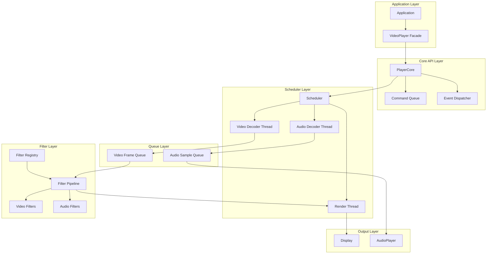
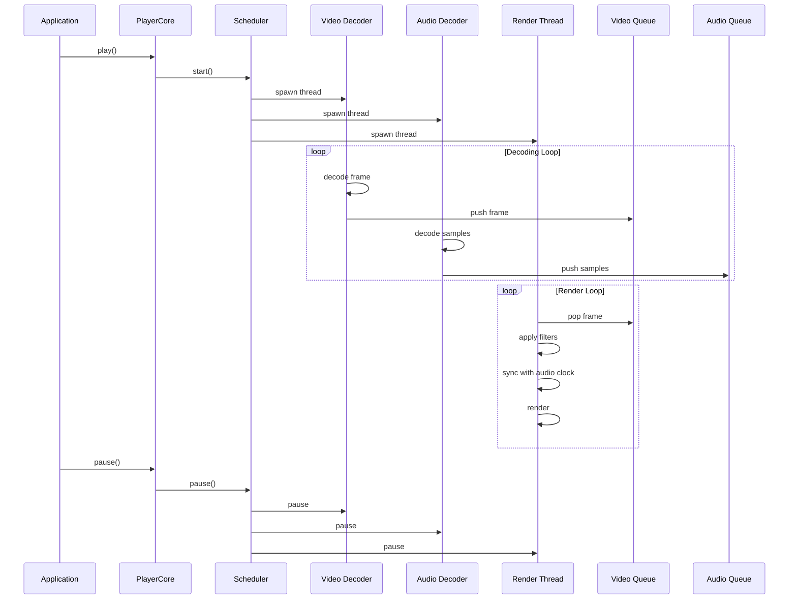
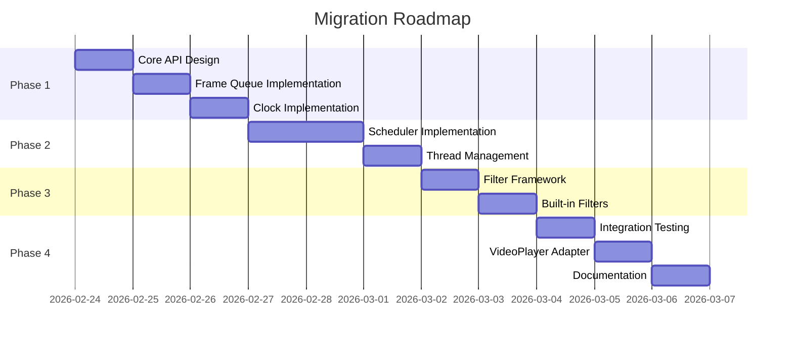

# Core API Refactor, Scheduler & Filter Framework

Feature Name: core-api-refactor-scheduler-filter
Updated: 2026-02-24

## Description

本项目将 Modern Video Player 从单线程架构重构为多线程架构，引入 Core API 层、任务调度器和 Filter 插件框架。核心目标包括：
1. 解耦播放控制接口与实现，提供稳定的 Core API
2. 实现多线程调度器，分离解码、渲染、音频处理
3. 构建可扩展的 Filter 插件系统，支持视频/音频后处理

## Architecture



### 线程模型



## Components and Interfaces

### PlayerCore (核心播放器)

```cpp
namespace vp::core {

enum class PlaybackState {
    Stopped,
    Playing,
    Paused
};

enum class ErrorCode {
    None = 0,
    FileNotFound,
    UnsupportedFormat,
    DecoderInitFailed,
    DisplayInitFailed,
    AudioInitFailed,
    SeekFailed,
    FilterError
};

struct PlaybackInfo {
    double duration{0.0};
    double position{0.0};
    int video_width{0};
    int video_height{0};
    int audio_sample_rate{0};
    int audio_channels{0};
};

class PlayerCore {
public:
    PlayerCore();
    ~PlayerCore();

    bool open(const std::string& filename);
    void close();
    
    void play();
    void pause();
    void stop();
    void seek(double timestamp);
    
    PlaybackState getState() const;
    PlaybackInfo getInfo() const;
    
    void setVolume(float volume);
    float getVolume() const;
    
    void setPlaybackSpeed(double speed);
    double getPlaybackSpeed() const;

    using StateCallback = std::function<void(PlaybackState)>;
    using PositionCallback = std::function<void(double)>;
    using ErrorCallback = std::function<void(ErrorCode, const std::string&)>;
    using FrameCallback = std::function<void()>;

    void onStateChanged(StateCallback callback);
    void onPositionChanged(PositionCallback callback);
    void onError(ErrorCallback callback);
    void onFrameRendered(FrameCallback callback);

private:
    class Impl;
    std::unique_ptr<Impl> impl_;
};

} // namespace vp::core
```

### Scheduler (调度器)

```cpp
namespace vp::core {

class Scheduler {
public:
    Scheduler();
    ~Scheduler();

    void setVideoDecoder(std::function<bool(VideoFrame&)> decoder);
    void setAudioDecoder(std::function<bool(AudioFrame&)> decoder);
    void setVideoQueue(FrameQueue<VideoFrame>* queue);
    void setAudioQueue(FrameQueue<AudioFrame>* queue);
    void setRenderCallback(std::function<void()> callback);
    void setClock(Clock* clock);

    void start();
    void pause();
    void resume();
    void stop();
    void flush();

    size_t getVideoQueueSize() const;
    size_t getAudioQueueSize() const;

private:
    void videoDecoderLoop();
    void audioDecoderLoop();
    void renderLoop();

    std::atomic<bool> running_{false};
    std::atomic<bool> paused_{false};
    
    std::thread video_thread_;
    std::thread audio_thread_;
    std::thread render_thread_;
    
    FrameQueue<VideoFrame>* video_queue_{nullptr};
    FrameQueue<AudioFrame>* audio_queue_{nullptr};
    
    Clock* clock_{nullptr};
};

} // namespace vp::core
```

### FrameQueue (帧队列)

```cpp
namespace vp::core {

template<typename FrameType>
class FrameQueue {
public:
    explicit FrameQueue(size_t capacity = 8);
    ~FrameQueue();

    bool push(FrameType&& frame, std::chrono::milliseconds timeout = std::chrono::milliseconds(100));
    bool pop(FrameType& frame, std::chrono::milliseconds timeout = std::chrono::milliseconds(100));
    
    void flush();
    void setCapacity(size_t capacity);
    
    size_t size() const;
    size_t capacity() const;
    bool empty() const;
    bool full() const;
    
    double getFillRatio() const;

private:
    std::queue<FrameType> queue_;
    mutable std::mutex mutex_;
    std::condition_variable not_empty_;
    std::condition_variable not_full_;
    size_t capacity_;
    std::atomic<bool> flushed_{false};
};

using VideoFrameQueue = FrameQueue<VideoFrame>;
using AudioFrameQueue = FrameQueue<AudioFrame>;

} // namespace vp::core
```

### Clock (时钟同步器)

```cpp
namespace vp::core {

enum class ClockSource {
    Audio,
    Video,
    System
};

class Clock {
public:
    Clock();
    
    void setSource(ClockSource source);
    ClockSource getSource() const;
    
    double getTime() const;
    void setTime(double time);
    
    void setAudioClock(double time);
    double getAudioClock() const;
    
    void setVideoClock(double time);
    double getVideoClock() const;
    
    void setSpeed(double speed);
    double getSpeed() const;
    
    void pause();
    void resume();
    void reset();

private:
    std::atomic<double> audio_clock_{0.0};
    std::atomic<double> video_clock_{0.0};
    std::atomic<double> speed_{1.0};
    ClockSource source_{ClockSource::Audio};
    std::atomic<bool> paused_{false};
    TimePoint pause_time_;
    double paused_at_{0.0};
};

} // namespace vp::core
```

### Filter Framework (滤镜框架)

```cpp
namespace vp::filters {

class IVideoFilter {
public:
    virtual ~IVideoFilter() = default;
    virtual std::string getName() const = 0;
    virtual void process(VideoFrame& frame) = 0;
    virtual void setParameter(const std::string& name, double value) = 0;
    virtual double getParameter(const std::string& name) const = 0;
    virtual std::vector<std::string> getParameterNames() const = 0;
    virtual void enable(bool enabled) = 0;
    virtual bool isEnabled() const = 0;
};

class IAudioFilter {
public:
    virtual ~IAudioFilter() = default;
    virtual std::string getName() const = 0;
    virtual void process(uint8_t* samples, size_t sample_count, int channels) = 0;
    virtual void setParameter(const std::string& name, double value) = 0;
    virtual double getParameter(const std::string& name) const = 0;
    virtual std::vector<std::string> getParameterNames() const = 0;
    virtual void enable(bool enabled) = 0;
    virtual bool isEnabled() const = 0;
};

using VideoFilterFactory = std::function<std::unique_ptr<IVideoFilter>()>;
using AudioFilterFactory = std::function<std::unique_ptr<IAudioFilter>()>;

class FilterRegistry {
public:
    static FilterRegistry& instance();
    
    void registerVideoFilter(const std::string& name, VideoFilterFactory factory);
    void registerAudioFilter(const std::string& name, AudioFilterFactory factory);
    
    std::unique_ptr<IVideoFilter> createVideoFilter(const std::string& name);
    std::unique_ptr<IAudioFilter> createAudioFilter(const std::string& name);
    
    std::vector<std::string> getVideoFilterNames() const;
    std::vector<std::string> getAudioFilterNames() const;

private:
    FilterRegistry() = default;
    std::unordered_map<std::string, VideoFilterFactory> video_factories_;
    std::unordered_map<std::string, AudioFilterFactory> audio_factories_;
    mutable std::mutex mutex_;
};

class FilterPipeline {
public:
    void addVideoFilter(std::unique_ptr<IVideoFilter> filter);
    void addAudioFilter(std::unique_ptr<IAudioFilter> filter);
    void removeVideoFilter(const std::string& name);
    void removeAudioFilter(const std::string& name);
    
    void processVideo(VideoFrame& frame);
    void processAudio(uint8_t* samples, size_t sample_count, int channels);
    
    IVideoFilter* getVideoFilter(const std::string& name);
    IAudioFilter* getAudioFilter(const std::string& name);

private:
    std::vector<std::unique_ptr<IVideoFilter>> video_filters_;
    std::vector<std::unique_ptr<IAudioFilter>> audio_filters_;
    mutable std::mutex video_mutex_;
    mutable std::mutex audio_mutex_;
};

} // namespace vp::filters
```

### Built-in Filters (内置滤镜)

```cpp
namespace vp::filters::builtin {

class BrightnessFilter : public IVideoFilter {
public:
    std::string getName() const override { return "brightness"; }
    void process(VideoFrame& frame) override;
    void setParameter(const std::string& name, double value) override;
    double getParameter(const std::string& name) const override;
    std::vector<std::string> getParameterNames() const override;
    void enable(bool enabled) override { enabled_ = enabled; }
    bool isEnabled() const override { return enabled_; }

private:
    double brightness_{0.0};
    bool enabled_{true};
};

class ContrastFilter : public IVideoFilter {
public:
    std::string getName() const override { return "contrast"; }
    void process(VideoFrame& frame) override;
    void setParameter(const std::string& name, double value) override;
    double getParameter(const std::string& name) const override;
    std::vector<std::string> getParameterNames() const override;
    void enable(bool enabled) override { enabled_ = enabled; }
    bool isEnabled() const override { return enabled_; }

private:
    double contrast_{1.0};
    bool enabled_{true};
};

class SaturationFilter : public IVideoFilter {
public:
    std::string getName() const override { return "saturation"; }
    void process(VideoFrame& frame) override;
    void setParameter(const std::string& name, double value) override;
    double getParameter(const std::string& name) const override;
    std::vector<std::string> getParameterNames() const override;
    void enable(bool enabled) override { enabled_ = enabled; }
    bool isEnabled() const override { return enabled_; }

private:
    double saturation_{1.0};
    bool enabled_{true};
};

void registerBuiltinFilters();

} // namespace vp::filters::builtin
```

## Data Models

### 帧数据结构

```cpp
namespace vp::core {

struct VideoFrame {
    AVFrame* frame{nullptr};
    double pts{0.0};
    double duration{0.0};
    bool valid{false};
    
    VideoFrame() = default;
    ~VideoFrame();
    
    VideoFrame(const VideoFrame&) = delete;
    VideoFrame& operator=(const VideoFrame&) = delete;
    VideoFrame(VideoFrame&& other) noexcept;
    VideoFrame& operator=(VideoFrame&& other) noexcept;
    
    int getWidth() const;
    int getHeight() const;
    AVPixelFormat getFormat() const;
};

struct AudioFrame {
    std::vector<uint8_t> samples;
    double pts{0.0};
    double duration{0.0};
    int sample_rate{0};
    int channels{0};
    bool valid{false};
};

} // namespace vp::core
```

### 命令结构

```cpp
namespace vp::core {

enum class CommandType {
    Play,
    Pause,
    Stop,
    Seek,
    SetVolume,
    SetSpeed
};

struct Command {
    CommandType type;
    double double_value{0.0};
    float float_value{0.0f};
    std::string string_value;
};

class CommandQueue {
public:
    void push(Command cmd);
    bool pop(Command& cmd, std::chrono::milliseconds timeout);
    void clear();

private:
    std::queue<Command> queue_;
    std::mutex mutex_;
    std::condition_variable cv_;
};

} // namespace vp::core
```

## Correctness Properties

1. **线程安全**: 所有共享数据结构使用互斥锁或原子操作保护，防止数据竞争
2. **无死锁**: 锁获取顺序全局一致（queue -> filter -> clock），避免循环等待
3. **资源释放**: 析构时确保所有线程已停止、队列已清空、资源已释放
4. **队列边界**: 帧队列容量上限防止内存耗尽，下限防止解码饥饿
5. **时钟单调**: 音频时钟单调递增，视频帧 PTS 与时钟比较决定渲染时机
6. **Filter 故障隔离**: 单个 Filter 异常不影响整体播放流程

## Error Handling

| 错误场景 | 处理策略 |
|---------|---------|
| 文件打开失败 | 返回 false，设置 ErrorCode，触发 onError |
| 解码器初始化失败 | 回退到仅播放可用流，记录警告 |
| 解码错误 | 跳过当前帧，继续解码下一帧 |
| 队列超时 | 返回超时状态，调用方决定重试或放弃 |
| Filter 异常 | 记录错误日志，跳过该 Filter，继续播放 |
| 线程崩溃 | 记录错误，尝试重启线程，超过 3 次则停止播放 |
| seek 失败 | 保持当前位置，返回错误状态 |

## Test Strategy

### 单元测试

1. **FrameQueue 测试**
   - 正常 push/pop 操作
   - 队列满/空时的阻塞行为
   - flush 操作正确性
   - 并发访问安全性

2. **Clock 测试**
   - 时钟单调性
   - 音频/视频时钟切换
   - 播放速度变化正确性

3. **Filter 测试**
   - Filter 注册和创建
   - 参数设置和获取
   - 处理链正确性
   - 异常处理

### 集成测试

1. **Scheduler 测试**
   - 线程启动和停止
   - 队列填充和消费
   - 暂停和恢复

2. **Core API 测试**
   - 完整播放流程
   - 状态转换正确性
   - 事件通知及时性

3. **音视频同步测试**
   - 正常播放同步
   - seek 后同步恢复
   - 变速播放同步

### 性能测试

1. **帧率测试**: 确保渲染帧率达标（60fps 场景下处理时间 < 16ms）
2. **延迟测试**: play/pause/seek 操作响应时间
3. **内存测试**: 长时间播放无内存泄漏

## Migration Roadmap



### 迁移步骤

1. **Phase 1: 基础设施**
   - 实现 FrameQueue、Clock、Command 类
   - 添加 CMake 配置 `USE_NEW_PLAYER_CORE` 选项
   - 新目录结构：`src/core/`, `src/filters/`

2. **Phase 2: 调度器**
   - 实现 Scheduler 类
   - 重构 VideoDecoder/AudioDecoder 支持回调模式
   - 实现 Core API 的基本播放控制

3. **Phase 3: Filter 系统**
   - 实现 FilterRegistry 和 FilterPipeline
   - 实现内置滤镜
   - 集成到渲染管道

4. **Phase 4: 迁移完成**
   - 实现 VideoPlayer 适配器调用 Core API
   - 移除旧实现
   - 更新文档

## References

[^1]: docs/design/ARCHITECTURE.md - 现有架构设计
[^2]: docs/guides/IMPLEMENTATION.md - 实现指南
[^3]: .monkeycode/specs/enterprise-quill-logging/design.md - 日志系统设计
