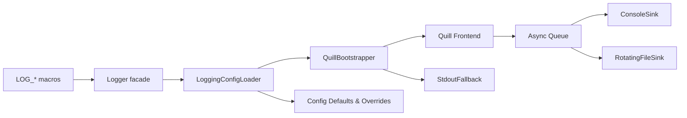

# Enterprise Quill Logging

Feature Name: enterprise-quill-logging  
Updated: 2026-02-24

## Description

本设计将 Modern Video Player 的日志系统升级为企业级 Quill 管道：在启用 `USE_QUILL_LOGGING` 时，通过异步后台线程同时输出到 `ConsoleSink` 与 `RotatingFileSink`，并提供运行时配置（目录/大小/保留数量/日志级别），兼容原有 `LOG_*` 宏与 `DEBUG_MODE` 控制。配置文件与环境变量驱动新的 `LoggingConfig`，并在未启用 Quill 时保持 stdout fallback。文档（`docs/design/LOGGING.md`、`docs/records/CHANGELOG.md`、`docs/records/VERSION.md`）将描述该方案与新配置项。

## Architecture



- `Logger facade` 保持现有宏接口，内部委派到 `QuillBootstrapper`，根据配置决定数据流。
- `LoggingConfigLoader` 从 `config/logging.conf` 和环境变量构造 `LoggingConfig`，并提供验证结果。
- `QuillBootstrapper` 依据配置启动 `quill::Backend`，注册双 sinks，并在异常时切换到 `StdoutFallback`。

## Components and Interfaces

- **config/logging.conf**: 纯文本 `key=value` 文件（UTF-8，无 BOM），示例：
  ```
  log_dir=logs
  max_file_size_mb=25
  max_files=7
  log_level=trace
  ```
- **LoggingConfig** (`struct LoggingConfig`):
  - `std::filesystem::path log_dir`
  - `size_t max_file_size_bytes`
  - `size_t max_files`
  - `quill::LogLevel log_level`
  - `bool enabled`（由 `USE_QUILL_LOGGING` 决定）
- **LoggingConfigLoader**:
  - `static LoggingConfig load(const std::string& path)` 读取文件→解析→调用 `applyEnvOverrides(LoggingConfig&)`。
  - 解析规则：忽略空行/以 `#` 开头注释；大小写不敏感的键；值裁剪空白。
  - 环境变量优先级：`MVP_LOG_DIR`, `MVP_LOG_LEVEL`, `MVP_LOG_MAX_FILE_MB`, `MVP_LOG_MAX_FILES`。
- **QuillBootstrapper**:
  - `bool start(const LoggingConfig&)`: 若 `enabled=false`，直接返回 false；否则设置 `quill::BackendOptions`（`set_backend_thread_cpu_affinity`, `set_backend_thread_params`），创建 sinks。
  - `void stop()`: 停止 backend 并重置状态。
  - `quill::Logger* get()`: 返回已注册的 logger，若空则触发 stdout fallback。
- **SinkFactory**（内部帮助函数）:
  - 创建 `ConsoleSink`（`stdout`，彩色输出关闭以兼容 Windows 控制台）。
  - 创建 `RotatingFileSink`：
    ```cpp
    quill::RotatingFileSinkConfig file_cfg;
    file_cfg.set_max_file_size(max_file_size_bytes);
    file_cfg.set_max_files(max_files);
    auto file_sink = quill::Frontend::create_or_get_sink<quill::RotatingFileSink>("rotating", log_dir / "modern-player.log", file_cfg);
    ```
  - Sink 名称使用稳定常量，避免重复注册。
- **StdoutFallback**:
  - 当 `LoggingConfig::enabled` 为 false 或启动失败时启用。
  - 继续复用当前 `std::cout/std::cerr` 实现；在 Quill 初始化失败时打印一次诊断信息。
- **Documentation Tasks**: `docs/design/LOGGING.md` 新增配置章节；`docs/records/CHANGELOG.md` & `docs/records/VERSION.md` 记录 Quill 已重启用与配置细节。

## Data Models

| 字段 | 类型 | 说明 | 默认值 |
|------|------|------|--------|
| `log_dir` | `std::filesystem::path` | 日志根目录；允许相对路径（相对于可执行文件） | `logs` |
| `max_file_size_bytes` | `size_t` | 单文件上限，`max_file_size_mb * 1024 * 1024` | `10 * 1024 * 1024` |
| `max_files` | `size_t` | 轮转保留个数 | `5` |
| `log_level` | `quill::LogLevel` | `trace`, `debug`, `info`, `warning`, `error`, `critical` | `info` |
| `enabled` | `bool` | 由 `USE_QUILL_LOGGING` 决定 | `false` when flag missing |

配置生效顺序：`env overrides` → `config/logging.conf` → `defaults`。解析失败的值记录 `ValidationIssue` 列表，并在初始化阶段通过 `LOG_WARNING` 输出。

## Correctness Properties

1. **宏兼容性**：`include/logger.h` 对外接口不变，所有调用者无需改动即可获得新功能。
2. **非阻塞性**：播放器线程仅执行 Quill 前端调用，最大延迟受限于环形缓冲大小，确保渲染/解码线程无阻塞。
3. **顺序一致性**：同一线程的日志按提交顺序出现在两个 sinks 中，满足调试/审计需求。
4. **Trace 控制**：`DEBUG_MODE` 关闭时，`LOG_TRACE_*` 与 `LOG_DEBUG` 在预处理阶段裁剪，保持零开销；打开时受 `log_level` 阈值控制。
5. **Fallback 安全性**：任何配置或 I/O 错误不会导致播放器退出；stdout 路径始终可用。

## Error Handling

- **配置文件缺失**：记录 INFO 并使用默认配置。
- **解析错误**：列出具体键与无效值，使用默认或裁剪后的合法值继续运行。
- **目录不可写**：尝试 `std::filesystem::create_directories`；失败则切换到 console-only，提示用户检查权限。
- **后端启动失败**：捕获 `quill::QuillError`，记录错误并禁用 Quill。
- **磁盘耗尽/旋转失败**：Rotating sink 抛出的异常在 Quill 回调中捕获，降级为 console-only 并提示用户。

## Test Strategy

1. **Unit Tests**
   - `LoggingConfigLoaderTest`：覆盖默认值、配置文件解析、环境变量优先级、非法数值裁剪。
   - `QuillBootstrapperTest`：在 `USE_QUILL_LOGGING` 条件下模拟成功/失败路径，验证 fallback 触发。
2. **Integration Tests**
   - 运行播放器或专用测试可执行，触发大量 `LOG_INFO` / `LOG_TRACE_*`，验证 `logs/modern-player.log` 轮转与 `stdout` 同步输出。
   - 强制日志目录不可写（临时目录 + chmod），确认 fallback 行为与告警日志。
3. **Documentation Validation**
   - 检查 `docs/design/LOGGING.md`、`docs/records/CHANGELOG.md`、`docs/records/VERSION.md` 中的配置示例与字段描述与实现一致。
4. **Manual Checklist**
   - 构建 `-DUSE_QUILL_LOGGING=ON` 与 `OFF` 两种二进制，运行示例媒体文件，确认双通道与 stdout-only 模式都可用。

## References

[^1]: docs/design/LOGGING.md  
[^2]: include/logger.h  
[^3]: docs/records/VERSION.md  
[^4]: docs/records/CHANGELOG.md
