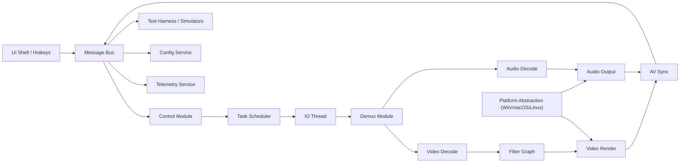

# Modern Video Player 企业架构设计

Feature Name: modern-video-player-architecture  
Updated: 2026-02-24

## 描述

Modern Video Player 目标是提供 MPC-HC 级别的可扩展播放核心，基于 C++17、FFmpeg、SDL2 与 Quill 构建，采用模块化内核、插件化 Filter Graph、多线程流水线和统一消息总线。该设计分离 UI 与核心，支持跨平台适配、企业级 Telemetry、配置中心与自动化测试能力。

## 架构

整体架构分为 UI Shell、Message Bus、Core Pipeline、Filter Graph、Enterprise Services 以及 Platform Abstraction。所有播放命令与状态通过消息总线流转，核心流水线以任务调度器串联 IO → Demux → Decode → Sync → Render/Audio Output。Filter 插件与 Telemetry/Config 服务并行耦合在消息总线与核心周围。

## 组件与接口

- **Message Bus**：基于发布订阅，定义 `Command`, `State`, `Telemetry`, `ConfigUpdate` 四类通道；使用 Quill 日志记录事件。提供同步 API（直接调用）与异步队列（无锁环形缓冲）。
- **Control Module**：解析来自 Message Bus 的 Play/Pause/Stop/Seek/Rate/Loop 命令，维护状态机并调用 Task Scheduler 调整流水线速率与跳转。
- **Task Scheduler**：封装线程池（std::jthread + work stealing），暴露 `schedule(task, lane)` 与 `rebalance(policy)` 接口，可根据 Config Service 配置 lane（IO、Demux、Decode、AV Sync、Render、Audio）。
- **Core Pipeline Modules**：
  - **IO**：读取文件、网络或内存媒体源，输出字节流到 Demux。
  - **Demux**：利用 FFmpeg `avformat` 将流分离为音视频队列。
  - **Decode**：根据队列类型调用 FFmpeg `avcodec`，输出帧缓冲。
  - **AV Sync**：比较音视频 PTS，通过 SDL2 时钟与 Audio Callback 协调帧展示时间。
  - **Render/Audio Output**：通过 SDL2 渲染器与音频设备输出；允许 GPU 纹理或外部渲染目标。
- **Filter Graph**：以 DAG 表示的插件链，每个节点实现 `process(FrameContext&)` 接口；支持热插拔、优先级与依赖声明。
- **Telemetry Service**：消费 Bus 事件，输出 JSON Lines 至本地文件或企业日志管道；暴露 gRPC/REST 端点供外部监控读取。
- **Config Service**：加载 JSON/YAML，执行 JSON Schema 校验；暴露 `get(key)`, `watch(path, callback)` API 并支持写回。
- **Test Harness**：提供 CLI 与 API，能够注入模拟媒体源、Mock 解码器、合成 UI 事件。
- **Platform Abstraction**：封装窗口、输入与音频设备差异；采用策略模式 (`PlatformAdapter`) 并在初始化时选择实现。

## 数据模型

- **MediaSession**：`id`, `sourceUri`, `state`, `activeFilters`, `playbackRate`, `loopRange`, `resourceHandles`。
- **PipelineFrame**：`streamType`, `pts`, `dts`, `bufferRef`, `metadata`, `errorCode`。
- **BusMessage**：`channel`, `timestamp`, `payload`, `correlationId`，payload 使用 Variant（Command/State/Telemetry/ConfigUpdate）。
- **ConfigDocument**：`format`, `version`, `schemaId`, `values`, `signature`。
- **TelemetryRecord**：`eventType`, `module`, `severity`, `metrics`, `context`, `sessionId`。

## 正确性属性

1. **模块隔离**：Demux、Decode、Sync、Render 通过消息或缓冲队列耦合，任一模块失败不得阻塞全局线程池超过配置阈值。
2. **时序一致性**: AV Sync 必须保证 `abs(videoPts - audioPts) <= configurableThreshold`；调度器需要在 Seek 后清空过期帧。
3. **Filter 完整性**：Filter Graph 必须保持 DAG，无循环依赖；节点变更后需重新计算拓扑序。
4. **消息有序性**：同一 `sessionId` 的状态消息必须按时间戳顺序广播，以便 UI 与 Telemetry 做精确回放。

## 错误处理

- **解码错误**：捕获 FFmpeg 返回码，生成 TelemetryRecord（severity=ERROR），并根据策略重试或跳过帧。
- **配置加载失败**：Config Service 回退到最近一次有效版本，记录 `ConfigUpdate` 消息并阻止未验证的热更新。
- **线程阻塞**：Task Scheduler 监控每个 lane 的心跳，超过阈值则触发 `PerformanceEvent` 并尝试迁移任务。
- **插件异常**：Filter Graph 在节点抛出异常时隔离节点、插入 `BypassFilter` 并通知 Control Module。
- **平台特性缺失**：Platform Adapter 检测缺失能力时上报 `CapabilityWarning`，并提供软件回退路径。

## 测试策略

- **核心 API 单元测试**：使用 GoogleTest/GoogleMock 覆盖状态机、消息路由、调度策略。
- **集成流水线测试**：在 CI 中运行模拟媒体源，验证多线程调度、Filter Graph 插拔和跨平台适配层行为。
- **性能基准**：构建 4K@60、HDR、低延迟场景基准，记录帧率、丢帧、线程饱和度。
- **容错测试**：通过 Test Harness 注入网络抖动、解码失败、配置错误与热键风暴，验证 Telemetry 和回退策略。
- **跨平台冒烟**：在 Win/macOS/Linux 容器执行统一脚本，确保 CMake Preset、依赖探测与 SDL2 设备初始化成功。

## 参考

[^1]: (.monkeycode/docs/playback-loop-exit-issue.md) - 播放循环退出问题分析
