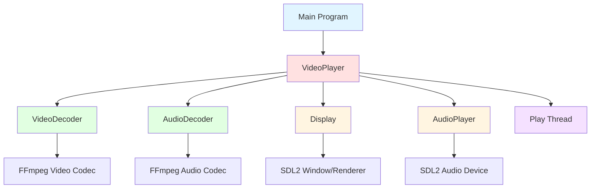
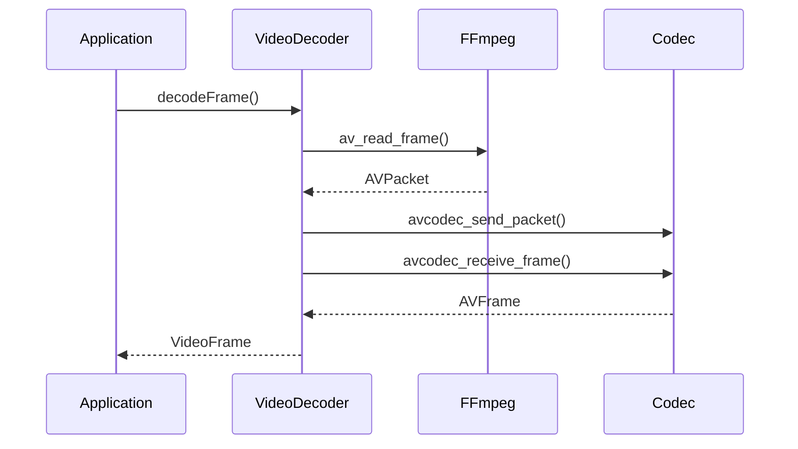
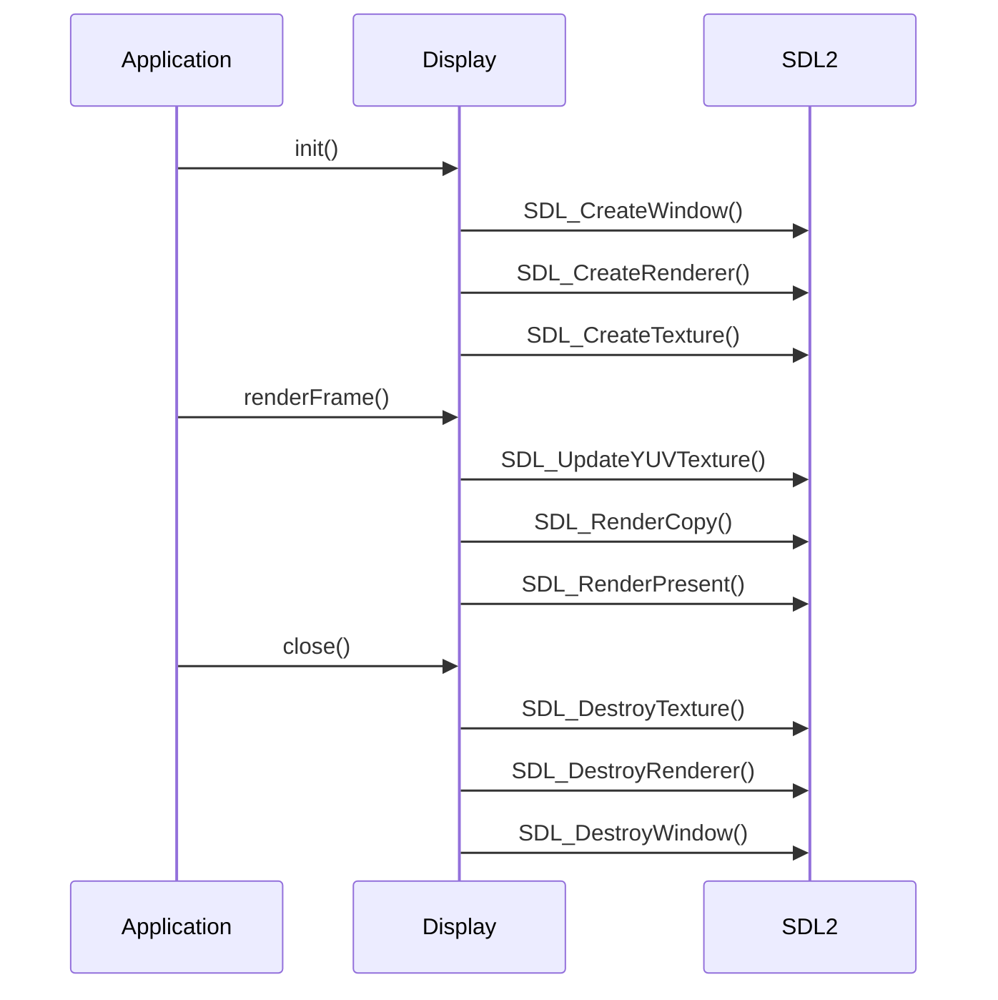
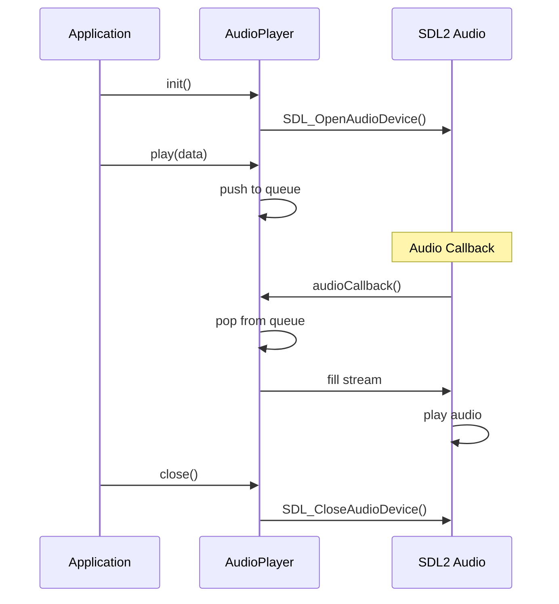
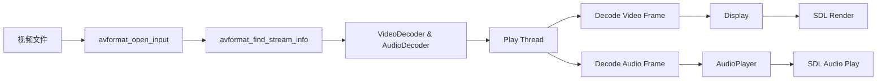

# 架构设计文档

## 项目依赖版本

| 组件 | 版本 |
|------|------|
| FFmpeg | 8.0.1 |
| SDL2 | 2.30.11 |
| Quill | 6.0.0 |
| CMake | 3.15+ |
| C++ | C++17 |

## 系统架构

## 1. 整体架构图



## 2. 模块设计

### 2.1 VideoPlayer (主播放器)

**职责**:
- 管理所有子模块
- 控制播放流程
- 实现音视频同步
- 处理用户输入

**关键接口**:
```cpp
class VideoPlayer {
    bool open(const std::string& filename);
    void play();
    void pause();
    void stop();
    void seek(double timestamp);
    void setVolume(float volume);
};
```

**状态管理**:
- `playing_`: 是否正在播放
- `paused_`: 是否暂停
- `stopped_`: 是否停止
- `current_time_`: 当前播放时间

**线程模型**:
- 主线程: 处理用户输入
- 播放线程: 音视频解码和渲染

### 2.2 VideoDecoder (视频解码器)

**职责**:
- 打开视频流
- 解码视频帧
- 格式转换
- 管理解码器资源

**FFmpeg 解码流程**:



**关键数据结构**:
- `AVFormatContext`: 媒体文件上下文
- `AVCodecContext`: 编解码器上下文
- `AVPacket`: 压缩数据包
- `AVFrame`: 解码后的原始帧
- `SwsContext`: 格式转换上下文

**线程安全**:
- 使用 `std::mutex` 保护共享资源
- RAII 管理 FFmpeg 资源

### 2.3 AudioDecoder (音频解码器)

**职责**:
- 打开音频流
- 解码音频帧
- 格式转换
- 管理解码器资源

**音频格式转换**:

```
原始格式 (多种) → SwrContext → 目标格式 (S16)
```

**关键数据结构**:
- `AVCodecContext`: 音频编解码器上下文
- `SwrContext`: 音频格式转换上下文

### 2.4 Display (显示模块)

**职责**:
- 创建和管理窗口
- 渲染视频帧
- 处理窗口事件
- 全屏切换

**SDL2 渲染流程**:



**YUV 渲染**:

```cpp
SDL_UpdateYUVTexture(texture_, nullptr,
    y_plane, y_stride,
    u_plane, u_stride,
    v_plane, v_stride
);
```

### 2.5 AudioPlayer (音频播放器)

**职责**:
- 打开音频设备
- 播放音频数据
- 音量控制
- 队列管理

**SDL2 音频流程**:



**音频回调机制**:

```cpp
void audioCallback(void* userdata, uint8_t* stream, int len) {
    // 从队列中获取音频数据
    // 填充到 stream 中
    // SDL 自动播放
}
```

## 3. 数据流

### 3.1 视频数据流

```
视频文件 → AVPacket → VideoDecoder → AVFrame → Display → 屏幕显示
```

### 3.2 音频数据流

```
音频文件 → AVPacket → AudioDecoder → AVFrame → AudioPlayer → 扬声器
```

### 3.3 完整播放流程



## 4. 线程模型

### 4.1 单线程版本 (当前实现)

```
主线程:
├── 处理用户输入
├── 解码视频帧
├── 解码音频帧
├── 渲染视频
└── 播放音频
```

**优点**:
- 简单易懂
- 资源占用少

**缺点**:
- 音视频同步较难
- 性能可能受限

### 4.2 多线程版本 (改进方向)

```
主线程:
└── 处理用户输入

视频解码线程:
└── 解码视频帧 → 视频队列

音频解码线程:
└── 解码音频帧 → 音频队列

渲染线程:
├── 从视频队列取帧
├── 渲染视频
└── 控制同步

音频播放线程:
└── SDL 音频回调
```

**优点**:
- 音视频同步更准确
- 性能更好

**缺点**:
- 复杂度增加
- 需要线程同步

## 5. 音视频同步

### 5.1 同步策略

当前使用基于视频时钟的简单同步：

```cpp
double video_pts = frame.pts();
double delay = video_pts - current_time_;
if (delay > 0.01) {
    sleep(delay);
}
```

### 5.2 改进策略

**主时钟选择**:
- 如果有音频: 使用音频时钟
- 如果无音频: 使用视频时钟

**时钟同步算法**:

```cpp
double getMasterClock() {
    if (audio_enabled) {
        return audio_clock;
    }
    return video_clock;
}

void syncVideo(double pts) {
    double delay = pts - getMasterClock();
    if (delay > 0) {
        sleep(delay);
    }
}
```

## 6. 错误处理

### 6.1 错误类型

1. **文件错误**: 文件不存在、格式不支持
2. **解码错误**: 编解码器打开失败、解码失败
3. **显示错误**: 窗口创建失败、渲染失败
4. **音频错误**: 音频设备打开失败

### 6.2 错误处理策略

```cpp
bool open(const std::string& filename) {
    if (avformat_open_input(...) != 0) {
        std::cerr << "Error: Could not open file" << std::endl;
        return false;
    }
    
    if (!video_decoder_->open(...)) {
        close();  // 清理已分配的资源
        return false;
    }
    
    return true;
}
```

## 7. 资源管理

### 7.1 RAII 模式

使用 C++ 的 RAII (Resource Acquisition Is Initialization) 管理资源：

```cpp
class VideoDecoder {
    ~VideoDecoder() {
        close();  // 析构时自动清理
    }
    
    void close() {
        if (codec_ctx_) {
            avcodec_free_context(&codec_ctx_);
        }
        if (sws_ctx_) {
            sws_freeContext(sws_ctx_);
        }
    }
};
```

### 7.2 智能指针

使用 `std::unique_ptr` 管理模块生命周期：

```cpp
class VideoPlayer {
    std::unique_ptr<VideoDecoder> video_decoder_;
    std::unique_ptr<Display> display_;
};
```

## 8. 性能优化

### 8.1 帧队列

使用队列缓存解码后的帧：

```cpp
std::queue<VideoFrame> video_queue_;
std::mutex queue_mutex_;
```

### 8.2 格式转换缓存

复用格式转换上下文：

```cpp
if (!sws_ctx_) {
    sws_ctx_ = sws_getContext(...);
}
```

### 8.3 硬件加速

使用硬件解码器：

```cpp
AVCodec* codec = avcodec_find_decoder_by_name("h264_cuvid");
```

## 9. 扩展功能

### 9.1 播放列表

```cpp
class Playlist {
    std::vector<std::string> files_;
    int current_index_;
    
    void next();
    void previous();
};
```

### 9.2 字幕支持

```cpp
class SubtitleDecoder {
    bool decodeSubtitle(SubtitleFrame& frame);
    void renderSubtitle(Display& display);
};
```

### 9.3 倍速播放

```cpp
void setPlaybackSpeed(double speed) {
    playback_speed_ = speed;
    // 调整延迟计算
    double delay = (pts - current_time_) / speed;
}
```

## 10. 测试策略

### 10.1 单元测试

测试各个模块的功能：

```cpp
TEST(VideoDecoder, OpenAndDecode) {
    VideoDecoder decoder;
    EXPECT_TRUE(decoder.open(fmt_ctx, stream_idx));
    
    VideoFrame frame;
    EXPECT_TRUE(decoder.decodeFrame(frame));
}
```

### 10.2 集成测试

测试整体播放流程：

```cpp
TEST(VideoPlayer, PlayVideo) {
    VideoPlayer player;
    EXPECT_TRUE(player.open("test.mp4"));
    
    player.play();
    EXPECT_TRUE(player.isPlaying());
    
    std::this_thread::sleep_for(std::chrono::seconds(1));
    
    player.stop();
}
```

## 11. 部署

### 11.1 Linux

```bash
# 编译
mkdir build && cd build
cmake ..
make

# 安装
sudo make install
```

### 11.2 打包

```bash
# 创建 AppImage
mkdir -p AppDir/usr/bin
cp VideoPlayer AppDir/usr/bin/
linuxdeploy-x86_64.AppImage --appdir AppDir --output appimage
```

## 12. 维护

### 12.1 日志系统

```cpp
#include <spdlog/spdlog.h>

spdlog::info("Playing video: {}", filename);
spdlog::error("Failed to open codec");
```

### 12.2 配置管理

```cpp
struct Config {
    int volume = 100;
    bool fullscreen = false;
    std::string theme = "dark";
};

Config loadConfig();
void saveConfig(const Config& config);
```

## 总结

本架构设计采用模块化、面向对象的方式，充分利用 C++17 新特性，实现了清晰、高效的视频播放器。通过良好的架构设计，便于后续功能扩展和性能优化。
