# Day3 结论：当前主瓶颈是“硬解回拷 + 软件转换 + CPU 深拷贝 + SDL 上传”，同步策略只解释部分卡顿

日期：2026-03-14  
范围：`src/core/player_core.cpp`、`src/core/scheduler.cpp`、`src/display.cpp`、`src/audio_player.cpp`、`docs/reports/PERFORMANCE_LOG_LOCAL_CHECK.md`、`docs/reports/1080P60_STABILITY_LOCAL_CHECK.md`、`docs/reports/4K_PLAYBACK_LOCAL_CHECK.md`、`docs/reports/HIGH_BITRATE_LOCAL_CHECK.md`

## implementation planner

1. 先按 `DAY3_EXECUTION.md` 回看 Day2 主链，只保留性能相关路径。
2. 结合本地验收报告建立 `1080p60 / 4K / >80Mbps` 三组基线现象。
3. 顺着 `decodeVideoFrame -> prepareVideoOutputFrame -> convertVideoFrameToYuv420` 读清视频输出链路。
4. 顺着 `renderFrame -> Display::copyFrameData -> SDL_UpdateYUVTexture` 读清渲染落地链路。
5. 再读 `Scheduler::videoDecoderLoop/audioDecoderLoop/pumpRenderOnce()`，区分吞吐瓶颈和同步策略问题。
6. 最后读 `AudioPlayer::play/audioCallback/getPlaybackPts` 与 `startAudioConsumer()`，确认音频链对主时钟和稳定性的影响。

## 先给结论

- `1080p60` 和 `>80Mbps 1080p` 路径已经稳定，说明当前架构在中高负载下仍然能维持完整播放主链。
- `4K60` 样本能推进到 `PASS`，但性能日志同时给出 `cpu_avg_percent=100.023`、`demux_dropped_packets=125`、`scheduler_late_drops=0`，这说明问题不主要是“渲染线程太晚被丢帧”，而是上游吞吐已经把 CPU 压满。
- 当前 Windows 下虽然选择了 `D3D11VA + D3D11`，但视频帧仍然经过：`av_hwframe_transfer_data()` 回拷到 CPU、`sws_scale` 转成 `YUV420P`、`Display::copyFrameData()` 再做一次平面深拷贝、`SDL_UpdateYUVTexture()` 再上传回 GPU。它不是零拷贝路径。
- `pumpRenderOnce()` 的等待/丢帧策略会影响“看起来卡不卡”，但它主要处理时钟偏差，不解决吞吐成本。4K 样本里 `late_drops=0` 就是反证。
- 真正该优先优化的是视频链的 copy 点和缺少阶段化 profiling；否则只能看到“CPU 满了”，却看不清是 `hwframe transfer`、`swscale`、`memcpy` 还是 `texture upload` 占了大头。

## 关键文件与函数

| 文件 | 关键函数 | 性能含义 |
| --- | --- | --- |
| `src/core/player_core.cpp:1202` | `initDecoders()` | 决定视频解码后端顺序，Windows 会优先尝试 `D3D11VA` |
| `src/core/player_core.cpp:1388` | `tryConfigureD3D11HardwareDecode()` | 给 FFmpeg 绑定 D3D11VA 设备上下文 |
| `src/core/player_core.cpp:1462` | `prepareVideoOutputFrame()` | 硬件帧回拷和像素格式归一化的关键入口 |
| `src/core/player_core.cpp:1476` | `av_hwframe_transfer_data()` | 发生 GPU -> CPU 回拷 |
| `src/core/player_core.cpp:1546` | `convertVideoFrameToYuv420()` | `sws_scale` 做软件像素格式转换 |
| `src/core/scheduler.cpp:132` | `videoDecoderLoop()` | 视频解码线程，受 80%/50% 队列背压控制 |
| `src/core/scheduler.cpp:163` | `audioDecoderLoop()` | 音频解码线程，沿用同样背压策略 |
| `src/core/scheduler.cpp:194` | `pumpRenderOnce()` | 早到等待、晚到丢帧；只解决同步，不解决吞吐 |
| `src/display.cpp:763` | `copyFrameData()` | 再做一次 Y/U/V 平面 CPU 深拷贝 |
| `src/display.cpp:700` | `updateTexture()` | `SDL_UpdateYUVTexture()` 把 CPU 数据上传到纹理 |
| `src/display.cpp:826` | `renderLoop()` | 显示线程真正执行 `SDL_RenderCopy/Present` |
| `src/audio_player.cpp:85` | `AudioPlayer::play()` | 把 PCM 送入 SDL 队列 |
| `src/audio_player.cpp:183` | `audioCallback()` | SDL 真正消费音频，推进 `playback_pts_` |
| `src/core/player_core.cpp:1758` | `startAudioConsumer()` | 音频消费线程做缓冲背压并推进音频主时钟 |
| `src/core/player_core.cpp:1837` | `maybeLogDiagnostics()` | 统一打印 demux/decode/render/audio/clock 指标 |

## 性能瓶颈地图

```mermaid
flowchart LR
    A[Demuxer.readPacket] --> B[PacketQueue]
    B --> C[decodeVideoFrame]
    C --> D[prepareVideoOutputFrame]
    D -->|copy #1| E[av_hwframe_transfer_data\nGPU -> CPU]
    E -->|copy #2| F[convertVideoFrameToYuv420\nsws_scale]
    F --> G[VideoFrameQueue]
    G --> H[Scheduler::pumpRenderOnce]
    H -->|wait/drop| I[PlayerCore::renderFrame]
    I --> J[Display::copyFrameData]
    J -->|copy #3| K[PendingVideoFrame]
    K --> L[Display::renderLoop]
    L -->|copy #4| M[SDL_UpdateYUVTexture\nCPU -> GPU]
    M --> N[SDL_RenderCopy/Present]

    B --> O[decodeAudioFrame]
    O --> P[audio_queue_]
    P --> Q[startAudioConsumer]
    Q --> R[AudioPlayer::play]
    R --> S[SDL audioCallback]
    S --> T[playback_pts_]
    T --> U[clock_.audio_clock + position_]
    U --> H
```

结论：

- 视频链至少有 4 次重成本数据搬运，其中 2 次跨 CPU/GPU 边界。
- 音频链主要承担“主时钟”和“缓冲深度”职责，不是当前 4K 样本里的主要热点。

## 报告证据矩阵

| 现象 | 指标/报告 | 代码位置 | 结论 |
| --- | --- | --- | --- |
| `1080p60` 稳定 | `docs/reports/1080P60_STABILITY_LOCAL_CHECK.md`：`advance_ratio=0.994133`、`late_drops=0`、`demux_dropped_packets=0` | `src/core/scheduler.cpp:194`、`src/core/player_core.cpp:1837` | 当前架构在 1080p60 下吞吐足够，等待/丢帧策略没有被逼到极限 |
| `>80Mbps 1080p` 稳定 | `docs/reports/HIGH_BITRATE_LOCAL_CHECK.md`：`advance_ratio=0.988444`、`late_drops=0`、`demux_dropped_packets=0` | `src/core/player_core.cpp:1202`、`src/core/player_core.cpp:1837` | 高码率本身不是问题，分辨率和帧尺寸带来的 copy/upload 更可能是关键成本 |
| `4K60` 进度仍可推进 | `docs/reports/4K_PLAYBACK_LOCAL_CHECK.md`：`advance_ratio=0.968167`、`late_drops=0`、`demux_dropped_packets=125` | `src/core/player_core.cpp:1678`、`src/core/player_core.cpp:1837` | 不是典型“渲染落后导致大量 late drop”，而是上游阶段已让 demux/queue 吃紧 |
| CPU 满载 | `docs/reports/PERFORMANCE_LOG_LOCAL_CHECK.md`：`cpu_avg_percent=100.023` | `src/core/player_core.cpp:1462`、`src/display.cpp:763`、`src/display.cpp:700` | 4K 路径大概率卡在视频帧搬运与上传，不是单纯解码器算力不足 |
| 硬解仍然不轻 | `decoder_backend=D3D11VA` 同时 `renderer_backend=D3D11` | `src/core/player_core.cpp:1476`、`src/display.cpp:700` | “硬解已开”不等于“渲染零拷贝”；当前只是把 decode 这一段交给了 GPU |
| 同步策略有影响但不是主因 | `scheduler_late_drops=0` | `src/core/scheduler.cpp:194` | 当前样本里 `wait/drop` 没成为首要损耗项；它更多决定体验边缘而非吞吐上限 |

## 当前性能问题该怎么分层理解

### 1. 吞吐瓶颈

- `prepareVideoOutputFrame()` 在硬解路径上先做 `av_hwframe_transfer_data()`，这已经把硬件帧拉回了软件内存。
- 如果源帧不是 `YUV420P`，还会继续走 `convertVideoFrameToYuv420()`，即一次 `sws_scale`。
- 到 `Display::copyFrameData()` 又复制一次平面数据，最后 `SDL_UpdateYUVTexture()` 再上传回 GPU。
- 所以当前实际负担是：`硬解节省了 bitstream -> surface`，但后面仍然有完整的 CPU 图像处理和上传开销。

### 2. 同步策略成本

- `Scheduler::pumpRenderOnce()` 在 `diff > 0` 时短等，在 `diff < -0.25` 时丢帧。
- 这套策略能处理“主时钟偏差”，但不能让昂贵的视频搬运变便宜。
- 真正会由同步策略直接引起的可见现象，主要是：
  - 领先时的轻微停顿感
  - 落后后的跳帧感
  - seek 后或时钟突然变化时的瞬时抖动

### 3. 背压副作用

- `videoDecoderLoop()` 和 `audioDecoderLoop()` 都在帧队列填充比达到 `0.8` 时暂停，到 `0.5` 以下再恢复。
- 这能避免队列无上限增长，但如果上游阶段本身很贵，背压只能“止血”，不能提高总吞吐。
- `startAudioConsumer()` 还对音频设备缓冲深度做了 `0.35s` 上限控制；它的目标是响应性，不是提升帧处理速度。

## 哪些卡顿来自同步策略，而不是解码能力不足

| 现象 | 更像哪个层面 | 原因 |
| --- | --- | --- |
| 画面偶尔停一下，但没有大面积丢帧 | 同步策略 | `diff > 0` 时渲染线程短等待，属于主动对齐主时钟 |
| 画面偶尔跳一下，但 CPU 并不满 | 同步策略 | `diff < -0.25` 时迟到帧被丢弃，属于追主时钟而非吞吐崩溃 |
| seek 后第一小段抖动 | 同步策略 + 队列收敛 | 新旧时间线切换时，等待/丢帧会帮助快速重新贴主时钟 |
| 4K 播放 CPU 打满且 demux 有 drop | 吞吐瓶颈 | 上游处理成本过高，已经在渲染前把系统压住了 |
| 1080p60 稳、4K 才开始吃紧 | 吞吐瓶颈 | 同步算法没变，变化的是每帧数据量和 copy/upload 成本 |

## 优化 Backlog

### P0

| 项目 | 目标 | 预期收益 | 验证方式 |
| --- | --- | --- | --- |
| P0-1 为 `prepareVideoOutputFrame()` 加阶段耗时采样 | 分离 `hwframe transfer / swscale / render copy / texture upload` 成本 | 先看清热点，避免盲改 | 在 `maybeLogDiagnostics()` 或单独 profiling 日志输出每阶段 ms |
| P0-2 实现真正的 D3D11 直通渲染原型 | 去掉 `av_hwframe_transfer_data()` 和 `SDL_UpdateYUVTexture()` 之间的往返 | 4K CPU 显著下降 | 对比 4K 样本下 `cpu_avg_percent`、`demux_dropped_packets` |
| P0-3 去掉 `Display::copyFrameData()` 的平面深拷贝 | 至少先消掉 CPU 侧一次大 memcpy | 降低 render thread 前的内存带宽占用 | 对比 `render_frames`、CPU 使用率和 Present 平稳度 |

### P1

| 项目 | 目标 | 预期收益 | 验证方式 |
| --- | --- | --- | --- |
| P1-1 让 `D3D11VideoRenderer` 不再只是 `Display` 包装器 | 把“D3D11 渲染器”变成独立 GPU 路径 | 为零拷贝打基础 | 看代码链是否还会经过 `Display::copyFrameData()` |
| P1-2 为同步策略阈值加可观测指标 | 记录 `wait_events` 和 `late_drop` 的时间分布 | 区分吞吐问题和同步问题 | 4K/seek/变速样本比较阈值调整前后表现 |
| P1-3 给 demux 丢包补分类 | 区分“队列满导致未入队”和“线程收口导致主动丢弃” | 避免把所有 drop 混成一个数字 | 诊断日志新增 drop reason |

### P2

| 项目 | 目标 | 预期收益 | 验证方式 |
| --- | --- | --- | --- |
| P2-1 统一 GPU frame 抽象 | 为 D3D11/OpenGL/Vulkan 等多后端铺路 | 长期架构收益 | 新渲染器不再依赖 `AVFrame` 软件像素平面 |
| P2-2 把 `OpenGLVideoRenderer` 从 stub 补成真实实现或下线 | 减少名义后端与真实能力不一致 | 降低维护噪音 | 后端能力矩阵和代码实现一致 |

## Day3 验收标准对应回答

### 1. 当前瓶颈是否主要在“硬解回拷 + 纹理上传”

可以下这个结论，但要更精确一点：当前主瓶颈不是“只有两处成本”，而是整条 `硬解回拷 + 软件 YUV 转换 + CPU 平面深拷贝 + SDL 纹理上传` 复合成本。其中最值得优先怀疑的是 `av_hwframe_transfer_data()` 和 `SDL_UpdateYUVTexture()` 两个跨设备边界，再加上中间的 `sws_scale`。

### 2. 哪些卡顿来自“同步策略”而非“解码能力不足”

可以。`pumpRenderOnce()` 的等待和丢帧处理的，是“视频帧相对主时钟太早或太晚”的问题。它造成的现象通常是轻停顿或跳帧，但不会解释 4K 样本里那种 `CPU 100% + demux_dropped_packets=125 + late_drops=0` 的组合。后者更像吞吐链本身太重。

### 3. 至少 5 条可执行优化项、优先级与收益预期

可以，见上面的 `P0/P1/P2` Backlog。优先级最高的不是先调 `250ms` 阈值，而是先把每阶段耗时量出来，并尽快做 D3D11 直通渲染原型，验证是否能把 4K 样本的 CPU 和 demux drop 拉下来。
