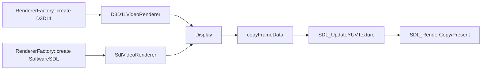
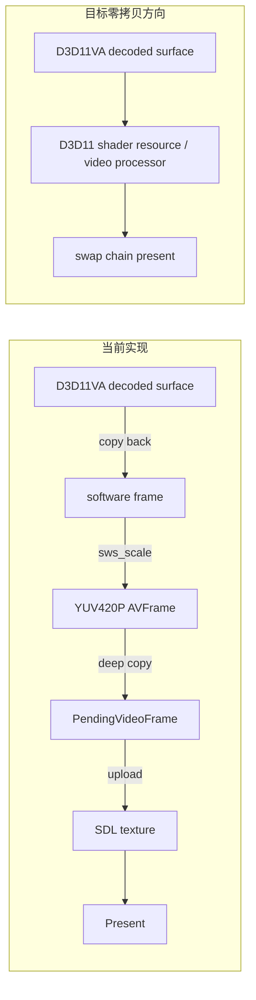

# Day4 结论：当前 D3D11 渲染器只是 SDL/D3D11 驱动偏好，不是解码面到显示面的零拷贝

日期：2026-03-14  
范围：`src/render/renderer_factory.cpp`、`src/render/sdl_video_renderer.cpp`、`src/render/d3d11_video_renderer.cpp`、`src/render/opengl_video_renderer.cpp`、`src/display.cpp`、`src/core/player_core.cpp`

## implementation planner

1. 先读 `renderer_factory`，确认“自动选择后端”和“失败回退”的边界。
2. 再对比 `SdlVideoRenderer` 与 `D3D11VideoRenderer`，确认两者是否共享同一显示实现。
3. 再读 `Display` 的 `renderFrame/copyFrameData/updateTexture/renderLoop`，确认 copy 点和线程边界。
4. 最后回到 `prepareVideoOutputFrame()`，把“硬解输出”与“渲染输入”之间的断点找出来。
5. 基于代码事实输出后端能力矩阵、零拷贝差距图和三条改造路线。

## 先给结论

- Windows 下 `RendererFactory::detectBestRendererType()` 默认返回 `D3D11`，但当前 `D3D11VideoRenderer` 本质上仍然是 `Display` 的包装器。
- `SdlVideoRenderer` 和 `D3D11VideoRenderer` 的共同点远大于差异：两者都把 `VideoFrame.frame` 交给 `Display::renderFrame()`，真正的显示线程、事件处理、字幕叠加、OSD 和 `SDL_UpdateYUVTexture()` 全都走 `Display`。
- `D3D11VideoRenderer` 现在唯一新增的行为是：给 SDL renderer 提一个 `direct3d11` 驱动偏好，并在初始化后校验 SDL 实际选中的 renderer 名称。
- 因为视频帧在进 `Display` 之前已经被 `prepareVideoOutputFrame()` 统一整理成软件 `YUV420P`，所以当前路径不可能是零拷贝。GPU 解码面早就在 `av_hwframe_transfer_data()` 那一步被拉回 CPU 了。
- `OpenGLVideoRenderer` 目前是明确的 stub，`init()` 固定返回 `false`。它现在属于“名义后端”，不属于“可交付后端”。

## 关键文件与函数

| 文件 | 关键函数 | 当前角色 |
| --- | --- | --- |
| `src/render/renderer_factory.cpp:10` | `detectBestRendererType()` | Windows 默认偏向 `D3D11` |
| `src/render/renderer_factory.cpp:19` | `create()` | 创建 `SdlVideoRenderer / D3D11VideoRenderer / OpenGLVideoRenderer` |
| `src/render/sdl_video_renderer.cpp:11` | `SdlVideoRenderer::init()` | 创建 `Display` 并走 SDL 通用显示路径 |
| `src/render/d3d11_video_renderer.cpp:40` | `D3D11VideoRenderer::init()` | 仍创建 `Display`，只是设置 preferred SDL driver |
| `src/render/d3d11_video_renderer.cpp:81` | `D3D11VideoRenderer::renderFrame()` | 仍转发给 `Display::renderFrame()` |
| `src/render/opengl_video_renderer.cpp:6` | `OpenGLVideoRenderer::init()` | 当前未实现 |
| `src/display.cpp:722` | `Display::renderFrame()` | 接收 `AVFrame` 并转成待渲染缓存 |
| `src/display.cpp:763` | `copyFrameData()` | 深拷贝 Y/U/V 平面 |
| `src/display.cpp:700` | `updateTexture()` | `SDL_UpdateYUVTexture()` 纹理上传 |
| `src/display.cpp:826` | `renderLoop()` | 真正执行 `SDL_RenderCopy/Present` |
| `src/core/player_core.cpp:1462` | `prepareVideoOutputFrame()` | 把硬件帧/其他格式统一整理成软件 `YUV420P` |
| `src/core/player_core.cpp:1476` | `av_hwframe_transfer_data()` | 当前零拷贝断点 |
| `src/core/player_core.cpp:1546` | `convertVideoFrameToYuv420()` | 当前统一渲染输入格式的转换点 |

## 当前渲染后端能力矩阵

| 后端 | 当前如何被选中 | 实际显示实现 | 输入帧形态 | 零拷贝能力 | 当前结论 |
| --- | --- | --- | --- | --- | --- |
| `SoftwareSDL` | 显式选中或其他后端失败回退 | `Display` | 软件 `AVFrame(YUV420P)` | 无 | 真实可用主路径 |
| `D3D11` | Windows `Auto` 默认优先 | 仍是 `Display`，只是 SDL renderer 偏好为 `direct3d11` | 软件 `AVFrame(YUV420P)` | 无 | 名称是 D3D11，数据链路仍非零拷贝 |
| `OpenGL` | 显式选中 | 无 | 无 | 无 | 目前不可用 |

## `D3D11VideoRenderer` 与 SDL 渲染路径的真实关系

一句话结论：

- 现在的 `D3D11VideoRenderer` 不是一条独立 GPU 渲染管线，只是“让 SDL 尽量选 D3D11 renderer backend”的一层薄包装。

## 零拷贝差距图

差距不在“后端名字”，而在下面这几个事实：

1. `prepareVideoOutputFrame()` 先把硬件帧拉回软件内存。  
2. `Display` 只接受软件平面数据，不接受 GPU surface/texture。  
3. `D3D11VideoRenderer` 没有自己的 texture/swap chain/video processor 管理。  
4. OSD/字幕也是跟着 `Display` 的 SDL 叠加逻辑走。

## 为什么当前一定属于“硬解 + 回拷 + 上传”

| 代码事实 | 含义 |
| --- | --- |
| `tryConfigureD3D11HardwareDecode()` 只负责给 FFmpeg 绑定 D3D11VA device | 说明硬解只发生在 decode 侧 |
| `prepareVideoOutputFrame()` 命中硬件像素格式后调用 `av_hwframe_transfer_data()` | 说明 decode 结果离开了 GPU surface |
| `convertVideoFrameToYuv420()` 统一输出 `AV_PIX_FMT_YUV420P` | 说明渲染输入被压成软件像素平面 |
| `Display::copyFrameData()` 用 `memcpy` 拷 Y/U/V 平面 | 说明显示层只认 CPU buffer |
| `Display::updateTexture()` 用 `SDL_UpdateYUVTexture()` | 说明真正显示前又做了一次 CPU -> GPU 上传 |

所以当前是：

- 解码在 GPU
- 渲染前处理在 CPU
- 最终显示再回 GPU

这不是零拷贝，也不是“硬解 surface 直接 present”。

## 三条零拷贝改造路线

### 路线 A：保守路线，先消掉 CPU 深拷贝，仍保留 SDL 呈现

| 项目 | 方案 | 代价 | 风险 |
| --- | --- | --- | --- |
| A1 | 让 `Display` 复用外部帧或引用计数帧，而不是 `copyFrameData()` 深拷贝 | 低到中 | 生命周期管理会变复杂，且仍然存在 `SDL_UpdateYUVTexture()` 上传 |
| A2 | 给 `Display` 增加环形 staging buffer，减少重复分配和 memcpy | 低 | 只能减轻 CPU 压力，不是零拷贝 |

适用判断：

- 如果目标是“先把 4K CPU 从 100% 拉下来一点”，这条可以先做。
- 但它不能从根上解决 `hwframe transfer` 和 `texture upload` 两个大头。

### 路线 B：主路线，做真正的 `D3D11VideoRenderer`

| 项目 | 方案 | 代价 | 风险 |
| --- | --- | --- | --- |
| B1 | `D3D11VideoRenderer` 直接接收 `AV_PIX_FMT_D3D11` 帧，维护 D3D11 device/context/swap chain | 中到高 | 需要重写显示层和 OSD 叠加方案 |
| B2 | 使用 shader/video processor 完成颜色空间转换和缩放 | 中 | 需要补齐 YUV/NV12 等格式处理 |
| B3 | 字幕和 OSD 改为 D3D11 overlay/pass | 中 | 现有 `Display` 叠加逻辑无法直接复用 |

适用判断：

- 这是当前项目最值得走的真零拷贝方向。
- 成本高，但和 Day3 暴露出来的 4K CPU 问题是直接对口的。

### 路线 C：进取路线，抽象统一 `GpuFrame` 与多后端渲染层

| 项目 | 方案 | 代价 | 风险 |
| --- | --- | --- | --- |
| C1 | 在 `PlayerCore` 和渲染层之间引入 `GpuFrame / CpuFrame` 双分支 | 高 | 需要重构 `VideoFrame`、滤镜、截图、字幕等边界 |
| C2 | D3D11 先落地，后续再接 OpenGL/Vulkan/Metal 风格后端 | 高 | 设计不好会把复杂度提前摊开 |

适用判断：

- 适合明确要把播放器做成长期多后端演进的平台。
- 不适合作为第一阶段止血方案。

## 技术决策建议

- 短期：先做路线 A 的“减拷贝 + 精准 profiling”，把证据补齐。
- 中期：以路线 B 为主，做真实 `D3D11VideoRenderer` 原型，把 `av_hwframe_transfer_data()` 从热路径移掉。
- 长期：只有在 D3D11 原型成功后，才值得推进路线 C 的统一 GPU 帧抽象。

## Day4 验收标准对应回答

### 1. 为什么当前属于“硬解 + 回拷 + 上传”，不是零拷贝

可以直接用代码回答：`D3D11VA` 硬件帧在 `prepareVideoOutputFrame()` 里被 `av_hwframe_transfer_data()` 拉回软件内存，随后又被转换成 `YUV420P`，再被 `Display::copyFrameData()` 深拷贝，最后通过 `SDL_UpdateYUVTexture()` 上传回 GPU。只要这几步存在，它就不是零拷贝。

### 2. D3D11 渲染器与 SDL 渲染路径的关系

当前关系是“同一条显示链路的两个外观名字”。`D3D11VideoRenderer` 和 `SdlVideoRenderer` 都持有一个 `Display`，都调用相同的 `renderFrame/present/handleEvents`。区别只在初始化时是否给 SDL 一个 `direct3d11` 驱动偏好，以及是否校验 SDL 实际选中的 backend 名字。

### 3. 三条零拷贝改造路线及其代价与风险

可以，见上面的路线 A/B/C：

- A 是减拷贝，不是真零拷贝，代价低，收益有限。  
- B 是真正的 D3D11 独立渲染路径，代价中高，但收益最直接。  
- C 是统一 GPU 帧架构，代价最高，适合长期演进，不适合先止血。
