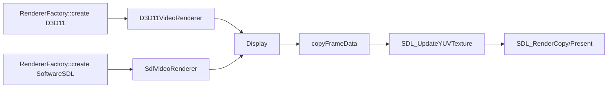

# Day4 缁撹锛氬綋鍓?D3D11 娓叉煋鍣ㄥ彧鏄?SDL/D3D11 椹卞姩鍋忓ソ锛屼笉鏄В鐮侀潰鍒版樉绀洪潰鐨勯浂鎷疯礉

> 补充更新（2026-03-24）：本文关于 `OpenGL` stub 的判断已过期；当前仓库已具备 `OpenGL` M0 最小可用路径，作为 `MVP_RENDERER_BACKEND=opengl` 的显式 opt-in 后端使用。

> 鍘嗗彶璇存槑锛?026-03-18锛夛細鏈枃缁撹瀵瑰簲 2026-03-14 鐨勬棫瀹炵幇銆傚綋鍓嶄粨搴撳凡缁忓叿澶囩嫭绔嬬殑鍘熺敓 D3D11 device/swap chain/video present/subtitle overlay 涓婚摼锛岃浠?[`docs/design/D3D11_NATIVE_RENDER_CHAIN_2026-03-18.md`](../design/D3D11_NATIVE_RENDER_CHAIN_2026-03-18.md) 涓烘渶鏂扮姸鎬佽鏄庛€?鏃ユ湡锛?026-03-14  
鑼冨洿锛歚src/render/renderer_factory.cpp`銆乣src/render/sdl_video_renderer.cpp`銆乣src/render/d3d11_video_renderer.cpp`銆乣src/render/opengl_video_renderer.cpp`銆乣src/display.cpp`銆乣src/core/player_core.cpp`

## implementation planner

1. 鍏堣 `renderer_factory`锛岀‘璁も€滆嚜鍔ㄩ€夋嫨鍚庣鈥濆拰鈥滃け璐ュ洖閫€鈥濈殑杈圭晫銆?2. 鍐嶅姣?`SdlVideoRenderer` 涓?`D3D11VideoRenderer`锛岀‘璁や袱鑰呮槸鍚﹀叡浜悓涓€鏄剧ず瀹炵幇銆?3. 鍐嶈 `Display` 鐨?`renderFrame/copyFrameData/updateTexture/renderLoop`锛岀‘璁?copy 鐐瑰拰绾跨▼杈圭晫銆?4. 鏈€鍚庡洖鍒?`prepareVideoOutputFrame()`锛屾妸鈥滅‖瑙ｈ緭鍑衡€濅笌鈥滄覆鏌撹緭鍏モ€濅箣闂寸殑鏂偣鎵惧嚭鏉ャ€?5. 鍩轰簬浠ｇ爜浜嬪疄杈撳嚭鍚庣鑳藉姏鐭╅樀銆侀浂鎷疯礉宸窛鍥惧拰涓夋潯鏀归€犺矾绾裤€?
## 鍏堢粰缁撹

- Windows 涓?`RendererFactory::detectBestRendererType()` 榛樿杩斿洖 `D3D11`锛屼絾褰撳墠 `D3D11VideoRenderer` 鏈川涓婁粛鐒舵槸 `Display` 鐨勫寘瑁呭櫒銆?- `SdlVideoRenderer` 鍜?`D3D11VideoRenderer` 鐨勫叡鍚岀偣杩滃ぇ浜庡樊寮傦細涓よ€呴兘鎶?`VideoFrame.frame` 浜ょ粰 `Display::renderFrame()`锛岀湡姝ｇ殑鏄剧ず绾跨▼銆佷簨浠跺鐞嗐€佸瓧骞曞彔鍔犮€丱SD 鍜?`SDL_UpdateYUVTexture()` 鍏ㄩ兘璧?`Display`銆?- `D3D11VideoRenderer` 鐜板湪鍞竴鏂板鐨勮涓烘槸锛氱粰 SDL renderer 鎻愪竴涓?`direct3d11` 椹卞姩鍋忓ソ锛屽苟鍦ㄥ垵濮嬪寲鍚庢牎楠?SDL 瀹為檯閫変腑鐨?renderer 鍚嶇О銆?- 鍥犱负瑙嗛甯у湪杩?`Display` 涔嬪墠宸茬粡琚?`prepareVideoOutputFrame()` 缁熶竴鏁寸悊鎴愯蒋浠?`YUV420P`锛屾墍浠ュ綋鍓嶈矾寰勪笉鍙兘鏄浂鎷疯礉銆侴PU 瑙ｇ爜闈㈡棭灏卞湪 `av_hwframe_transfer_data()` 閭ｄ竴姝ヨ鎷夊洖 CPU 浜嗐€?- `OpenGLVideoRenderer` 鐩墠鏄槑纭殑 stub锛宍init()` 鍥哄畾杩斿洖 `false`銆傚畠鐜板湪灞炰簬鈥滃悕涔夊悗绔€濓紝涓嶅睘浜庘€滃彲浜や粯鍚庣鈥濄€?
## 鍏抽敭鏂囦欢涓庡嚱鏁?
| 鏂囦欢 | 鍏抽敭鍑芥暟 | 褰撳墠瑙掕壊 |
| --- | --- | --- |
| `src/render/renderer_factory.cpp:10` | `detectBestRendererType()` | Windows 榛樿鍋忓悜 `D3D11` |
| `src/render/renderer_factory.cpp:19` | `create()` | 鍒涘缓 `SdlVideoRenderer / D3D11VideoRenderer / OpenGLVideoRenderer` |
| `src/render/sdl_video_renderer.cpp:11` | `SdlVideoRenderer::init()` | 鍒涘缓 `Display` 骞惰蛋 SDL 閫氱敤鏄剧ず璺緞 |
| `src/render/d3d11_video_renderer.cpp:40` | `D3D11VideoRenderer::init()` | 浠嶅垱寤?`Display`锛屽彧鏄缃?preferred SDL driver |
| `src/render/d3d11_video_renderer.cpp:81` | `D3D11VideoRenderer::renderFrame()` | 浠嶈浆鍙戠粰 `Display::renderFrame()` |
| `src/render/opengl_video_renderer.cpp:6` | `OpenGLVideoRenderer::init()` | 褰撳墠鏈疄鐜?|
| `src/display.cpp:722` | `Display::renderFrame()` | 鎺ユ敹 `AVFrame` 骞惰浆鎴愬緟娓叉煋缂撳瓨 |
| `src/display.cpp:763` | `copyFrameData()` | 娣辨嫹璐?Y/U/V 骞抽潰 |
| `src/display.cpp:700` | `updateTexture()` | `SDL_UpdateYUVTexture()` 绾圭悊涓婁紶 |
| `src/display.cpp:826` | `renderLoop()` | 鐪熸鎵ц `SDL_RenderCopy/Present` |
| `src/core/player_core.cpp:1462` | `prepareVideoOutputFrame()` | 鎶婄‖浠跺抚/鍏朵粬鏍煎紡缁熶竴鏁寸悊鎴愯蒋浠?`YUV420P` |
| `src/core/player_core.cpp:1476` | `av_hwframe_transfer_data()` | 褰撳墠闆舵嫹璐濇柇鐐?|
| `src/core/player_core.cpp:1546` | `convertVideoFrameToYuv420()` | 褰撳墠缁熶竴娓叉煋杈撳叆鏍煎紡鐨勮浆鎹㈢偣 |

## 褰撳墠娓叉煋鍚庣鑳藉姏鐭╅樀

| 鍚庣 | 褰撳墠濡備綍琚€変腑 | 瀹為檯鏄剧ず瀹炵幇 | 杈撳叆甯у舰鎬?| 闆舵嫹璐濊兘鍔?| 褰撳墠缁撹 |
| --- | --- | --- | --- | --- | --- |
| `SoftwareSDL` | 鏄惧紡閫変腑鎴栧叾浠栧悗绔け璐ュ洖閫€ | `Display` | 杞欢 `AVFrame(YUV420P)` | 鏃?| 鐪熷疄鍙敤涓昏矾寰?|
| `D3D11` | Windows `Auto` 榛樿浼樺厛 | 浠嶆槸 `Display`锛屽彧鏄?SDL renderer 鍋忓ソ涓?`direct3d11` | 杞欢 `AVFrame(YUV420P)` | 鏃?| 鍚嶇О鏄?D3D11锛屾暟鎹摼璺粛闈為浂鎷疯礉 |
| `OpenGL` | 鏄惧紡閫変腑 | 鏃?| 鏃?| 鏃?| 鐩墠涓嶅彲鐢?|

## `D3D11VideoRenderer` 涓?SDL 娓叉煋璺緞鐨勭湡瀹炲叧绯?


涓€鍙ヨ瘽缁撹锛?
- 鐜板湪鐨?`D3D11VideoRenderer` 涓嶆槸涓€鏉＄嫭绔?GPU 娓叉煋绠＄嚎锛屽彧鏄€滆 SDL 灏介噺閫?D3D11 renderer backend鈥濈殑涓€灞傝杽鍖呰銆?
## 闆舵嫹璐濆樊璺濆浘

```mermaid
flowchart LR
    subgraph Current[褰撳墠瀹炵幇]
        A1[D3D11VA decoded surface] -->|copy back| A2[software frame]
        A2 -->|sws_scale| A3[YUV420P AVFrame]
        A3 -->|deep copy| A4[PendingVideoFrame]
        A4 -->|upload| A5[SDL texture]
        A5 --> A6[Present]
    end

    subgraph Target[鐩爣闆舵嫹璐濇柟鍚慮
        B1[D3D11VA decoded surface] --> B2[D3D11 shader resource / video processor]
        B2 --> B3[swap chain present]
    end
```

宸窛涓嶅湪鈥滃悗绔悕瀛椻€濓紝鑰屽湪涓嬮潰杩欏嚑涓簨瀹烇細

1. `prepareVideoOutputFrame()` 鍏堟妸纭欢甯ф媺鍥炶蒋浠跺唴瀛樸€? 
2. `Display` 鍙帴鍙楄蒋浠跺钩闈㈡暟鎹紝涓嶆帴鍙?GPU surface/texture銆? 
3. `D3D11VideoRenderer` 娌℃湁鑷繁鐨?texture/swap chain/video processor 绠＄悊銆? 
4. OSD/瀛楀箷涔熸槸璺熺潃 `Display` 鐨?SDL 鍙犲姞閫昏緫璧般€?
## 涓轰粈涔堝綋鍓嶄竴瀹氬睘浜庘€滅‖瑙?+ 鍥炴嫹 + 涓婁紶鈥?
| 浠ｇ爜浜嬪疄 | 鍚箟 |
| --- | --- |
| `tryConfigureD3D11HardwareDecode()` 鍙礋璐ｇ粰 FFmpeg 缁戝畾 D3D11VA device | 璇存槑纭В鍙彂鐢熷湪 decode 渚?|
| `prepareVideoOutputFrame()` 鍛戒腑纭欢鍍忕礌鏍煎紡鍚庤皟鐢?`av_hwframe_transfer_data()` | 璇存槑 decode 缁撴灉绂诲紑浜?GPU surface |
| `convertVideoFrameToYuv420()` 缁熶竴杈撳嚭 `AV_PIX_FMT_YUV420P` | 璇存槑娓叉煋杈撳叆琚帇鎴愯蒋浠跺儚绱犲钩闈?|
| `Display::copyFrameData()` 鐢?`memcpy` 鎷?Y/U/V 骞抽潰 | 璇存槑鏄剧ず灞傚彧璁?CPU buffer |
| `Display::updateTexture()` 鐢?`SDL_UpdateYUVTexture()` | 璇存槑鐪熸鏄剧ず鍓嶅張鍋氫簡涓€娆?CPU -> GPU 涓婁紶 |

鎵€浠ュ綋鍓嶆槸锛?
- 瑙ｇ爜鍦?GPU
- 娓叉煋鍓嶅鐞嗗湪 CPU
- 鏈€缁堟樉绀哄啀鍥?GPU

杩欎笉鏄浂鎷疯礉锛屼篃涓嶆槸鈥滅‖瑙?surface 鐩存帴 present鈥濄€?
## 涓夋潯闆舵嫹璐濇敼閫犺矾绾?
### 璺嚎 A锛氫繚瀹堣矾绾匡紝鍏堟秷鎺?CPU 娣辨嫹璐濓紝浠嶄繚鐣?SDL 鍛堢幇

| 椤圭洰 | 鏂规 | 浠ｄ环 | 椋庨櫓 |
| --- | --- | --- | --- |
| A1 | 璁?`Display` 澶嶇敤澶栭儴甯ф垨寮曠敤璁℃暟甯э紝鑰屼笉鏄?`copyFrameData()` 娣辨嫹璐?| 浣庡埌涓?| 鐢熷懡鍛ㄦ湡绠＄悊浼氬彉澶嶆潅锛屼笖浠嶇劧瀛樺湪 `SDL_UpdateYUVTexture()` 涓婁紶 |
| A2 | 缁?`Display` 澧炲姞鐜舰 staging buffer锛屽噺灏戦噸澶嶅垎閰嶅拰 memcpy | 浣?| 鍙兘鍑忚交 CPU 鍘嬪姏锛屼笉鏄浂鎷疯礉 |

閫傜敤鍒ゆ柇锛?
- 濡傛灉鐩爣鏄€滃厛鎶?4K CPU 浠?100% 鎷変笅鏉ヤ竴鐐光€濓紝杩欐潯鍙互鍏堝仛銆?- 浣嗗畠涓嶈兘浠庢牴涓婅В鍐?`hwframe transfer` 鍜?`texture upload` 涓や釜澶уご銆?
### 璺嚎 B锛氫富璺嚎锛屽仛鐪熸鐨?`D3D11VideoRenderer`

| 椤圭洰 | 鏂规 | 浠ｄ环 | 椋庨櫓 |
| --- | --- | --- | --- |
| B1 | `D3D11VideoRenderer` 鐩存帴鎺ユ敹 `AV_PIX_FMT_D3D11` 甯э紝缁存姢 D3D11 device/context/swap chain | 涓埌楂?| 闇€瑕侀噸鍐欐樉绀哄眰鍜?OSD 鍙犲姞鏂规 |
| B2 | 浣跨敤 shader/video processor 瀹屾垚棰滆壊绌洪棿杞崲鍜岀缉鏀?| 涓?| 闇€瑕佽ˉ榻?YUV/NV12 绛夋牸寮忓鐞?|
| B3 | 瀛楀箷鍜?OSD 鏀逛负 D3D11 overlay/pass | 涓?| 鐜版湁 `Display` 鍙犲姞閫昏緫鏃犳硶鐩存帴澶嶇敤 |

閫傜敤鍒ゆ柇锛?
- 杩欐槸褰撳墠椤圭洰鏈€鍊煎緱璧扮殑鐪熼浂鎷疯礉鏂瑰悜銆?- 鎴愭湰楂橈紝浣嗗拰 Day3 鏆撮湶鍑烘潵鐨?4K CPU 闂鏄洿鎺ュ鍙ｇ殑銆?
### 璺嚎 C锛氳繘鍙栬矾绾匡紝鎶借薄缁熶竴 `GpuFrame` 涓庡鍚庣娓叉煋灞?
| 椤圭洰 | 鏂规 | 浠ｄ环 | 椋庨櫓 |
| --- | --- | --- | --- |
| C1 | 鍦?`PlayerCore` 鍜屾覆鏌撳眰涔嬮棿寮曞叆 `GpuFrame / CpuFrame` 鍙屽垎鏀?| 楂?| 闇€瑕侀噸鏋?`VideoFrame`銆佹护闀溿€佹埅鍥俱€佸瓧骞曠瓑杈圭晫 |
| C2 | D3D11 鍏堣惤鍦帮紝鍚庣画鍐嶆帴 OpenGL/Vulkan/Metal 椋庢牸鍚庣 | 楂?| 璁捐涓嶅ソ浼氭妸澶嶆潅搴︽彁鍓嶆憡寮€ |

閫傜敤鍒ゆ柇锛?
- 閫傚悎鏄庣‘瑕佹妸鎾斁鍣ㄥ仛鎴愰暱鏈熷鍚庣婕旇繘鐨勫钩鍙般€?- 涓嶉€傚悎浣滀负绗竴闃舵姝㈣鏂规銆?
## 鎶€鏈喅绛栧缓璁?
- 鐭湡锛氬厛鍋氳矾绾?A 鐨勨€滃噺鎷疯礉 + 绮惧噯 profiling鈥濓紝鎶婅瘉鎹ˉ榻愩€?- 涓湡锛氫互璺嚎 B 涓轰富锛屽仛鐪熷疄 `D3D11VideoRenderer` 鍘熷瀷锛屾妸 `av_hwframe_transfer_data()` 浠庣儹璺緞绉绘帀銆?- 闀挎湡锛氬彧鏈夊湪 D3D11 鍘熷瀷鎴愬姛鍚庯紝鎵嶅€煎緱鎺ㄨ繘璺嚎 C 鐨勭粺涓€ GPU 甯ф娊璞°€?
## Day4 楠屾敹鏍囧噯瀵瑰簲鍥炵瓟

### 1. 涓轰粈涔堝綋鍓嶅睘浜庘€滅‖瑙?+ 鍥炴嫹 + 涓婁紶鈥濓紝涓嶆槸闆舵嫹璐?
鍙互鐩存帴鐢ㄤ唬鐮佸洖绛旓細`D3D11VA` 纭欢甯у湪 `prepareVideoOutputFrame()` 閲岃 `av_hwframe_transfer_data()` 鎷夊洖杞欢鍐呭瓨锛岄殢鍚庡張琚浆鎹㈡垚 `YUV420P`锛屽啀琚?`Display::copyFrameData()` 娣辨嫹璐濓紝鏈€鍚庨€氳繃 `SDL_UpdateYUVTexture()` 涓婁紶鍥?GPU銆傚彧瑕佽繖鍑犳瀛樺湪锛屽畠灏变笉鏄浂鎷疯礉銆?
### 2. D3D11 娓叉煋鍣ㄤ笌 SDL 娓叉煋璺緞鐨勫叧绯?
褰撳墠鍏崇郴鏄€滃悓涓€鏉℃樉绀洪摼璺殑涓や釜澶栬鍚嶅瓧鈥濄€俙D3D11VideoRenderer` 鍜?`SdlVideoRenderer` 閮芥寔鏈変竴涓?`Display`锛岄兘璋冪敤鐩稿悓鐨?`renderFrame/present/handleEvents`銆傚尯鍒彧鍦ㄥ垵濮嬪寲鏃舵槸鍚︾粰 SDL 涓€涓?`direct3d11` 椹卞姩鍋忓ソ锛屼互鍙婃槸鍚︽牎楠?SDL 瀹為檯閫変腑鐨?backend 鍚嶅瓧銆?
### 3. 涓夋潯闆舵嫹璐濇敼閫犺矾绾垮強鍏朵唬浠蜂笌椋庨櫓

鍙互锛岃涓婇潰鐨勮矾绾?A/B/C锛?
- A 鏄噺鎷疯礉锛屼笉鏄湡闆舵嫹璐濓紝浠ｄ环浣庯紝鏀剁泭鏈夐檺銆? 
- B 鏄湡姝ｇ殑 D3D11 鐙珛娓叉煋璺緞锛屼唬浠蜂腑楂橈紝浣嗘敹鐩婃渶鐩存帴銆? 
- C 鏄粺涓€ GPU 甯ф灦鏋勶紝浠ｄ环鏈€楂橈紝閫傚悎闀挎湡婕旇繘锛屼笉閫傚悎鍏堟琛€銆?

