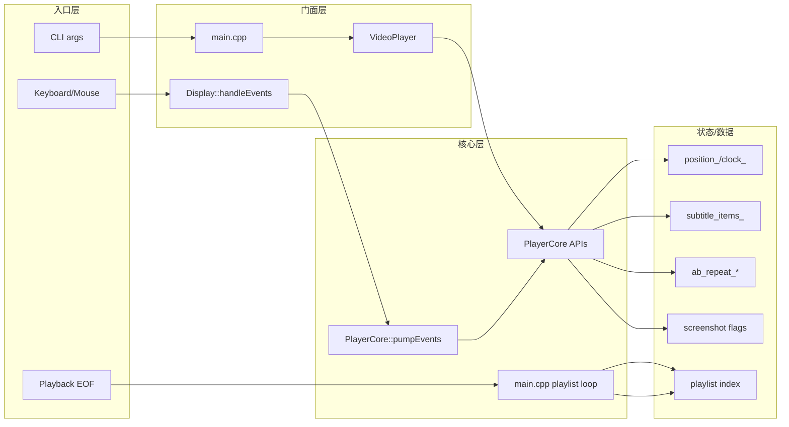
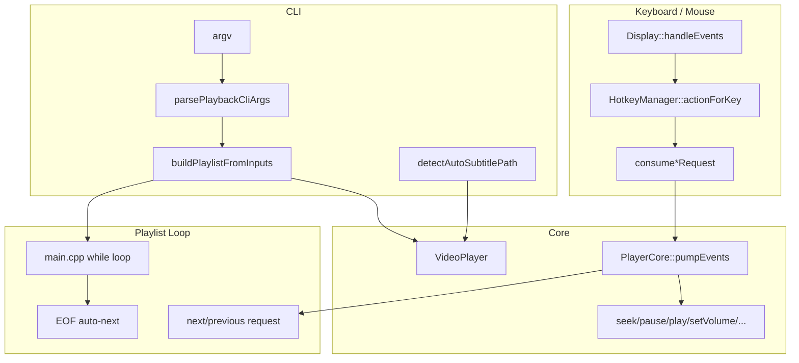

# Day5 结论：功能入口分三层，`Display/CLI` 负责产生请求，`PlayerCore::pumpEvents()` 和 `main.cpp` 负责把请求落到核心状态

日期：2026-03-14  
范围：`src/main.cpp`、`src/video_player.cpp`、`src/core/player_core.cpp`、`src/display.cpp`、`src/playlist/playlist_manager.cpp`、`src/subtitle/srt_parser.cpp`、`src/subtitle/subtitle_timeline.cpp`、`src/input/hotkey_manager.cpp`、`docs/guides/PLAYER_FEATURES_USAGE_VALIDATION.md`

## implementation planner

1. 先从 `main.cpp` 看普通播放模式的 CLI 入口、播放列表构建和主循环。
2. 再看 `VideoPlayer`，确认它是门面层还是功能实际落点。
3. 再读 `Display::handleEvents()` 和 `PlayerCore::pumpEvents()`，把“键鼠事件 -> 核心动作”链路串起来。
4. 分专题补读字幕、播放列表、章节、AB Repeat、截图、帧步进。
5. 最后结合 `PLAYER_FEATURES_USAGE_VALIDATION.md`，区分“终端用户功能”和“验收/开发能力”。

## 先给结论

- 这个项目的功能入口主要分三层：
  - CLI 入口在 `main.cpp`
  - 运行时键鼠入口在 `Display::handleEvents()`
  - 核心状态落点在 `PlayerCore`，其中事件分发枢纽是 `PlayerCore::pumpEvents()`
- `VideoPlayer` 是非常薄的门面层。它主要做三件事：
  - 对外暴露简单 API
  - 缓存一部分用户态配置
  - 把底层 `PlayerCore` 的状态回调同步到门面缓存
- 播放列表的“上一项 / 下一项 / EOF 自动切换”并不在 `PlayerCore` 内部闭环完成，而是在 `main.cpp` 的播放循环中收 `consumeNextItemRequest()` / `consumePreviousItemRequest()` / EOF 停止后决定切哪一项。
- 字幕链路已经是完整用户能力：CLI/自动探测加载 `SRT`，运行时按 `position_ - subtitle_delay` 匹配文本，再由渲染器叠加显示。
- 插件、流媒体缓冲、ABR、格式探测等能力虽然有入口和本地验收，但它们里有一部分仍然是“开发/验收能力”，不应该和普通用户播放功能混为一谈。

## 功能分层图



## 关键文件与函数

| 文件 | 关键函数 | 作用 |
| --- | --- | --- |
| `src/main.cpp:769` | `parsePlaybackCliArgs()` | 解析普通播放模式命令行 |
| `src/main.cpp:802` | `buildPlaylistFromInputs()` | 把单文件、多文件、本地 `m3u8` 统一成播放列表 |
| `src/main.cpp:821` | `detectAutoSubtitlePath()` | 自动探测同名 `SRT` |
| `src/main.cpp:3491` | 播放列表初始化 | 从 CLI 输入恢复成运行时播放列表 |
| `src/main.cpp:3517` | 主播放循环 | 控制 open/play/stop/close 和 playlist index |
| `src/main.cpp:3555` | `consumeNextItemRequest()` | 处理用户请求下一项 |
| `src/main.cpp:3588` | EOF 自动下一项 | 播放结束后自动推进播放列表 |
| `src/video_player.cpp:30` | `VideoPlayer::open()` | 门面层转发打开并补下发配置 |
| `src/video_player.cpp:154` | `VideoPlayer::pumpEvents()` | 门面层把事件泵转发给 `PlayerCore` |
| `src/video_player.cpp:277` | `loadExternalSubtitle()` | 校验并解析外挂 `SRT` |
| `src/display.cpp:941` | `Display::handleEvents()` | 键盘/鼠标 -> 一次性请求标志 |
| `src/core/player_core.cpp:630` | `PlayerCore::pumpEvents()` | 请求消费中心，真正落到 Core API |
| `src/core/player_core.cpp:470` | `seekToNextChapter()` | 章节跳转 |
| `src/core/player_core.cpp:516` | `setABRepeatStart()` | 设 A 点 |
| `src/core/player_core.cpp:537` | `setABRepeatEnd()` | 设 B 点并开启循环 |
| `src/core/player_core.cpp:594` | `requestScreenshot()` | 截图请求 |
| `src/core/player_core.cpp:1037` | `setAudioDelay()` | 音频延迟调节 |
| `src/core/player_core.cpp:1049` | `setSubtitleDelay()` | 字幕延迟调节 |
| `src/core/player_core.cpp:1085` | `setExternalSubtitles()` | 挂载字幕时间线 |
| `src/core/player_core.cpp:1168` | `toggleSubtitleEnabled()` | 字幕开关 |
| `src/core/player_core.cpp:2085` | `updateSubtitleOverlay()` | 当前位置映射到字幕文本 |
| `src/subtitle/subtitle_timeline.cpp:18` | `resolveActiveSubtitleIndex()` | 高效定位当前命中字幕 |
| `src/playlist/playlist_manager.cpp:56` | `loadM3U8()` | 从本地 `m3u8` 重建播放列表 |
| `src/playlist/playlist_manager.cpp:102` | `saveM3U8()` | 导出播放列表 |
| `src/input/hotkey_manager.cpp:125` | `resetToDefaults()` | 默认热键表 |
| `src/input/hotkey_manager.cpp:171` | `actionForKey()` | 按键码 -> 语义动作 |

## 事件入口总图



## 功能映射表（不少于 12 项）

| 功能 | 起点 | 中间枢纽 | 落点函数 | 状态/数据变化 | 当前定位 |
| --- | --- | --- | --- | --- | --- |
| 播放/暂停 | `Space` / UI | `Display::consumeTogglePauseRequest()` -> `PlayerCore::pumpEvents()` | `pause()` / `play()` | `state_`、`clock_`、音频设备状态 | 用户可直接使用 |
| 相对 seek | `Left/Right`、`Ctrl+Left/Right` | `consumeSeekDeltaRequest()` | `seek(target)` | `position_`、时钟、队列 | 用户可直接使用 |
| 百分比 seek | `1..9` | `consumeSeekRequest()` | `seek(duration * ratio)` | 同上 | 用户可直接使用 |
| 鼠标拖动进度条 | `Display::updateSeekFromMouse()` | `consumeSeekRequest()` | `seek()` | 同上 | 用户可直接使用 |
| 音量增减/静音 | `Up/Down/+/-/M` 或鼠标拖音量条 | `consumeVolumeChangeRequest()` | `setVolume()` | `volume_`、`AudioPlayer` 音量 | 用户可直接使用 |
| 倍速调节/恢复 | `[` `]` `R` | `consumeSpeedChangeRequest()` / `consumeResetSpeedRequest()` | `setPlaybackSpeed()` | `speed_`、`clock_.speed` | 用户可直接使用 |
| 上一章/下一章 | `Home/End` | `consumePreviousChapterRequest()` / `consumeNextChapterRequest()` | `seekToPreviousChapter()` / `seekToNextChapter()` | `position_` 跳转 | 用户可直接使用 |
| 上一项/下一项 | `PageUp/PageDown` | `consumePreviousItemRequest()` / `consumeNextItemRequest()` | `main.cpp` 改 `current_index` | 播放列表索引 | 用户可直接使用 |
| EOF 自动下一项 | 播放结束 | `main.cpp` 播放循环 | `++current_index` | 播放列表索引 | 用户可直接使用 |
| 外挂字幕加载 | `--subtitle` 或自动探测 | `VideoPlayer::loadExternalSubtitle()` | `setExternalSubtitles()` | `subtitle_items_`、`subtitle_source_path_` | 用户可直接使用 |
| 字幕开关 | `V` | `consumeToggleSubtitleRequest()` | `toggleSubtitleEnabled()` | `subtitle_enabled_` | 用户可直接使用 |
| 字幕延迟 | `J/K` | `consumeSubtitleDelayChangeRequest()` | `setSubtitleDelay()` | `subtitle_delay_seconds_` | 用户可直接使用 |
| 音频延迟 | `Ctrl+J/Ctrl+K` | `consumeAudioDelayChangeRequest()` | `setAudioDelay()` | `audio_delay_seconds_` | 用户可直接使用 |
| A-B Repeat | `A/B/C` | `consumeSetABRepeat*Request()` | `setABRepeatStart/End()` / `clearABRepeat()` | `ab_repeat_*` | 用户可直接使用 |
| 帧步进 | `,` `.` | `consumeStepFrame*Request()` | `stepFrameBackward/Forward()` | seek + 暂停态渲染定位 | 用户可直接使用 |
| 截图 | `S` | `consumeScreenshotRequest()` | `requestScreenshot()` | `screenshot_requested_` / 文件输出 | 用户可直接使用 |
| 本地 `m3u8` 列表 | CLI 单个 `.m3u8` | `buildPlaylistFromInputs()` | `PlaylistManager::loadM3U8()` | `PlaylistManager.items_` | 用户可直接使用 |
| 热键自定义 | `config/player_settings.ini` | `loadHotkeySettings()` | `HotkeyManager::bind()` | `action_to_key_` | 用户可直接使用 |
| `--probe-file` / `--capabilities` | CLI | `main.cpp` 命令分支 | 各 check/probe 函数 | 控制台输出 | 开发/验收能力 |
| `--plugin-check` / `--streaming-buffer-check` / `--adaptive-bitrate-check` | CLI | `main.cpp` 命令分支 | 专项验收函数 | 控制台输出 | 主要是开发/验收能力 |

## 功能完成度分级表

### A. 可直接给终端用户使用

- 本地文件播放
- 多文件/本地 `m3u8` 播放列表
- 外挂 `SRT` 与同名字幕自动探测
- 播放/暂停、seek、音量、静音、倍速
- 章节跳转
- A-B Repeat
- 帧步进
- 截图
- 热键系统与设置持久化

这些能力的共同特点是：

- 有普通播放模式入口
- 有运行时交互入口
- 落点在 `PlayerCore` 的真实状态更新逻辑中

### B. 已有实现，但更偏开发/验收能力

- `--capabilities`
- `--probe-file`
- `--evaluate-target`
- `--subtitle-sync-check`
- `--playlist-flow-check`
- `--chapter-nav-check`
- `--ab-repeat-check`
- `--frame-step-check`
- `--delay-adjust-check`
- `--numeric-seek-check`
- `--screenshot-check`
- `--performance-log-check`
- `--1080p60-check`
- `--4k-playback-check`
- `--high-bitrate-check`
- `--long-playback-check`
- `--renderer-fallback-check`
- `--windows-backend-check`

这些能力的共同特点是：

- 有 CLI 命令入口
- 主要输出日志/统计/报告
- 不是普通用户日常播放路径的一部分

### C. 基础设施已在，但不能误判为完整用户功能

- 插件系统
- 流媒体缓冲
- HLS/DASH 自适应码率
- `OpenGL` 渲染后端

判断标准：

- 代码里有能力或专项验收入口
- 但没有完整的终端用户播放闭环、界面或稳定主路径

## 最短功能回归路径

如果只想用最少命令覆盖 Day5 关注的功能链，最短集合可以是：

```powershell
.\build\Debug\modern-video-player.exe .\video1.mp4 .\video2.mkv --subtitle .\video1.srt
.\build\Debug\modern-video-player.exe --playlist-flow-check <media1> <media2> <media3> <media4> <media5>
.\build\Debug\modern-video-player.exe --chapter-nav-check <media_file>
.\build\Debug\modern-video-player.exe --ab-repeat-check <media_file>
.\build\Debug\modern-video-player.exe --frame-step-check <media_file>
.\build\Debug\modern-video-player.exe --delay-adjust-check <media_file> <subtitle.srt>
.\build\Debug\modern-video-player.exe --numeric-seek-check <media_file>
.\build\Debug\modern-video-player.exe --screenshot-check <media_file>
```

这组命令基本覆盖：

- 播放列表
- 字幕
- 章节
- A-B Repeat
- 帧步进
- 时延调节
- 数字 seek
- 截图

## Day5 验收标准对应回答

### 1. 每个核心功能的调用起点和落点

可以。当前大部分交互功能都遵循同一模式：

- 起点在 `CLI` 或 `Display::handleEvents()`  
- 枢纽在 `PlayerCore::pumpEvents()`  
- 落点在 `PlayerCore` 的具体 API，如 `seek()`、`setVolume()`、`toggleSubtitleEnabled()`、`setABRepeatStart()` 等

例外是播放列表切项：

- `PlayerCore` 只负责把“下一项/上一项请求”变成标志和状态切换
- 真正的索引推进在 `main.cpp` 的播放循环里完成

### 2. 如何区分“用户可直接用”与“仅验收能力”

标准很简单：

- 终端用户功能要有普通播放入口和运行时交互闭环。  
- 验收能力通常只有 CLI 命令入口，输出的是检查结果、统计指标或报告。  
- 流媒体/插件/ABR 这类能力虽然已经实现并可本地验收，但还不等于完整用户功能。

### 3. 可执行的功能回归最短路径

可以，见上面的“最短功能回归路径”。如果只跑一轮，就先跑普通播放 + 字幕 + 列表，再补 `chapter / AB / frame-step / delay / numeric-seek / screenshot` 六类 CLI 检查即可。
