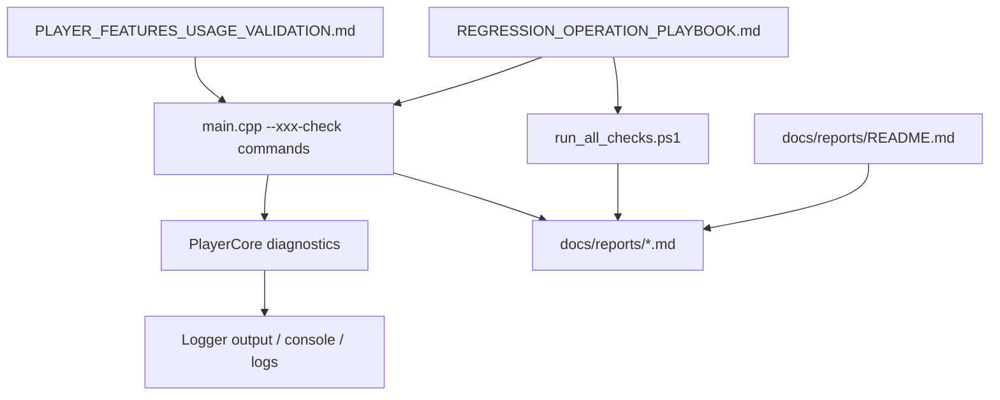
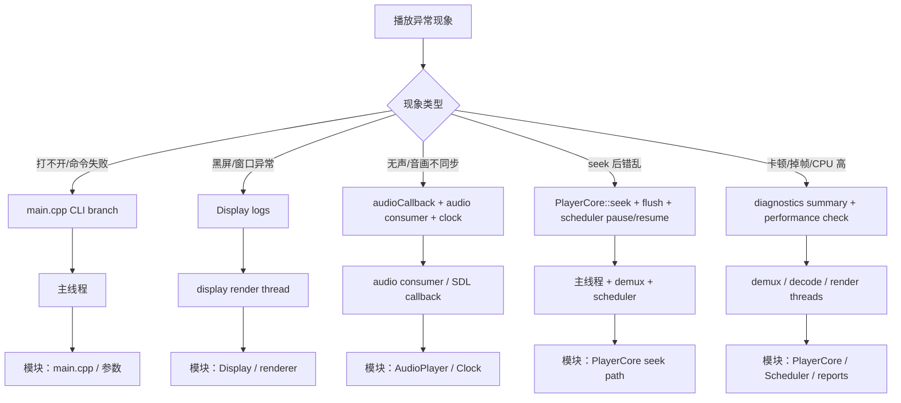

# Day6 结论：当前回归体系是“文档手册 + CLI 验收命令 + 报告沉淀 + 轻量脚本 + 诊断日志”五层拼出来的，不是单一总控脚本

日期：2026-03-14  
范围：`docs/workflows/REGRESSION_OPERATION_PLAYBOOK.md`、`docs/reports/README.md`、`docs/guides/PLAYER_FEATURES_USAGE_VALIDATION.md`、`tools/run_all_checks.ps1`、`src/main.cpp`、`src/core/player_core.cpp`、`src/core/scheduler.cpp`、`include/logger.h`、`src/logger.cpp`

## implementation planner

1. 先读 `REGRESSION_OPERATION_PLAYBOOK.md` 和 `docs/reports/README.md`，确认回归入口和报告组织方式。
2. 再读 `PLAYER_FEATURES_USAGE_VALIDATION.md`，把“功能 -> 命令 -> 报告”映射补齐。
3. 再读 `tools/run_all_checks.ps1`，确认这个脚本到底覆盖了多少内容。
4. 最后回到代码，看 `main.cpp` 命令分发、`PlayerCore::getDiagnosticsSnapshot()`、`maybeLogDiagnostics()` 和 `Logger`。
5. 产出最短回归命令清单、日志速查表、报告模板和故障排查路径图。

## 先给结论

- 当前项目的回归体系不是一条脚本包打天下，而是 5 层叠起来的：
  - 操作手册层：告诉你怎么编译、准备样本、跑什么命令
  - CLI 验收层：`main.cpp` 里分支出来的一组 `--xxx-check`
  - 报告沉淀层：`docs/reports/*.md`
  - 快速 smoke 层：`tools/run_all_checks.ps1`
  - 运行时诊断层：`PlayerCore::maybeLogDiagnostics()` 和 `DiagnosticsSnapshot`
- `run_all_checks.ps1` 很有用，但它只做了两件事：
  - `--probe-file --json`
  - `tools/format_regression/run_format_regression.ps1`
  它不是 seek/字幕/播放列表/性能/章节/A-B 的全量回归脚本。
- 真正完整的本地回归，仍然要靠 `PLAYER_FEATURES_USAGE_VALIDATION.md` 里的命令分项执行。
- 日志定位的最快路径是：先看 CLI 输出和对应报告，再看 `PlayerCore` 每秒诊断汇总，再回到具体线程函数。
- 现在的问题不是“没有回归体系”，而是“体系是分散的”。这让它适合人工定位，但不够像一个统一的自动化回归入口。

## 回归体系总图



## 最短回归命令清单

### 1. 环境/基础健康检查

```powershell
& 'C:\Program Files\Microsoft Visual Studio\2022\Community\MSBuild\Current\Bin\MSBuild.exe' `
  build\modern-video-player.sln `
  /t:modern-video-player `
  /p:Configuration=Debug `
  /p:Platform=x64

powershell -ExecutionPolicy Bypass -File .\tools\download_test_samples.ps1
powershell -ExecutionPolicy Bypass -File .\tools\run_all_checks.ps1
.\build\Debug\modern-video-player.exe --capabilities
.\build\Debug\modern-video-player.exe --probe-file .\juren-30s.mp4 --json
```

这组命令回答的是：

- 能不能构建
- 样本在不在
- 基础探测和格式矩阵是否健康

### 2. 功能最短回归集

```powershell
.\build\Debug\modern-video-player.exe --subtitle-sync-check <subtitle.srt>
.\build\Debug\modern-video-player.exe --playlist-flow-check <media1> <media2> <media3> <media4> <media5>
.\build\Debug\modern-video-player.exe --chapter-nav-check <media_file>
.\build\Debug\modern-video-player.exe --ab-repeat-check <media_file>
.\build\Debug\modern-video-player.exe --frame-step-check <media_file>
.\build\Debug\modern-video-player.exe --delay-adjust-check <media_file> <subtitle.srt>
.\build\Debug\modern-video-player.exe --numeric-seek-check <media_file>
.\build\Debug\modern-video-player.exe --screenshot-check <media_file>
```

### 3. 性能/稳定性最短回归集

```powershell
.\build\Debug\modern-video-player.exe --performance-log-check <media_file> 5000
.\build\Debug\modern-video-player.exe --1080p60-check <media_file> 5000
.\build\Debug\modern-video-player.exe --4k-playback-check <media_file> 5000
.\build\Debug\modern-video-player.exe --high-bitrate-check <media_file> 5000
.\build\Debug\modern-video-player.exe --long-playback-check <media_file> 5000
```

### 4. 后端/平台/基础设施回归集

```powershell
.\build\Debug\modern-video-player.exe --renderer-fallback-check <media_file>
.\build\Debug\modern-video-player.exe --windows-backend-check <media_file>
.\build\Debug\modern-video-player.exe --plugin-check [plugin_dir_or_file]
.\build\Debug\modern-video-player.exe --streaming-buffer-check <playlist_url> [segment_limit] [target_buffer_bytes]
.\build\Debug\modern-video-player.exe --adaptive-bitrate-check <manifest_url> <bandwidth_samples_csv> [segment_limit] [target_buffer_bytes]
```

## `run_all_checks.ps1` 的真实覆盖范围

| 脚本步骤 | 文件位置 | 作用 | 没覆盖什么 |
| --- | --- | --- | --- |
| `--probe-file --json` | `tools/run_all_checks.ps1` | 单文件能力探测 | 不覆盖 seek、字幕、播放列表、性能 |
| `run_format_regression.ps1` | `tools/run_all_checks.ps1` | 批量格式探测回归 | 不覆盖运行时播放交互 |

结论：

- 它更像“日常健康检查”和“格式矩阵 smoke”。
- 它不是完整的播放器行为回归伞。

## 日志定位速查表

| 模块 | 关键入口 | 线程/上下文 | 典型问题 |
| --- | --- | --- | --- |
| 命令分发 | `src/main.cpp:3131` 起的帮助与 `3183+` 分支 | 主线程 | 命令输错、参数不全、跑错模式 |
| Demux | `src/core/player_core.cpp:1678`、`1837` | demux 线程 | packet push retry、drop、EOF 收口 |
| 视频解码 | `src/core/player_core.cpp:1871`、`1837` | scheduler 视频解码线程 | 解码不出帧、硬解/软解行为异常 |
| 音频解码 | `src/core/player_core.cpp:1934`、`1837` | scheduler 音频解码线程 | 音频帧空、重采样异常 |
| 渲染调度 | `src/core/scheduler.cpp:194` | scheduler 渲染线程 | `wait_events`、`late_drops`、A/V 对齐异常 |
| 显示层 | `src/display.cpp:700`、`826` | display 渲染线程 | 纹理更新失败、黑屏、窗口重建问题 |
| 音频播放 | `src/audio_player.cpp:85`、`183` | audio consumer / SDL callback | 无声、缓冲过深、主时钟不推进 |
| 诊断汇总 | `src/core/player_core.cpp:993`、`1837` | 多线程触发但按秒节流输出 | 快速看整体健康度 |
| Logger | `include/logger.h`、`src/logger.cpp` | 全局 | 看日志级别、输出落点、是否启用 Quill |
| 报告沉淀 | `docs/reports/*.md` | 文档层 | 查历史验收和命令样例 |

## 故障排查路径图



## 一份可复制的报告模板

````markdown
# 本地验收：<标题>

- 日期：`YYYY-MM-DD`
- 目标：验证 `<功能/场景>`
- 样本：`<path or url>`
- 环境：`Debug/Release + renderer/decoder backend`

## 执行命令

```powershell
<command>
```

## 输出摘要

```text
<key=value lines>
```

## 现象

- <用户可见现象>

## 证据

- 日志入口：`<file:line>`
- 指标：`<metric=value>`
- 线程：`<thread>`

## 结论

- <根因判断>

## 风险 / 后续动作

- <仍未覆盖的边界>
````

## 为什么说当前体系是“分散但可用”

- 可用，是因为：
  - 文档已经把命令和报告串起来了
  - `main.cpp` 的 CLI 验收入口足够全
  - `PlayerCore` 诊断日志能给到线程级指标
- 分散，是因为：
  - `run_all_checks.ps1` 没有把大多数播放行为检查纳进来
  - 功能验收依赖多个独立命令和多份报告
  - 没有一条统一脚本把“功能 + 性能 + 平台后端”串成全量回归

## Day6 验收标准对应回答

### 1. 从任一播放异常现象快速定位到对应日志入口

可以。最快方法是先按现象分类：

- 打不开：先看 `main.cpp` 命令分支和参数  
- 黑屏：看 `Display::updateTexture/renderLoop`  
- 无声或主时钟不动：看 `AudioPlayer::audioCallback` 和 `startAudioConsumer()`  
- seek 乱序：看 `PlayerCore::seek()` 和 Day2 seek 顺序  
- 卡顿掉帧：先看 `maybeLogDiagnostics()` 的 demux/dec/render/clock 摘要

### 2. 15 分钟内列出一次完整回归所需命令

可以，直接用上面的四组命令清单即可。真正最短的完整顺序是：

1. 编译  
2. 下载样本  
3. `run_all_checks.ps1`  
4. 一组功能回归命令  
5. 一组性能/平台命令

### 3. 写出结构化且可复现的问题报告

可以，直接套上面的报告模板。它已经包含：命令、样本、输出摘要、日志入口、线程、结论和剩余风险。

