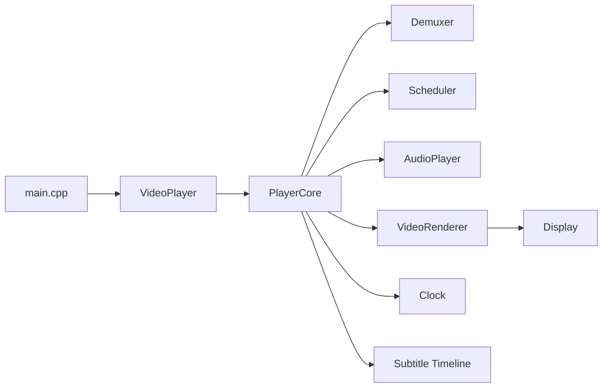
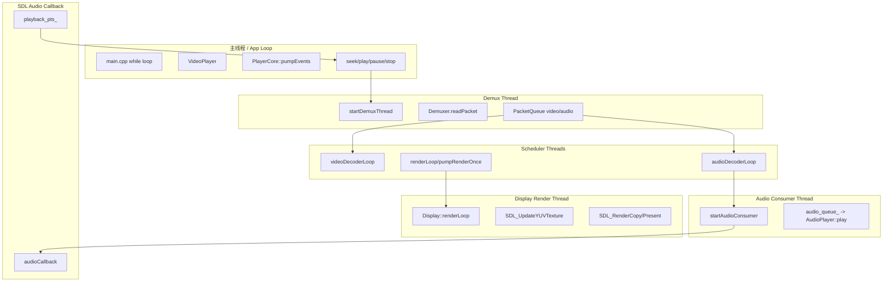
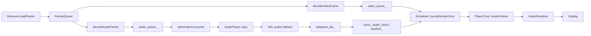
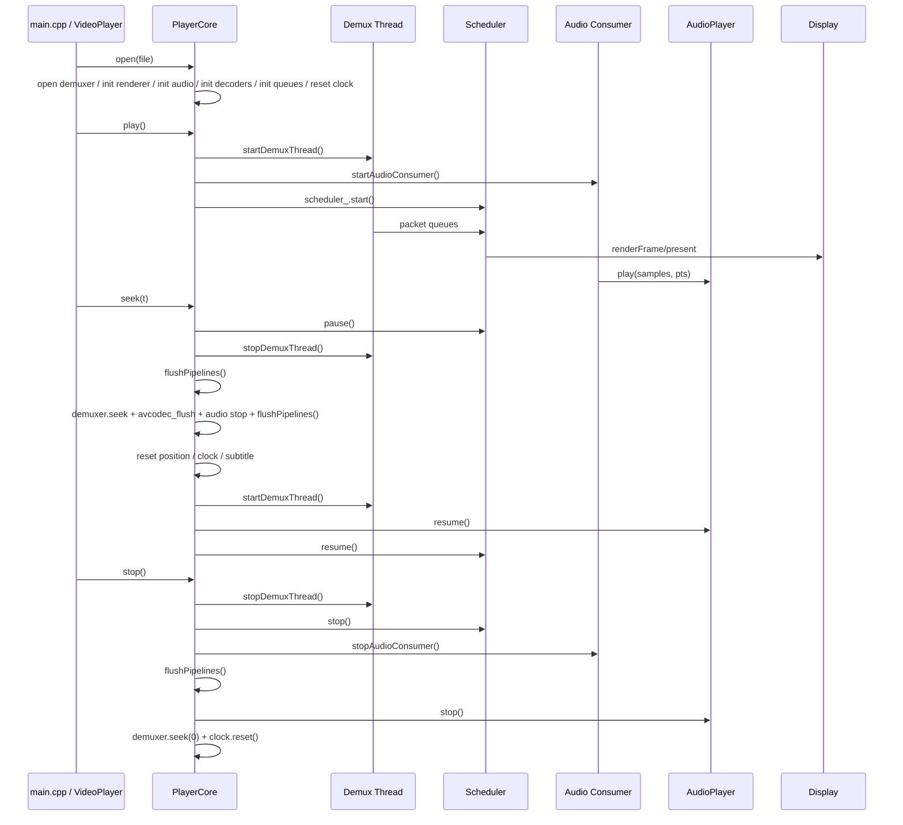

# Day7 结论：项目主链已经足够清晰，真正需要讲透的是线程分工、主时钟来源、seek 收口顺序，以及“D3D11 不是零拷贝”这几个关键边界

日期：2026-03-14  
范围：`docs/interpretation/PLAYBACK_MAIN_PATH.md`、`docs/analysis/PLAYERCORE_SEEK_DAY2_ANALYSIS.md`、`docs/analysis/PLAYERCORE_DAY3_PERFORMANCE_ANALYSIS.md`、`docs/analysis/PLAYERCORE_DAY4_RENDERER_ANALYSIS.md`、`docs/analysis/PLAYERCORE_DAY5_FEATURE_FLOW_ANALYSIS.md`、`docs/analysis/PLAYERCORE_DAY6_REGRESSION_DIAGNOSTICS_ANALYSIS.md`、`src/core/player_core.cpp`、`src/core/scheduler.cpp`、`src/display.cpp`、`src/audio_player.cpp`、`src/main.cpp`

## implementation planner

1. 汇总 Day1~Day6 已经确认的事实，去掉相互重复的表述。
2. 用模块层、线程层、数据流层三张图把主链重新讲一遍。
3. 再把 `open/play/seek/stop` 四条路径压成一套统一时序。
4. 归纳最容易讲错的边界：主时钟、seek、D3D11、run_all_checks、OpenGL 等。
5. 输出一版 15 分钟讲解提纲和两周改造路线，让 Day7 真正变成“可讲解、可传递、可落地”的终稿。

## 先给结论

- 这个项目的主链并不复杂，复杂的是线程边界和“谁拥有最终时间线”。
- 模块分层可以概括成：`main.cpp / VideoPlayer` 负责应用层流程，`PlayerCore` 负责播放状态与时钟，`Scheduler` 负责解码/渲染调度，`Display` 和 `AudioPlayer` 负责设备侧落地。
- 真正需要记牢的只有四条链：
  - 打开链：`open()`
  - 播放链：`play()`
  - seek 链：`pause/stop demux/flush/seek/flush/reset clock/resume`
  - 停止链：`stop demux/scheduler/audio consumer/flush/reset`
- 当前项目的“设计理由”很明确：
  - demux、decode、render、audio callback 都有不同阻塞特征，所以拆线程
  - `PlayerCore` 集中持有状态和时钟，避免 UI、显示层和解码层各自改时间线
  - `Display` 独占渲染线程，是为了把 SDL 纹理和窗口操作收敛到一个 owner thread
- 当前最关键的工程边界也很明确：
  - seek 已经是一次完整的时间线切换，不是一个简单 API
  - 音频主时钟模式下，`position_` 权威来源是 SDL 真正已播放到的 `playback_pts_`
  - 当前 `D3D11` 只是“硬解 + SDL D3D11 renderer backend”，不是解码面直接呈现
  - 当前回归体系是分层可用，但还没有统一全量总控脚本

## 架构总览图（模块层）



### 为什么这样分层

- `main.cpp` 负责应用生命周期、CLI 模式和播放列表循环。
- `VideoPlayer` 作为门面层，把外部 API 压成简单接口。
- `PlayerCore` 统一持有播放器核心状态，避免状态散落在 UI、渲染器和音频设备中。
- `Scheduler` 把解码和渲染调度与 `PlayerCore` 的业务状态隔离开。
- `Display` / `AudioPlayer` 是设备和 UI 的落地层，不应反向拥有主状态。

## 线程模型图（线程层）



### 为什么这样分线程

- demux 线程负责 I/O 和 packet 分发，避免阻塞解码。
- 视频/音频解码各自独立，避免一个流的解码抖动拖垮另一个。
- 渲染线程独立，是为了按主时钟做等待/丢帧决策。
- `Display` 再单独有一个 render owner thread，是为了把 SDL texture/window 操作收敛到同一线程。
- SDL 音频回调线程完全由音频设备驱动，它天生适合作为“真实播放进度”的来源。

## 数据流图（数据流层）



## 同步与时钟图

```mermaid
flowchart LR
    A[SDL audioCallback] --> B[AudioPlayer::playback_pts_]
    B --> C[startAudioConsumer]
    C --> D[clock_.setAudioClock]
    C --> E[position_.store]
    D --> F[Clock::getTime]
    F --> G[Scheduler::pumpRenderOnce]

    H[PlayerCore::renderFrame] --> I[clock_.setVideoClock]
    H --> J{ClockSource == Audio?}
    J -- no --> K[position_.store(frame.pts)]
    J -- yes --> L[只更新 video_clock]
```

一句话：

- 音频主时钟模式下，`position_` 与 `clock_.audio_clock_` 共用同一个上游事实来源：SDL 真正已播到哪。

## 最终播放时序图（open/play/seek/stop）



## 15 分钟讲解稿提纲

### 第 1 段：1 分钟说清模块

- `main.cpp` 管应用模式和播放列表。
- `VideoPlayer` 是门面。
- `PlayerCore` 是核心状态机和时间线拥有者。
- `Scheduler` 负责把 packet 变 frame，并按主时钟渲染。
- `Display` / `AudioPlayer` 是设备落地点。

### 第 2 段：3 分钟说清线程

- 主线程只做控制和事件泵。
- demux 线程只管读包。
- scheduler 三线程负责视频解码、音频解码、渲染。
- `Display` 还有自己的 render owner thread。
- SDL 音频回调是真正消费音频的线程。

### 第 3 段：3 分钟说清数据流

- `PacketQueue -> decode -> FrameQueue -> render/audio`
- 视频走渲染器和显示线程。
- 音频走 `AudioPlayer` 和 SDL callback。
- `position_` 与 `clock_` 的来源跟主时钟有关。

### 第 4 段：3 分钟说清同步

- `pumpRenderOnce()` 对比 `frame.pts` 和主时钟。
- 早到短等，晚到丢帧。
- 音频存在时，音频主时钟最稳，因为它来自真实播放进度。

### 第 5 段：3 分钟说清 seek

- seek 是“旧时间线收口 -> 跳转 -> flush -> 重建时钟 -> 恢复”。
- 顺序不能乱，因为生产者、消费者、codec 缓存和设备缓冲都要一起切换。
- 这是 Day2 最核心的工程点。

### 第 6 段：2 分钟说清当前瓶颈和路线

- 4K 的主要问题不是同步策略，而是 copy-heavy 视频链。
- 当前 D3D11 不是零拷贝。
- 短期先做 profiling 和减拷贝，中期做真实 D3D11 直通渲染。

## 常见误区

| 误区 | 正确说法 |
| --- | --- |
| 开了 `D3D11VA` 就是零拷贝 | 错。当前仍有 `hwframe transfer + swscale + memcpy + SDL upload` |
| `seek()` 就是 `av_seek_frame()` | 错。当前实现是完整时间线切换过程 |
| 视频渲染的 PTS 一定是 `position_` 权威来源 | 错。音频主时钟模式下权威来源是 `playback_pts_` |
| `run_all_checks.ps1` 就代表完整回归 | 错。它只覆盖 probe + format regression |
| `OpenGL` 已经是可用渲染后端 | 错。当前是 stub |
| `D3D11VideoRenderer` 和 `SoftwareSDL` 是两条完全不同的显示链 | 错。当前两者都包着同一个 `Display` |

## Day1 的 5 个 P0 问题：白板版收敛回答

### P0-1 `seek()` 顺序为什么是现在这样

- 因为旧时间线有生产者、消费者、codec 缓存、设备缓冲四层残留。
- 顺序本质是先收口旧流，再建立新时间线。

### P0-2 `PacketQueue` 的 EOF / stop / clear 分别是什么

- `EOF`：告诉消费者“没有新数据了”。
- `stop`：强制打断等待，常用于停线程。
- `clear`：只丢内容，不改控制位。

### P0-3 `pumpRenderOnce()` 的 `250ms` 迟到阈值是什么

- 它是经验阈值，表示“超过这个迟到量就不值得再显示”。
- 它解决的是同步追赶，不是吞吐提升。

### P0-4 音频主时钟下 `position_` 的最终权威来源是谁

- 是 `AudioPlayer::getPlaybackPts()`，而它来自 SDL 已真实消费的音频字节偏移。

### P0-5 暂停帧步进会和谁竞争

- 会和 scheduler 的协作式暂停、视频 codec 访问、以及位置回写竞争。
- 当前用 `paused_`、codec mutex 和 `state_ == Playing` 守卫把竞争面压住了，但没有显式 `Seeking/Stepping` 过程态。

## 两周后续改造路线

### 第 1 周：先补证据和回归闭环

| 项目 | 目标 | 风险 | 验证方式 |
| --- | --- | --- | --- |
| W1-1 视频链阶段 profiling | 量出 `hw transfer / swscale / memcpy / upload` 各自耗时 | 需要控制日志开销 | 对比 1080p60/4K 样本 |
| W1-2 扩展 `run_all_checks.ps1` | 把字幕、seek、章节、AB、截图、性能命令串进统一脚本 | 脚本时长变长 | 本地一键回归输出完整报告 |
| W1-3 为 seek / step 引入显式过程态 | 降低暂停步进、seek 边界竞争 | 改动状态机接口 | seek/step 回归更稳定 |

### 第 2 周：做性能主线原型

| 项目 | 目标 | 风险 | 验证方式 |
| --- | --- | --- | --- |
| W2-1 减少 `Display::copyFrameData()` 额外拷贝 | 先拿掉一层 CPU memcpy | 需要梳理帧生命周期 | 4K CPU 降低、render 不卡死 |
| W2-2 原型化真实 `D3D11VideoRenderer` | 验证硬解 surface 能否直达显示 | OSD/字幕路径要重做 | 4K 样本 `cpu_avg_percent`、`demux_dropped_packets` 下降 |
| W2-3 补日志原因分类 | 把 `demux_dropped_packets`、`late_drops` 分类细化 | 统计字段会变多 | 故障定位更快、更少误判 |

## Day7 验收标准对应回答

### 1. 15 分钟内完整讲清主链，不依赖源码

可以，直接按上面的 6 段讲稿讲：模块、线程、数据流、同步、seek、性能路线。

### 2. 为什么这样分线程/分层

可以。核心理由就是把 I/O、解码、渲染、设备回调这些不同阻塞模型隔离开，同时让 `PlayerCore` 成为唯一的时间线拥有者，避免状态分裂。

### 3. 拿出可执行的后续优化路线，而不是泛泛建议

可以，见上面的两周计划。它不是空泛的“优化性能”，而是明确分成：

- 第 1 周先补 profiling、回归总控和 seek 过程态  
- 第 2 周做减拷贝和真实 D3D11 直通渲染原型
