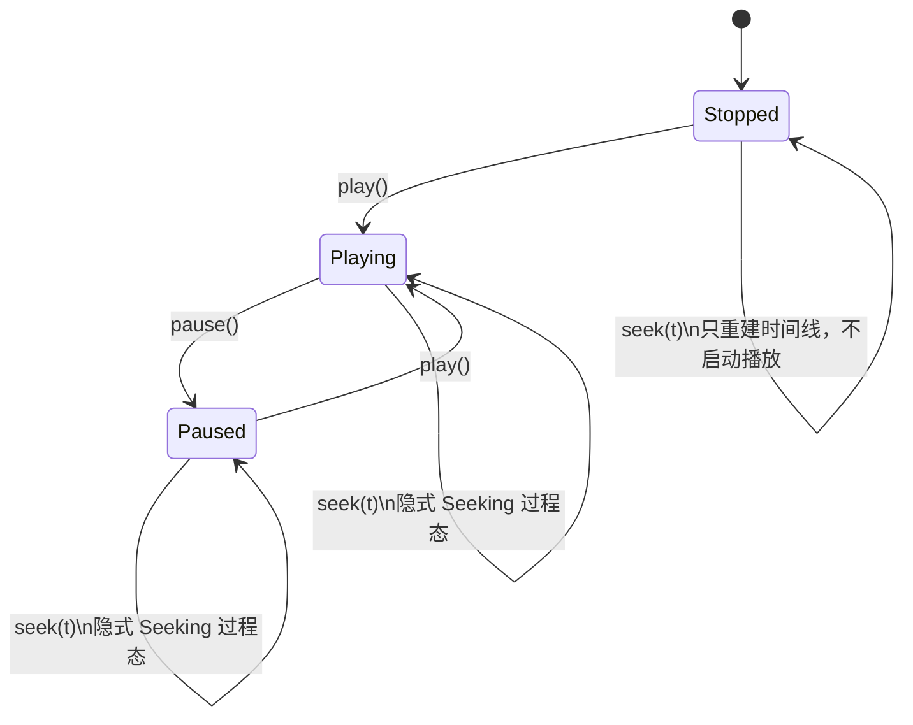
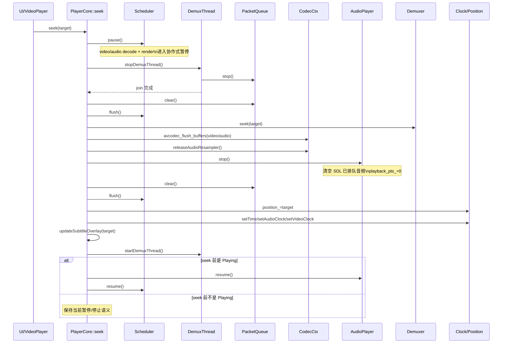

# Day2 结论：`PlayerCore::seek()`、时钟与线程停启

日期：2026-03-14  
范围：`src/core/player_core.cpp`、`src/core/scheduler.cpp`、`src/core/clock.cpp`、`src/audio_player.cpp`、`src/demuxer.cpp`、`include/thread_safe_queue.h`、`include/core/player_core.h`

## implementation planner

1. 按 `DAY2_EXECUTION.md` 的严格顺序先读 `PlayerCore::seek()`。
2. 再读 `flushPipelines()`、`stopDemuxThread()` / `startDemuxThread()`，确认 seek 的生产者/消费者收口顺序。
3. 再读 `Scheduler::pause/resume/pumpRenderOnce()`，确认视频侧为什么要等待和丢帧。
4. 最后读 `AudioPlayer::getPlaybackPts()` 与 `startAudioConsumer()`，确认音频主时钟与 `position_` 的一致性来源。

## 先给结论

- 当前实现里，`seek()` 的核心不是“改一个时间戳”，而是一次“旧时间线收口 -> demux 跳转 -> codec flush -> 音频设备清空 -> 新时间线重启”。
- 当前 `PlaybackState` 只有 `Stopped / Playing / Paused`，所以 seek 期间没有显式 `Seeking` 状态；它是一个隐式过程态。
- seek 时真正被“硬停”的是 `demux` 线程；`scheduler` 是协作式 `pause`；`audio consumer` 线程并没有停，只是靠 `audio_player_->stop()` 和队列清空来失效旧音频。
- `pumpRenderOnce()` 同时需要“等待”和“丢帧”，因为视频相对主时钟既可能跑太快，也可能已经明显落后；两种偏差必须分别处理。
- 在音频主时钟模式下，`position_` 的权威来源不是视频渲染 PTS，而是 SDL 音频回调线程推进出来的 `playback_pts_`。

## 关键文件与函数

| 文件 | 关键函数 | 作用 |
| --- | --- | --- |
| `src/core/player_core.cpp` | `seek()` | seek 总控，负责线程收口、flush、时钟重建、恢复 |
| `src/core/player_core.cpp` | `flushPipelines()` | 清空 `Scheduler` 的音视频帧队列和压缩包队列 |
| `src/core/player_core.cpp` | `stopDemuxThread()` / `startDemuxThread()` | 停止/恢复旧时间线 packet 生产 |
| `src/core/player_core.cpp` | `startAudioConsumer()` | 读取 `AudioPlayer::getPlaybackPts()` 并把它写回 `clock_` 和 `position_` |
| `src/core/player_core.cpp` | `renderFrame()` | 提交视频帧，更新 `video_clock_`；仅在非音频主时钟下更新 `position_` |
| `src/core/scheduler.cpp` | `pause()` / `resume()` / `pumpRenderOnce()` | 协作式冻结解码/渲染线程；按主时钟等待或丢帧 |
| `src/audio_player.cpp` | `audioCallback()` / `getPlaybackPts()` / `stop()` | SDL 真正消费音频、推进 `playback_pts_`、清空旧音频缓冲 |
| `src/demuxer.cpp` | `seek()` | 调 `av_seek_frame()` 切换 demux 读取位置 |
| `include/thread_safe_queue.h` | `stop()` / `start()` / `clear()` / `setEof()` | seek 与 stop 期间的包队列边界语义 |
| `src/core/clock.cpp` | `getTime()` / `setAudioClock()` / `setVideoClock()` / `setTime()` | 主时钟解析与时钟重建 |

## `seek()` 的真实执行链路

代码主入口：`src/core/player_core.cpp:320-377`

1. `seek()` 先钳制 `timestamp` 到 `[0, duration]`。
2. 记录两个恢复用快照：
   - `was_playing`
   - `demux_was_running`
3. 如果原来在播放，先 `scheduler_.pause()`。
4. 如果 demux 线程在跑，执行 `stopDemuxThread()`。
5. 执行第一次 `flushPipelines()`，清空旧包和旧帧队列。
6. 调 `demuxer_->seek(timestamp)`，让 demux 读指针切到新位置。
7. 在 codec mutex 下执行：
   - `avcodec_flush_buffers(video_codec_ctx_)`
   - `avcodec_flush_buffers(audio_codec_ctx_)`
   - `releaseAudioResampler()`
8. `audio_player_->stop()`，清空 SDL 设备侧已排队的旧 PCM，并把 `playback_pts_` 归零。
9. 执行第二次 `flushPipelines()`，再次扫掉 seek 过程中的残留帧/包。
10. 重建新时间线基准：
    - `position_ = timestamp`
    - `clock_.setTime(timestamp)`
    - `clock_.setAudioClock(timestamp)`
    - `clock_.setVideoClock(timestamp)`
11. 更新字幕与位置回调：
    - `updateSubtitleOverlay(timestamp)`
    - `emitPositionChanged(timestamp)`
12. 如果 seek 前 demux 在线，重新 `startDemuxThread()`。
13. 如果 seek 前是播放态，恢复：
    - `audio_player_->resume()`
    - `scheduler_.resume()`

## 为什么这个顺序不能随便换

说明：下面的“不能换”是针对当前仓库的线程模型和当前实现，不是说 FFmpeg 在理论上只有唯一顺序。

| 步骤 | 当前动作 | 为什么不能往前/往后随便换 |
| --- | --- | --- |
| 1 | 先记 `was_playing`、`demux_was_running` | 后面线程状态会变，恢复目标必须先拍快照，否则 seek 完不知道该回到 `Playing` 还是 `Paused`。 |
| 2 | 先 `scheduler_.pause()` | 如果先停 demux、甚至先 seek，解码/渲染线程还会继续消费旧 packet / 旧 frame，旧时间线会继续改写 `position_`、`video_clock_`，还可能多渲一帧旧画面。 |
| 3 | 再 `stopDemuxThread()` | 如果不先停生产者就 flush，demux 线程可能在你清队列的同时继续把旧 packet 塞回来，第一次 flush 就失效。 |
| 4 | `stopDemuxThread()` 里先 `queue.stop()` 再 `join()` | 这是为了唤醒可能卡在 `push()` 的 demux 线程；不先 `stop()`，它可能一直堵在满队列上，`join()` 无法收口。 |
| 5 | 第一次 `flushPipelines()` 放在 demux 停止后、seek 前 | 这是“切时间线前先倒垃圾”。如果 seek 以后再清旧队列，新时间线刚切过去，旧 packet / frame 仍会混入新时间线。 |
| 6 | `demuxer_->seek()` 后再 `avcodec_flush_buffers()` | 当前实现把“demux 位置切换”和“decoder 内部参考帧失效”放在同一段收口后处理里；这样失败路径仍可明确归因在 seek 切换点。即使理论上可调整，当前代码就是围绕这个切换点来做一致性恢复。 |
| 7 | `releaseAudioResampler()` 与 audio codec flush 同步做 | `SwrContext` 里可能还有旧时间线的延迟样本；只 flush codec 不重建 resampler，seek 后第一段音频仍可能带旧尾巴。 |
| 8 | `audio_player_->stop()` 放在 codec flush 之后 | 如果先停音频设备，但音频帧队列和 codec 内部旧数据还在，`audio_consumer` 线程仍可能把旧 PCM 再次送进 `AudioPlayer`，你等于刚清空又被旧数据回灌。 |
| 9 | 第二次 `flushPipelines()` 放在 `audio_player_->stop()` 后 | `scheduler_.pause()` 是协作式的，不是栅栏；旧 frame 可能在第一次 flush 前后穿过边界。第二次 flush 是为了扫尾，保证 seek 后从干净队列重启。 |
| 10 | 位置和时钟重建放在所有旧数据清空之后 | 否则旧时间线线程仍可能在后面把它们覆盖掉，尤其是音频消费线程和渲染线程。 |
| 11 | 先 `startDemuxThread()`，后 `scheduler_.resume()` | 先有 packet 生产源，再让解码/渲染消费者恢复，能减少恢复初期的空转和“时钟已跳、画面还没新帧”的窗口。 |
| 12 | 先 `audio_player_->resume()`，后 `scheduler_.resume()` | 音频是主时钟时，先恢复音频设备更稳；否则 scheduler 已开始送新音频/新视频，但主时钟仍被暂停的音频设备卡住，A/V 对齐会更抖。 |

## seek 期间的状态迁移

当前显式状态只有 `Stopped / Playing / Paused`，seek 不会显式写入新的状态值。



结论：

- 播放中 seek：恢复回 `Playing`
- 暂停中 seek：恢复回 `Paused`
- 已打开未播放的 `Stopped` seek：状态仍是 `Stopped`
- 这也是为什么当前实现只能靠 `was_playing` 这种局部变量恢复，而不是靠显式状态机

## seek 期间各线程的停启顺序

### 线程状态切换表

| 线程/组件 | seek 前 Playing | seek 进行中 | seek 后恢复到 Playing | seek 后停在 Paused |
| --- | --- | --- | --- | --- |
| demux 线程 | 运行 | `stopDemuxThread()` 硬停并 `join` | `startDemuxThread()` 重启 | `startDemuxThread()` 重启 |
| scheduler 视频解码线程 | 运行 | `pause()` 后协作式休眠 | `resume()` 后恢复 | 保持 pause |
| scheduler 音频解码线程 | 运行 | `pause()` 后协作式休眠 | `resume()` 后恢复 | 保持 pause |
| scheduler 渲染线程 | 运行 | `pause()` 后只走 idle 路径 | `resume()` 后恢复 | 保持 pause |
| audio consumer 线程 | 运行 | 没有停线程；继续活着，但会因队列清空而取不到帧 | 一直复用同一线程 | 一直复用同一线程 |
| SDL audio callback | 运行 | `audio_player_->stop()` 后暂停并清空设备队列 | `audio_player_->resume()` 后恢复 | 保持停止/暂停 |

### seek 时序图



## `PacketQueue` 的 EOF / stop / clear 边界

证据：`include/thread_safe_queue.h:21-92`、`src/core/player_core.cpp:1691-1699`、`src/core/player_core.cpp:1732-1748`

| 信号 | 语义 | 在当前项目里的用途 |
| --- | --- | --- |
| `setEof(true)` | 告诉消费者“当前时间线不会再有新 packet 了” | demux 读到 EOF 后唤醒等待中的解码线程 |
| `stop()` | 让生产者/消费者立刻从等待中退出来；是停止态，不是 EOF | `stopDemuxThread()` 用它打断可能卡在 `push()` 的 demux 线程 |
| `clear()` | 只清内容，不改 `stopped_` / `eof_` 状态 | seek 时丢弃旧时间线残留 packet |
| `start()` | 解除停止态，同时清掉 EOF 标记 | demux 线程重启前复用同一个队列对象 |

一个关键点：

- `EOF` 是“正常播完”
- `stop` 是“强制收口线程”
- `clear` 是“丢内容但不改控制位”

这三者不能混成一个概念，否则 seek / stop / EOF 收尾会互相污染。

## `pumpRenderOnce()` 为什么既要等待也要丢帧

代码：`src/core/scheduler.cpp:194-239`

逻辑非常直接：

1. `frame.pts - master > 0`
   - 说明视频帧“早到了”
   - 不能马上渲，否则视频会跑在主时钟前面
   - 所以短等一会，最多等 `5ms`
2. `frame.pts - master < -0.25`
   - 说明视频帧已经明显“晚到”
   - 再渲这帧只会把画面继续拖后
   - 所以直接丢掉，追赶主时钟

### 为什么必须两种手段都存在

- 只有等待，没有丢帧：
  - 解决不了“已经落后”的情况
  - 视频会越积越慢
- 只有丢帧，没有等待：
  - 解决不了“视频领先”的情况
  - 画面会抢跑、抖动、A/V 不同步

### 为什么等待只等 `5ms`

- 当前实现不想把渲染线程长时间睡死
- 它宁愿“多次短等”，也不做一次大睡眠
- 这样 `pause/seek/stop` 响应更快，`idle_callback_()` 也还有机会执行

### 为什么晚到阈值是 `250ms`

- 代码里没有给出更细的数学推导，当前只能把它视为经验阈值。
- 从行为上看，它表达的是：
  - 小抖动先容忍，不急着丢
  - 但超过四分之一秒，已经属于肉眼明显落后，优先追实时

这里“250ms 为什么是这个值”属于当前实现的经验参数，而不是已被文档化证明的唯一正确值。

## “音频主时钟”与 `position_` 的一致性来源

### 主链路

1. `PlayerCore::open()` 在有音频设备时把主时钟切到 `ClockSource::Audio`
   - `src/core/player_core.cpp:197-219`
2. SDL 音频回调线程真实消费音频样本时，按 `chunk.pts + offset / bytes_per_second` 推进 `playback_pts_`
   - `src/audio_player.cpp:182-223`
3. `startAudioConsumer()` 周期性读取 `audio_player_->getPlaybackPts()`
   - `src/core/player_core.cpp:1752-1794`
4. 它把同一个 `content_pts` 同时写到：
   - `clock_.setAudioClock(content_pts)`
   - `position_.store(content_pts)`
5. `Clock::getTime()` 在 `ClockSource::Audio` 下直接返回 `audio_clock_`
   - `src/core/clock.cpp:21-39`
6. `renderFrame()` 只有在主时钟不是音频时，才允许视频 PTS 回写 `position_`
   - `src/core/player_core.cpp:2024-2053`

### 图：一致性来源

```mermaid
flowchart LR
    A[SDL audioCallback] --> B[AudioPlayer::playback_pts_]
    B --> C[AudioPlayer::getPlaybackPts()]
    C --> D[startAudioConsumer()]
    D --> E[clock_.setAudioClock(content_pts)]
    D --> F[position_.store(content_pts)]
    E --> G[Clock::getTime()]
    G --> H[Scheduler::pumpRenderOnce()]

    I[PlayerCore::renderFrame()] --> J[clock_.setVideoClock(frame.pts)]
    I --> K{clock source == Audio?}
    K -- yes --> L[不回写 position_]
    K -- no --> M[position_.store(frame.pts)]
```

### 一句话结论

在音频主时钟模式下，`clock_` 和 `position_` 共用同一个上游事实来源：SDL 真正已经播放到哪里的 `playback_pts_`；视频侧只更新 `video_clock_`，不篡改 `position_`。

## `renderPausedFrameAtOrAfter()` 的竞争面

代码：`src/core/player_core.cpp:382-464`

当前暂停步进路径是：

1. `stepFrame(direction)` 先算目标时间
2. 直接调用 `seek(target)`
3. 再调用 `renderPausedFrameAtOrAfter(target)`

`renderPausedFrameAtOrAfter()` 的做法是：

- 先尝试从 `video_queue_` 直接取一帧
- 取不到再在当前线程主动调用 `decodeVideoFrame()`
- 命中目标帧后直接 `renderFrame()`
- 再强制把 `position_ / clock_` 对齐到该帧
- 把 `last_position_emit_tp_` 清零，确保这次位置更新不被节流掉

### 它会和谁竞争

| 竞争面 | 当前怎么收口 |
| --- | --- |
| scheduler 渲染线程可能还没完全看到 `paused_` | `Scheduler::pumpRenderOnce()` 开头先读 `paused_`，因此 pause 后它很快转入 idle；但这是协作式暂停，不是硬栅栏 |
| scheduler 视频解码线程与主线程都可能摸 codec | `decodeVideoFrame()` 用 `video_codec_mutex_` 串行化 |
| 音频线程回写 `position_` 覆盖步进结果 | 当前已加 `state_ == PlaybackState::Playing` 守卫，暂停时音频线程不再写回 |

结论：

- 这个竞争面是“被压住了”，不是“完全不存在了”
- 真正彻底的工程做法，还是把 seek / step 显式建模为过程态，而不是靠几个 flag 临时收口

## Day2 验收标准对应回答

### 1. 你能解释 seek 顺序每一步为什么不能换顺序

可以。核心是三条：

1. 先停消费者，再停生产者，再清旧数据，否则旧时间线会继续流动。
2. demux seek 只切“未来输入位置”，codec flush / resampler reset / audio stop 才切“内部缓存与设备侧状态”。
3. 只有当“旧包、旧帧、旧 PCM、旧时钟写回”都失效后，`position_` 和 `clock_` 的新基准才可信。

### 2. 你能解释 `pumpRenderOnce()` 为什么既要等待也要丢帧

可以。等待解决“视频领先主时钟”，丢帧解决“视频落后主时钟”；缺任何一边都无法稳定 A/V 对齐。

### 3. 你能解释“音频主时钟”与 `position_` 的一致性来源

可以。`position_` 和 `clock_.audio_clock_` 都由 `AudioPlayer::getPlaybackPts()` 驱动，而 `getPlaybackPts()` 直接来自 SDL 真正已消费的音频字节偏移；视频渲染路径在音频主时钟模式下不会回写 `position_`。

### 4. 你能用 5 分钟白板讲清楚 Day1 的 5 个 P0 问题

可以，下面就是白板版。

## Day1 的 5 个 P0 问题：5 分钟白板版

### P0-1 `seek()` 顺序为什么是现在这样

- 本质：切时间线不是一个 API，而是一组“停旧流、清旧缓存、切读指针、重建时钟、恢复”的原子过程。
- 旧时间线有 4 层残留：
  - packet 队列
  - frame 队列
  - codec 内部参考帧 / 重采样延迟
  - SDL 音频设备里的已排队 PCM
- 所以必须分层收口，不能只 `av_seek_frame()`

### P0-2 `PacketQueue` 的 EOF / stop / clear 分别是什么

- EOF：正常播完，不会再来新 packet
- stop：强制把阻塞线程叫醒并退出
- clear：只丢内容，不改控制位

这三个概念一混，seek、stop、EOF 就会互相串。

### P0-3 `pumpRenderOnce()` 为什么有 `-0.25s` 丢帧阈值

- 不是所有晚到都要丢
- 小抖动先忍，让画面尽量平滑
- 明显晚到才丢，优先追主时钟

### P0-4 音频主时钟下 `position_` 到底谁说了算

- 不是视频帧 PTS
- 是 SDL 真正播到哪里的音频 PTS
- 因为用户听到的才是最稳的实时事实

### P0-5 `renderPausedFrameAtOrAfter()` 暂停步进会和谁打架

- 会和渲染线程、解码线程、音频位置回写打架
- 当前靠 `scheduler.pause()`、codec mutex、`state_ == Playing` 守卫压住
- 但 seek / step 仍是隐式过程态，这个设计仍有后续演进空间

## P0 闭环表

| P0 问题 | 结论 | 证据 |
| --- | --- | --- |
| `seek()` 顺序 | 先停消费者/生产者，再清队列，再切 demux，再 flush codec/resampler，再清音频设备，最后重建时钟并恢复 | `src/core/player_core.cpp:320-377` |
| `PacketQueue` 的 EOF / stop / clear | 三者分别对应“正常结束 / 强制打断 / 仅清内容” | `include/thread_safe_queue.h:21-92` |
| `pumpRenderOnce()` 等待与丢帧 | 等待处理“视频早到”，丢帧处理“视频晚到” | `src/core/scheduler.cpp:217-234` |
| 音频主时钟与 `position_` | 两者共享 SDL 音频回调推进出来的 `playback_pts_` 事实源 | `src/audio_player.cpp:182-223`、`src/core/player_core.cpp:1759-1765`、`src/core/player_core.cpp:2044-2049` |
| `renderPausedFrameAtOrAfter()` 竞争 | 竞争仍在，但已由 `pause`、codec mutex、状态守卫压缩到可控范围 | `src/core/player_core.cpp:382-464`、`src/core/player_core.cpp:1759-1765` |

## 当前实现的边界与风险

1. seek 没有显式 `Seeking` 状态，外部观察到的仍是 `Playing` 或 `Paused`。
2. seek 并不停止 `audio_consumer` 线程，只是靠队列清空和 `audio_player_->stop()` 间接收口。
3. `emitPositionChanged()` 有 `100ms` 节流；`seek()` 本身没有像 `stepFrame()` 那样重置这个节流窗口，所以 seek 后 UI 位置回调未必是“硬实时立即到达”。

## 证据索引

- `src/core/player_core.cpp:320-377` `PlayerCore::seek()`
- `src/core/player_core.cpp:1732-1748` `stopDemuxThread()`
- `src/core/player_core.cpp:1752-1794` `startAudioConsumer()`
- `src/core/player_core.cpp:1805-1812` `flushPipelines()`
- `src/core/player_core.cpp:2024-2053` `renderFrame()`
- `src/core/player_core.cpp:2135-2141` `emitPositionChanged()`
- `src/core/scheduler.cpp:194-239` `pumpRenderOnce()`
- `src/core/clock.cpp:21-39` `Clock::getTime()`
- `src/audio_player.cpp:132-143` `AudioPlayer::stop()`
- `src/audio_player.cpp:182-223` `AudioPlayer::audioCallback()`
- `src/demuxer.cpp:91-107` `Demuxer::seek()`
- `include/thread_safe_queue.h:21-92` `ThreadSafeQueue`

