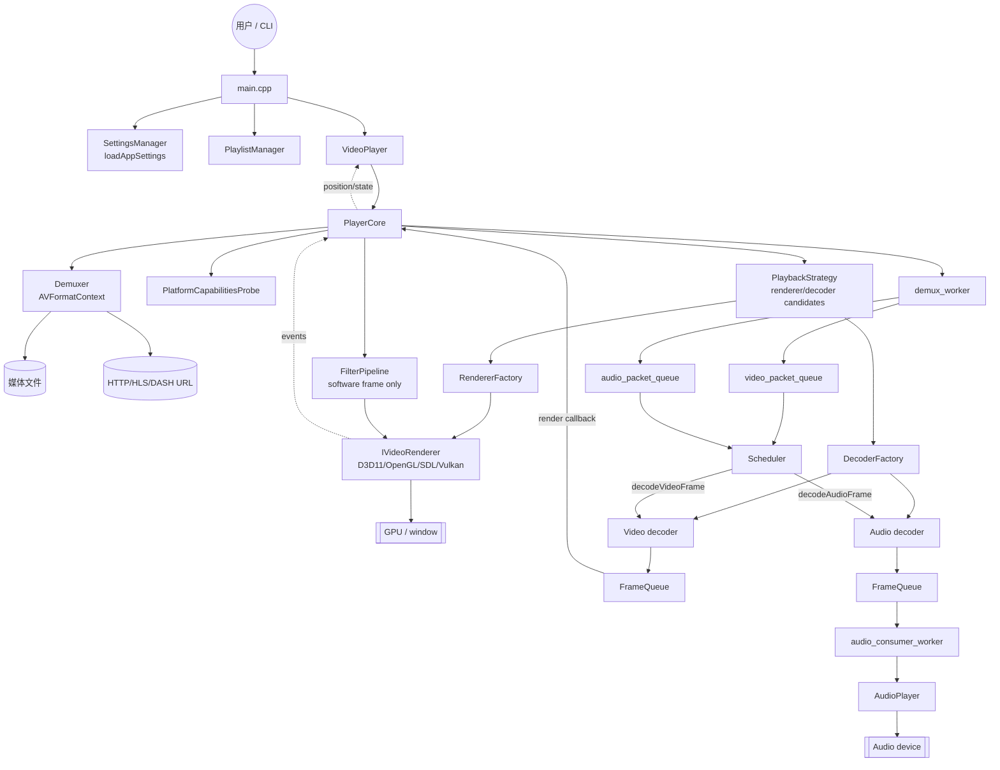
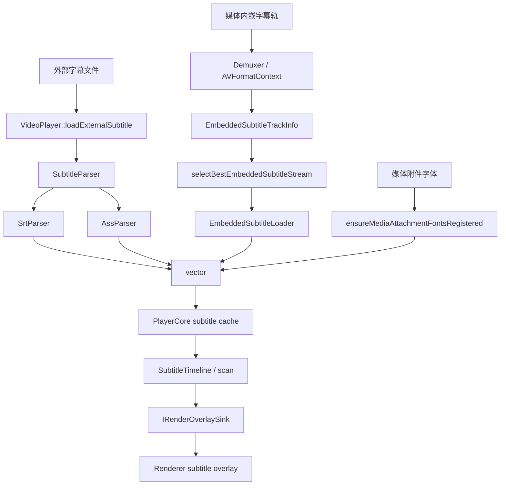
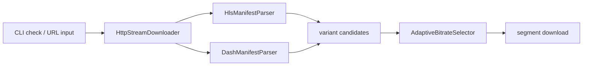
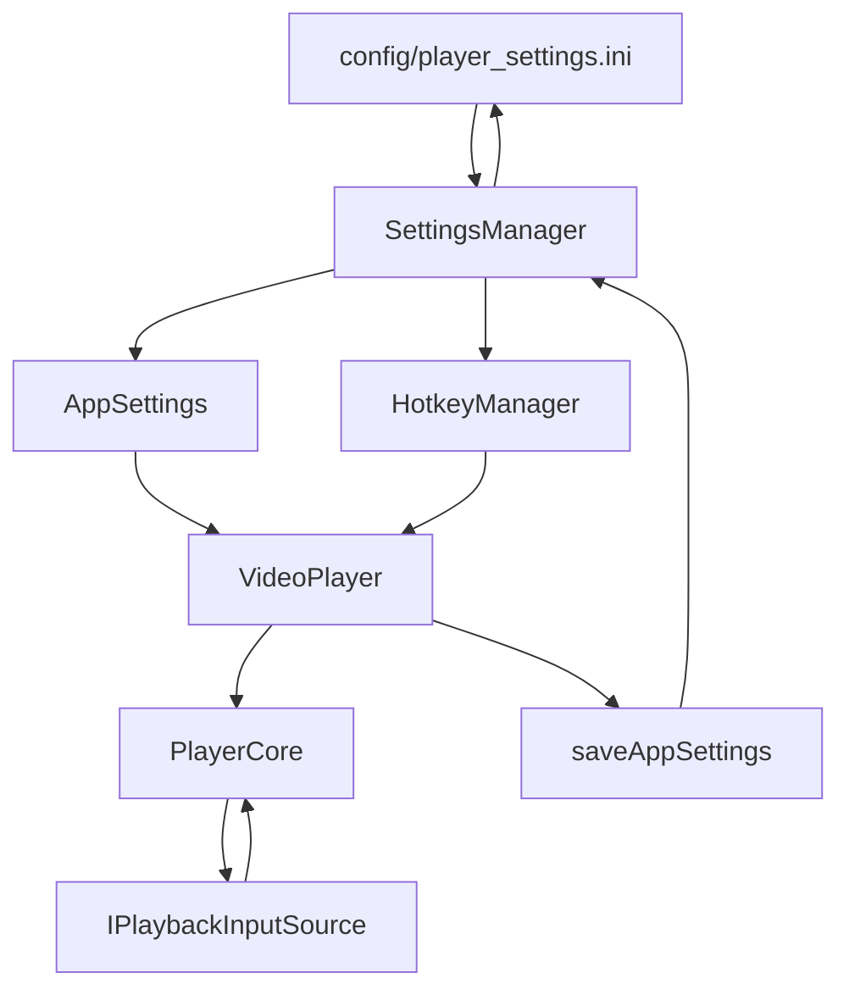
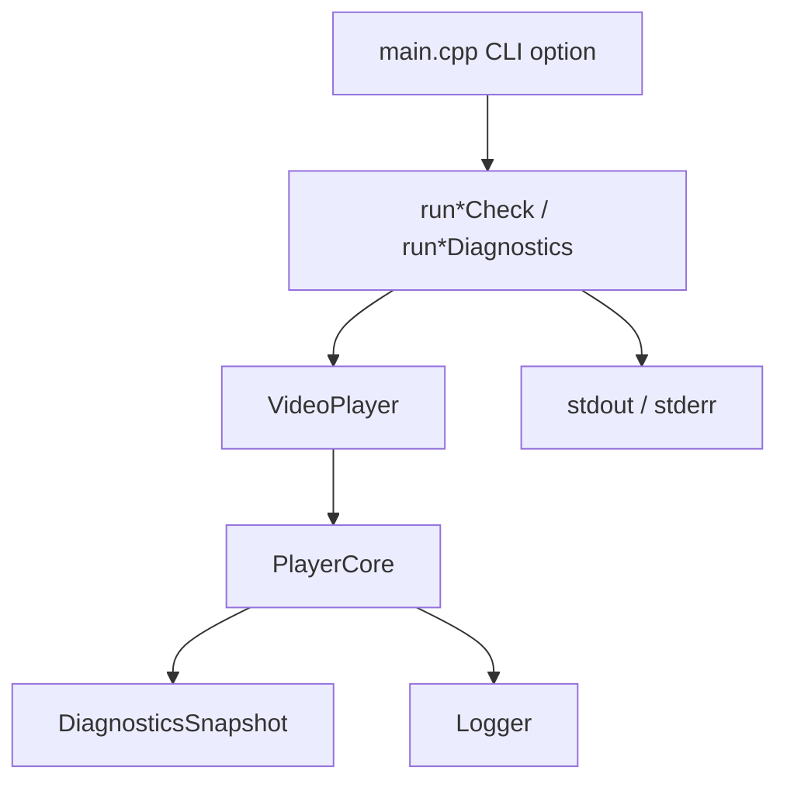

# 数据流图

围绕“一次媒体播放从输入到画面/声音输出”的核心数据流，外加字幕、流媒体、配置、诊断四条次要流。

## 一、主播放数据流（文件 / URL → 解复用 → 解码 → 输出）

### 关键节点说明

| 阶段 | 触发条件 | 关键模块 |
|---|---|---|
| 1. 输入归一 | CLI 参数、拖拽文件或播放列表项 | `main.cpp`, `PlaylistManager` |
| 2. 打开媒体 | `VideoPlayer::open` | `PlayerCore::open`, `Demuxer::open` |
| 3. 后端计划 | 读取媒体信息和平台能力 | `PlaybackStrategy`, `RendererFactory`, `DecoderFactory` |
| 4. 解复用 | play/start 后 demux worker 循环读包 | `Demuxer`, packet queues |
| 5. 解码调度 | Scheduler 三线程处理视频/音频/渲染 | `Scheduler`, `FrameQueue` |
| 6. 呈现 | PlayerCore render callback | `FilterPipeline`, `IVideoRenderer` |
| 7. 音频输出 | audio consumer 拉取 AudioFrame | `AudioPlayer`, SDL audio callback |

## 二、字幕数据流

### 字幕选择规则

| 来源 | 入口 | 生效条件 |
|---|---|---|
| 外部字幕 | `VideoPlayer::loadExternalSubtitle` | 文件扩展名可识别，解析成功 |
| 内嵌字幕 | `PlayerCore::open` | preferred stream 可用，或 selection policy 选出支持轨 |
| 字体附件 | `ensureMediaAttachmentFontsRegistered` | 媒体含 font attachment 且可提取/注册 |

## 三、流媒体辅助数据流

流媒体模块当前主要服务 CLI 检查和输入候选构造；实际媒体播放仍由 FFmpeg 打开最终 URL 或本地路径。

## 四、设置与热键数据流

| 配置域 | 读取位置 | 写入位置 |
|---|---|---|
| `player.volume` | `loadAppSettings` | `saveAppSettings` |
| `player.playback_speed` | `loadAppSettings` | `saveAppSettings` |
| `player.audio_delay_ms` / `subtitle_delay_ms` | `loadAppSettings` | `saveAppSettings` |
| `player.prefer_hardware_decode` | `loadAppSettings` | `saveAppSettings` |
| `hotkey.*` | `loadHotkeySettings` | `syncHotkeySettings` |

## 五、诊断 / 回归检查数据流

`main.cpp` 内部有大量 `--xxx-check` 入口，用于 CI/本地回归。它们复用生产播放器链路，但把结果输出为 `PASS/FAIL` 或 key/value。

