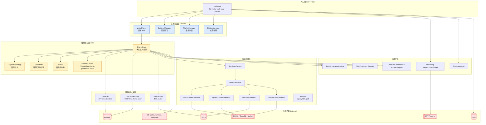
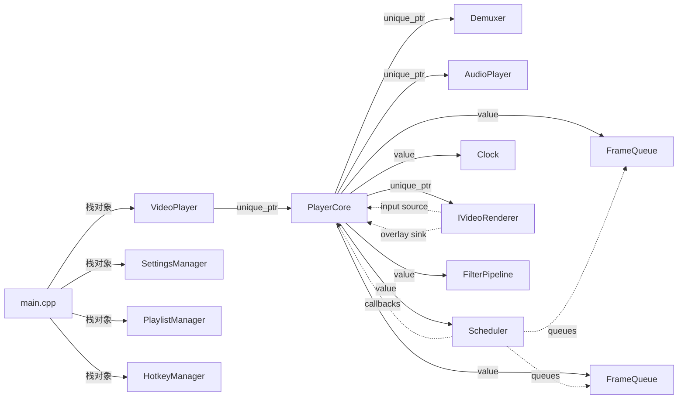

# 软件架构总览

Modern Video Player 是一个 C++17 / SDL2 / FFmpeg 桌面播放器，核心目标是跨平台播放、后端自动选择、字幕与诊断能力。

## 一、分层模型

## 二、各层职责

| 层 | 目录 | 职责 | 上对接 | 下对接 |
|---|---|---|---|---|
| 入口 | `src/main.cpp` | 解析 CLI、加载设置、组织播放循环、执行本地检查 | 用户 / CI | VideoPlayer、Settings、Playlist |
| 门面 | `include/video_player.h` | 屏蔽 PlayerCore 复杂状态，提供应用层 API | main.cpp | PlayerCore |
| 核心 | `include/core/`, `src/core/` | open/play/pause/seek/stop 状态机、调度、时钟、队列 | VideoPlayer | Demuxer、Decoder、Renderer、Audio |
| 媒体 IO | `demuxer.*`, `decoder/`, `audio_player.*` | 打开媒体、读包、解码后端选择、音频输出 | PlayerCore | FFmpeg、SDL audio、平台硬件 |
| 渲染输入 | `render/`, `display.*` | 视频呈现、窗口事件、overlay、热键请求 | PlayerCore | SDL/D3D11/OpenGL/Vulkan |
| 功能扩展 | `subtitle/`, `filters/`, `streaming/`, `plugin/` | 字幕、滤镜、流媒体、插件 | main.cpp / PlayerCore | 文件、HTTP、动态库 |
| 平台能力 | `platform/`, `media/` | 编译/运行时能力探测、格式能力评估 | PlayerCore / CLI | OS、GPU、FFmpeg |

## 三、核心持有关系

## 四、单例 vs 实例

| 类 / 模块 | 类型 | 原因 |
|---|---|---|
| `VideoPlayer` | 应用实例 | main 中按播放会话使用，持有一个 PlayerCore |
| `PlayerCore` | 实例 | 绑定一个当前媒体会话和一组运行状态 |
| `Scheduler` | PlayerCore 值成员 | 与 PlayerCore 生命周期一致，线程回调闭包捕获 PlayerCore |
| `Demuxer` | PlayerCore 内 unique_ptr | 每次 open 重新创建，绑定当前 AVFormatContext |
| `AudioPlayer` | PlayerCore 内 unique_ptr | 根据媒体音频参数初始化 SDL audio |
| `IVideoRenderer` | PlayerCore 内 unique_ptr | 根据 PlaybackStrategy 候选链选择后端 |
| `PluginManager` | main/检查流程实例 | 动态插件生命周期由调用方显式管理 |
| `Logger` | 静态接口 / 内部状态 | `Logger::init/shutdown/log` 封装全局日志系统 |

## 五、目录与命名空间

| 命名空间 | 目录 | 说明 |
|---|---|---|
| `vp` | 根 include/src | VideoPlayer、Demuxer、Display、AudioPlayer、Logger |
| `vp::core` | `include/core`, `src/core` | 播放状态机、调度、帧结构、队列 |
| `vp::render` | `include/render`, `src/render` | 渲染器接口与后端 |
| `vp::subtitle` | `include/subtitle`, `src/subtitle` | 字幕统一模型和解析器 |
| `vp::filters` | `include/filters`, `src/filters` | 滤镜接口、注册表、流水线 |
| `vp::streaming` | `include/streaming`, `src/streaming` | HLS/DASH/HTTP 辅助能力 |
| `vp::platform` | `include/platform`, `src/platform` | 平台和硬件设备能力 |
| `vp::media` | `include/media`, `src/media` | 格式能力与 FFmpeg 兼容辅助 |

## 六、跨模块强约束

| 约束 | 涉及模块 | 描述 |
|---|---|---|
| timeline serial | PlayerCore / Scheduler / queues | seek/flush/close 会切换 serial；解码、渲染、包队列必须丢弃旧 serial 数据 |
| renderer/input 双接口 | Renderer 后端 / PlayerCore | D3D11/OpenGL/SDL/Vulkan 同时实现 `IVideoRenderer` 与 `IPlaybackInputSource`，事件必须由 PlayerCore 主事件线程 pump |
| overlay 顺序 | PlayerCore::renderFrame / renderer | 先更新字幕与 overlay，再执行滤镜，最后 render + present |
| EOF 判断 | Demuxer / packet queues / frame queues / AudioPlayer | EOF 只有在包队列、帧队列和音频设备缓存都排空后才进入 Ended |
| 设置键名 | main.cpp / SettingsManager / HotkeyManager | `player.*` 与 `hotkey.*` 字段由手写字符串约定，改名需全局搜索 |

## 七、外部依赖

| 依赖 | 形式 | 用途 |
|---|---|---|
| FFmpeg | 链接 | demux、decode、subtitle packet、scale/resample |
| SDL2 | 链接 | 窗口、事件、软件渲染、音频输出 |
| Quill | 可选链接/header | 结构化日志；缺失时走 std::cout fallback |
| D3D11 / DXGI / DWrite / D2D | Windows 链接 | D3D11 渲染、字幕/字体、HDR/adapter 诊断 |
| OpenGL | 链接 | OpenGL 渲染后端 |
| Vulkan SDK/runtime | 可选 | Vulkan 渲染后端与诊断 |
| libass / fontconfig / freetype | Linux 链接 | 字幕 shaping、字体查找 |

## 八、配置文件

| 文件 | 路径 | 内容 |
|---|---|---|
| 播放设置 | `config/player_settings.ini` | 音量、倍速、硬解偏好、热键、字幕策略 |
| 日志设置 | `config/logging.conf` | 日志级别、路径、轮转 |
| CMake 选项 | `CMakeLists.txt` | renderer/decoder 编译开关、依赖探测 |
| 样例媒体 | `samples/` | 本地检查用 mp4/hls/dash/subtitle 样例 |

