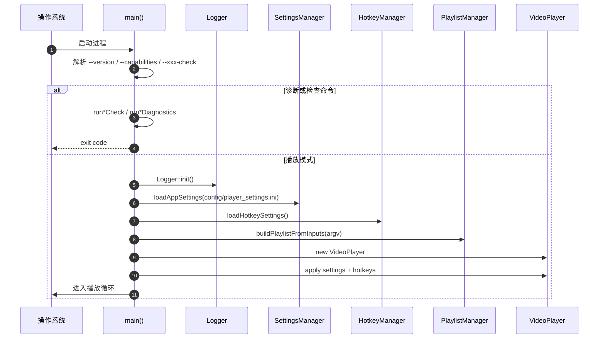
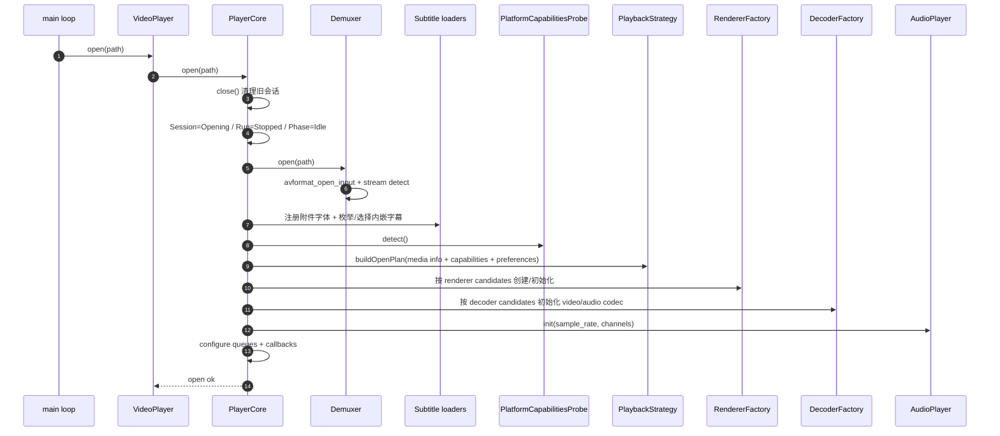
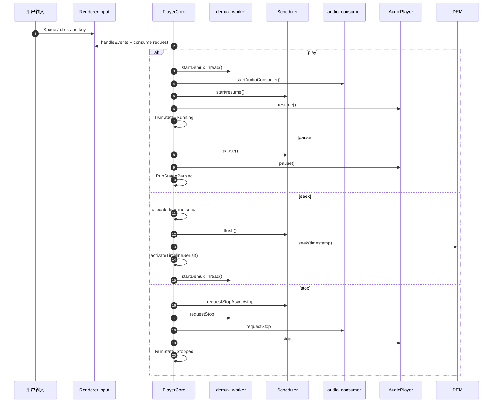
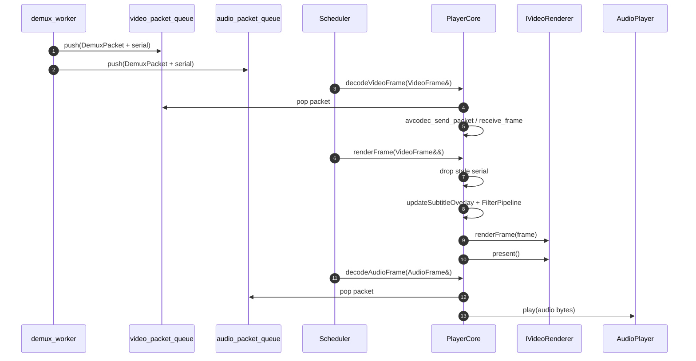
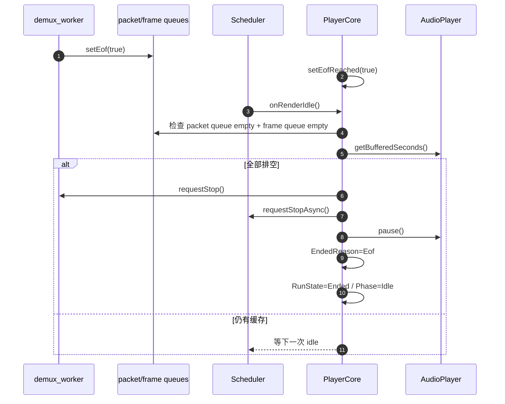
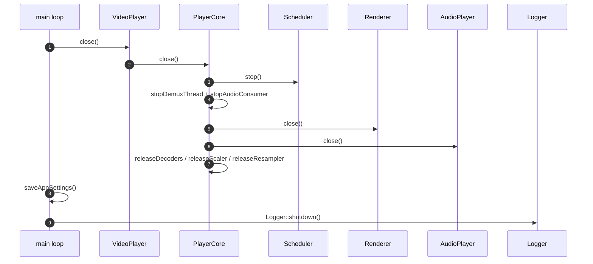

# 软件运行流程图

五个核心时序：**冷启动**、**打开媒体**、**播放控制**、**EOF 结束**、**关闭退出**。

## 一、冷启动时序

## 二、打开媒体时序

### 打开失败兜底

| 阶段 | 失败 | 行为 |
|---|---|---|
| Demuxer open | 文件/URL 打不开 | Session=Failed，emit FileNotFound |
| renderer candidates 为空 | 平台无可用 renderer | emit DisplayInitFailed |
| renderer init 失败 | 单个候选失败 | 尝试下一个 renderer |
| decoder init 失败 | 软/硬解不可用 | 按 decoder candidates fallback |
| audio init 失败 | SDL audio 初始化失败 | 根据媒体类型和策略进入错误处理 |

## 三、播放控制时序

## 四、帧调度与呈现时序

## 五、EOF / Ended 流程

## 六、关闭 / 退出流程

## 七、关键状态约束

| 状态 | 来源 | 用途 |
|---|---|---|
| `SessionState` | PlayerCore | open/close/fail 生命周期 |
| `RunState` | PlayerCore | Stopped/Starting/Running/Paused/Stopping/Ended |
| `PipelinePhase` | PlayerCore | Idle/Normal/Draining 等流水线阶段 |
| `TimelineSerial` | PlayerCore | seek/flush/close 后丢弃旧包旧帧 |
| `SchedulerControlSnapshot` | PlayerCore → Scheduler | 让 Scheduler 感知运行状态、时钟策略和 EOF 策略 |

