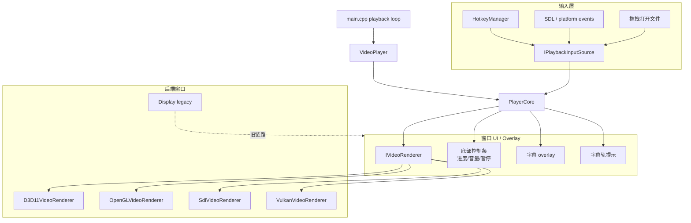
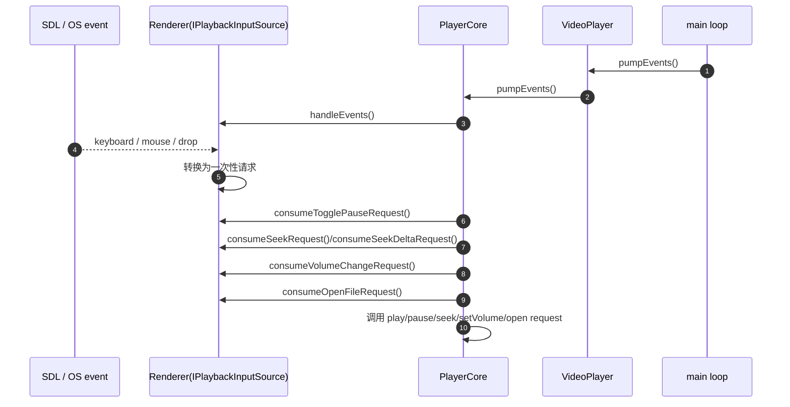
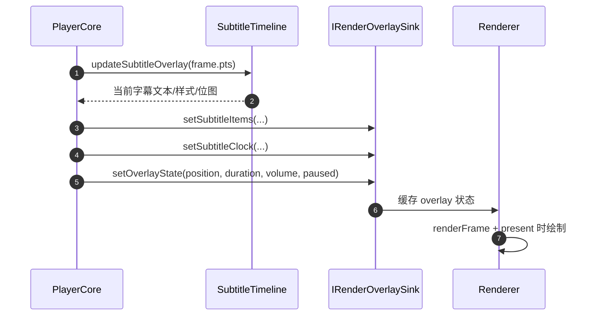

# UI 层

本项目没有 Qt Widget 层；用户界面由 SDL/D3D11/OpenGL/Vulkan renderer 的窗口事件、底部控制条 overlay、字幕 overlay 和热键系统组成。

## 一、窗口与视图的组合关系

## 二、UI 职责矩阵

| 组件 | 类型 | 入口 | 主要数据 | 输出请求 |
|---|---|---|---|---|
| `main.cpp` | 事件泵调用方 | playback loop | 播放列表、设置、退出条件 | `player.pumpEvents()` |
| `IPlaybackInputSource` | 接口 | renderer 实现 | 键盘、鼠标、拖拽 | seek/pause/volume/screenshot 等 consume 接口 |
| `HotkeyManager` | 配置模型 | 设置加载 | action → key code | `actionForKey` |
| `IRenderOverlaySink` | 接口 | PlayerCore | 字幕、进度、音量、字幕轨 | renderer overlay 状态 |
| `D3D11VideoRenderer` | 窗口 + GPU renderer | RendererFactory | video frame + overlay | 输入请求、诊断 |
| `OpenGLVideoRenderer` | 窗口 + GPU renderer | RendererFactory | video frame + overlay | 输入请求、诊断 |
| `SdlVideoRenderer` | 软件窗口 renderer | RendererFactory | YUV frame + overlay | 输入请求 |
| `VulkanVideoRenderer` | Vulkan 窗口 renderer | RendererFactory | video frame + overlay | 输入请求、诊断 |
| `Display` | legacy SDL 实现 | 旧 Display 路径 | pending frame + SDL texture | 输入请求 |

## 三、输入信号路由

## 四、Overlay 数据流

## 五、UI 线程模型

| 线程 | 持有者 | 职责 |
|---|---|---|
| main/event thread | `main.cpp`, `PlayerCore::pumpEvents` | 调用 renderer `handleEvents`，消费输入请求 |
| render thread | `Scheduler::renderLoop` | 拉取 VideoFrame 并调用 PlayerCore render callback |
| renderer 内部线程 | 部分后端 / legacy Display | 旧 SDL Display 有独立 render thread；新后端按各自实现 |
| audio callback | SDL audio | 从 AudioPlayer 队列取样本 |

## 六、UI 持久化

| 状态 | 持久化位置 | 何时写 |
|---|---|---|
| 音量 / 倍速 | `config/player_settings.ini` | 程序退出或设置检查 |
| 音频/字幕延迟 | `config/player_settings.ini` | 程序退出或设置检查 |
| 硬解偏好 | `config/player_settings.ini` | 程序退出或设置检查 |
| 热键 | `hotkey.*` | `syncHotkeySettings` |
| 播放列表恢复 | `player.resume_last_playlist`, `player.last_playlist_index` | `saveAppSettings` |
| 窗口位置/大小 | 当前未统一持久化 | — |

## 七、注意点

- `PlayerCore::pumpEvents` 会检查事件线程 id；从非事件线程调用会被忽略并记录 warning。
- renderer 的输入请求是一次性状态，必须通过 `consume*Request` 消费后清除。
- 新后端应同时实现 `IVideoRenderer`、`IPlaybackInputSource` 和必要的 `IRenderOverlaySink`，否则 PlayerCore 无法统一接入。

