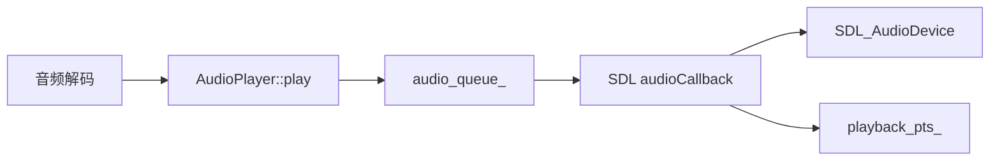

# AudioPlayer 音频输出

源码: `include/audio_player.h`, `src/audio_player.cpp`

## 角色

SDL 音频设备封装。接收解码后的 PCM 数据，放入内部音频队列，由 SDL callback 拉取播放，并维护音量、静音、播放 PTS、缓冲长度和初始化诊断。

## 接口

| 接口 | 用途 |
|---|---|
| `init(sample_rate, channels)` | 打开 SDL 音频设备，返回 `AudioInitReport` |
| `play(data, pts)` | 入队 PCM 数据 |
| `pause` / `resume` / `stop` | 控制音频设备和内部队列 |
| `setVolume` / `setMuted` | 音量和静音 |
| `getPlaybackPts()` | 返回当前音频播放时间 |
| `getQueuedBytes()` / `getBufferedSeconds()` | 查询音频缓冲 |
| `lastInitReport()` | 查询最近一次初始化报告 |

## 数据流

## 关键数据

| 数据 | 说明 |
|---|---|
| `AudioChunk` | PCM 数据、offset、pts |
| `audio_queue_` | callback 消费的音频块队列 |
| `queued_bytes_` | 当前排队字节数 |
| `AudioInitReport` | 初始化是否成功、是否尝试打开设备、耗时和策略说明 |

## 关键约束

- SDL callback 运行在音频线程，访问队列时必须使用 `queue_mutex_`。
- `volume_`、`muted_`、`paused_` 为原子状态，供控制线程和 callback 共享。
- `getBufferedSeconds()` 依赖输出采样率、通道数和样本格式。

## 注意点

- 音频初始化失败时上层仍可能进入无音频播放或回归诊断路径。
- 修改输出格式时要同步 `outputBytesPerSample()` 和缓冲秒数计算。
