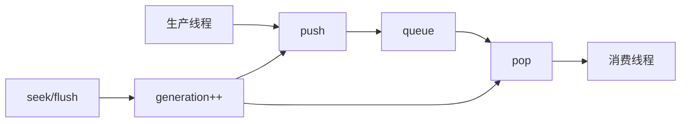

# FrameQueue / ThreadSafeQueue 队列

源码: `include/core/frame_queue.h`, `include/thread_safe_queue.h`

## 角色

跨线程缓冲队列。`FrameQueue` 面向音视频帧，提供容量、flush generation 和统计；`ThreadSafeQueue` 面向通用包/命令队列，提供 stop、EOF、clear 等控制语义。

## 接口

| 队列 | 主要接口 | 用途 |
|---|---|---|
| `FrameQueue<T>` | `push` / `pop` / `flush` / `setCapacity` | 视频帧、音频帧缓冲 |
| `FrameQueue<T>` | `getFillRatio` / `getStats` | 调度诊断和 backpressure 观测 |
| `ThreadSafeQueue<T>` | `push` / `pop` / `tryPop` / `clear` | 包队列或通用任务队列 |
| `ThreadSafeQueue<T>` | `stop` / `setEof` / `generation` | 终止、EOF、seek flush 协同 |

## 数据流

## 关键约束

- `generation_` 是 flush 屏障；push/pop 等待期间如果 generation 改变，需要放弃本次操作。
- `FrameQueue::flush()` 清空队列、递增 generation，并唤醒所有等待线程。
- `ThreadSafeQueue` 的 EOF 和 stop 是两种不同语义：EOF 表示输入结束，stop 表示队列不再服务。

## 注意点

- 这些队列是播放器线程安全的基础，不应在外部绕过接口直接访问内部容器。
- 新增统计字段时，需要同步诊断快照消费方。
