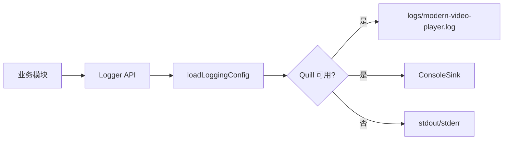

# Logger 日志封装

源码: `include/logger.h`, `src/logger.cpp`, `config/logging.conf`

## 角色

统一日志入口。优先使用 Quill 后端和 rotating file sink；当 Quill 未编译、配置禁用或初始化失败时，回退到 stdout/stderr。

## 接口

| 接口 | 用途 |
|---|---|
| `Logger::init()` | 初始化日志配置和后端 |
| `Logger::shutdown()` | 停止 Quill 后端并释放 logger |
| `info` / `warning` / `error` / `debug` | 常用日志级别 |
| `log(severity, category, message)` | 带分类的统一日志入口 |
| `MVP_LOG(...)` | 流式日志宏 |

## 配置

| 配置 | 来源 | 说明 |
|---|---|---|
| `log_dir` | `config/logging.conf` / `MVP_LOG_DIR` | 日志目录，默认 `logs` |
| `log_level` | `config/logging.conf` | 最小日志级别 |
| Quill 开关 | 编译宏 / `MVP_DISABLE_QUILL_LOGGING` | 控制是否启用 Quill |

## 数据流

## 关键约束

- `ensureInitialized()` 允许模块在未显式初始化时懒加载日志系统。
- 配置文件查找路径包含 `config/logging.conf`、`../config/logging.conf`、`../../config/logging.conf`。
- 文件日志使用 Quill rotating sink，日志目录不存在时会尝试创建。

## 注意点

- 日志是诊断链路的一部分，修改字段或关键字时需要检查 `docs/reports` 和脚本中是否有字符串依赖。
- 运行产物位于 `logs/`，不应作为源码文档依据长期保存。
