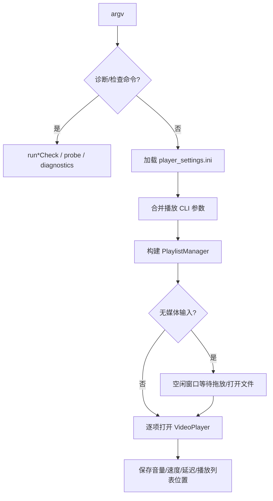

# main 播放器入口

源码: `src/main.cpp`

## 角色

进程入口和命令行调度器。它同时承担正常播放器启动、播放列表驱动、配置读写、能力探测以及大量回归检查命令的分发。

## 接口

| 入口 | 用途 |
|---|---|
| `int main(argc, argv)` | 分发版本、能力、探测、回归检查和正常播放流程 |
| `parsePlaybackCliArgs(...)` | 解析媒体输入、字幕、HDR、LUT、ICC 等播放参数 |
| `loadAppSettings(...)` / `saveAppSettings(...)` | 从 `config/player_settings.ini` 读写播放器设置 |
| `buildPlaylistFromInputs(...)` | 把命令行媒体路径或 `.m3u8` 输入转换为播放列表 |
| `run*Check(...)` | 本地回归检查入口，覆盖字幕、播放列表、渲染、流媒体、性能、硬件后端等场景 |

## 主流程

## 数据

| 数据 | 来源 | 去向 |
|---|---|---|
| `PlaybackCliArgs` | 命令行 | `VideoPlayer`、环境变量覆盖、字幕策略 |
| `AppSettings` | `SettingsManager` | 播放器初始化和退出保存 |
| `playlist::PlaylistManager` | 命令行输入 / 拖放输入 | 正常播放循环 |
| `ProbeReport` / diagnostics 输出 | FFmpeg 探测、渲染器探测 | stdout / 回归脚本 |

## 关键约束

- `main.cpp` 中的 `--xxx-check` 是回归入口，不属于普通播放路径，但复用 `VideoPlayer` 和底层模块。
- HDR、3D LUT、ICC 相关 CLI 参数通过环境变量覆盖传给渲染器。
- 播放列表位置、热键、音量、速度、音频/字幕延迟写回 `config/player_settings.ini`。

## 注意点

- 该文件体量大，新增命令时需要同步 `printUsage`、参数解析、返回码和相关报告文档。
- 正常播放循环依赖 `VideoPlayer::pumpEvents()` 消费窗口输入请求。
