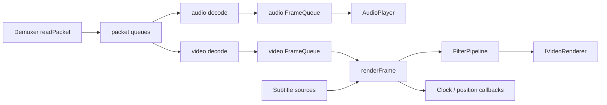

# PlayerCore 播放核心

源码: `include/core/player_core.h`, `src/core/player_core.cpp`

## 角色

播放器主编排器。负责打开媒体、创建解复用器、选择解码/渲染后端、启动调度器、维护播放状态、处理输入事件、合成字幕 overlay、同步音频和视频、输出诊断快照。

## 接口

| 接口 | 用途 |
|---|---|
| `open` / `close` | 建立和释放媒体会话 |
| `play` / `pause` / `stop` / `seek` | 控制运行态 |
| `setPreferHardwareDecode` / `videoDecoderBackend` | 解码后端策略 |
| `videoRendererBackendName` | 当前渲染后端名称 |
| `setExternalSubtitles` / `selectEmbeddedSubtitleStream` | 字幕源选择 |
| `pumpEvents` | 消费渲染器输入源请求 |
| `getInfo` / `getDiagnosticsSnapshot` | 播放信息和运行诊断 |

## 持有关系

| 模块 | 说明 |
|---|---|
| `Demuxer` | FFmpeg 输入、流探测、读包、seek |
| `AudioPlayer` | SDL 音频输出和音频缓冲 |
| `Scheduler` | 视频解码、音频解码、渲染线程调度 |
| `Clock` | 播放时钟 |
| `FrameQueue` | 视频帧和音频帧缓冲 |
| `IVideoRenderer` | D3D11/OpenGL/SDL/Vulkan 渲染后端 |
| `FilterPipeline` | 视频和音频滤镜流水线 |
| subtitle 组件 | 外挂/内嵌字幕、活跃字幕选择、字体注册 |

## 数据流

## 运行状态

| 状态组 | 内容 |
|---|---|
| 会话状态 | `Closed`、`Opening`、`Ready`、`Closing`、`Failed` |
| 运行状态 | `Stopped`、`Starting`、`Running`、`Pausing`、`Paused`、`Stopping`、`Ended` |
| 结束原因 | 包括 EOF 等终止原因 |

## 关键约束

- `Scheduler` 通过回调进入 `PlayerCore` 的解码和渲染函数，核心对象必须比 worker 线程存活更久。
- `pumpEvents()` 从渲染器的 `IPlaybackInputSource` 消费暂停、seek、章节、音量、倍速、延迟、字幕轨道、AB 循环、截图、逐帧、打开文件和退出请求。
- EOF 判定依赖 demux EOF、队列清空和音频缓冲耗尽等条件。

## 注意点

- 修改播放状态时需要同步诊断快照、回调通知和调度器状态。
- 渲染路径中先更新字幕 overlay，再处理滤镜和渲染器提交。
