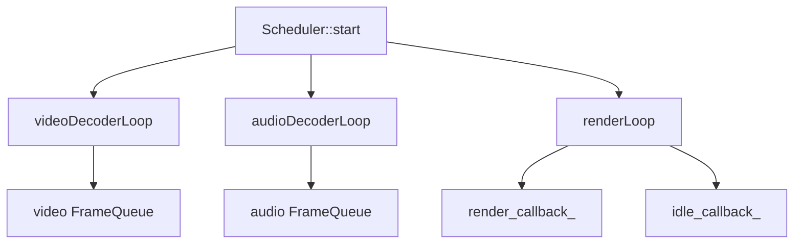

# Scheduler 播放调度器

源码: `include/core/scheduler.h`, `src/core/scheduler.cpp`

## 角色

播放 worker 调度器。它不直接解码或渲染，而是持有回调和队列指针，启动视频解码、音频解码、渲染三个线程，并统计 backpressure、等待、丢帧和 worker 重启指标。

## 接口

| 接口 | 用途 |
|---|---|
| `setVideoDecoder` / `setAudioDecoder` | 注入解码回调 |
| `setVideoQueue` / `setAudioQueue` | 注入帧队列 |
| `setRenderCallback` | 注入渲染回调 |
| `setIdleCallback` | 渲染空闲时回调给核心做 EOF 等处理 |
| `setClock` | 注入播放时钟 |
| `start` / `pause` / `resume` / `stop` | worker 生命周期控制 |
| `flush` / `pumpRenderOnce` | seek/逐帧等场景的队列和渲染控制 |
| `getStats()` | 导出调度统计 |

## 线程模型

## 诊断指标

| 指标 | 含义 |
|---|---|
| `video_decoded_frames_` / `audio_decoded_frames_` | 解码帧数 |
| `rendered_frames_` | 成功渲染帧数 |
| `dropped_late_frames_` | 延迟丢帧数 |
| `*_backpressure_events_` | 队列满导致的等待 |
| `WorkerRestartBudget` | worker 异常保护重启预算和命中次数 |

## 关键约束

- `Scheduler` 只保存队列裸指针和回调，实际对象生命周期由 `PlayerCore` 管理。
- `control_snapshot_provider_` 决定调度器当前运行态、pipeline phase、音频主时钟策略等。
- `stop()` 必须回收线程，避免回调访问已经析构的核心对象。

## 注意点

- 修改 worker 循环时需要保留 idle callback，否则 EOF 和空闲状态无法由 `PlayerCore` 收敛。
- 队列容量和 backpressure 策略会直接影响 seek、暂停和高码率播放表现。
