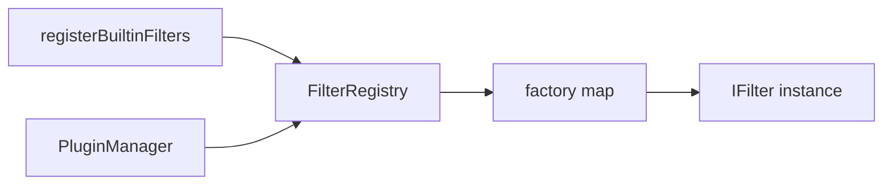

# FilterRegistry 滤镜注册表

源码: `include/filters/filter_registry.h`, `src/filters/filter_registry.cpp`

## 角色

滤镜工厂注册中心。插件和内置滤镜都可以向它注册视频/音频滤镜工厂，播放器按名称创建滤镜实例。

## 接口

| 接口 | 用途 |
|---|---|
| `instance()` | 获取全局注册表 |
| `registerVideoFilter` / `registerAudioFilter` | 注册滤镜工厂 |
| `unregisterVideoFilter` / `unregisterAudioFilter` | 移除滤镜工厂 |
| `createVideoFilter` / `createAudioFilter` | 按名称创建滤镜 |
| `getVideoFilterNames` / `getAudioFilterNames` | 列出可用滤镜 |

## 数据流

## 关键约束

- 注册表是进程内单例，内部使用 mutex 保护 factory map。
- 工厂返回 `unique_ptr`，每次创建都是独立滤镜实例。

## 注意点

- 插件卸载时需要注销由插件注册的滤镜，避免悬挂工厂。
- 滤镜名称是公共契约，修改会影响配置和插件。
