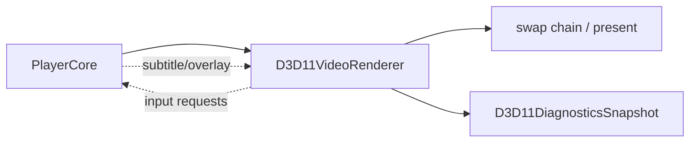

# D3D11VideoRenderer 渲染后端

源码: `include/render/d3d11_video_renderer.h`, `src/render/d3d11_video_renderer.cpp`

## 角色

Windows Direct3D 11 渲染后端。它实现视频帧渲染、窗口事件输入、字幕/控制栏 overlay、D3D11 诊断和 HDR 输出相关状态。

## 接口

| 接口 | 用途 |
|---|---|
| `init(config)` / `close()` | 创建和释放 D3D11 渲染资源 |
| `renderFrame` / `present` / `clear` | 帧渲染和交换链呈现 |
| `handleEvents` / `consume*Request` | SDL/窗口输入转为播放器动作 |
| `setOverlayState` / `setSubtitleText` / `setSubtitleItems` | 控制栏和字幕 overlay |
| `supportsNativeFrameFormat` | 判断 native frame 支持 |
| `nativeDeviceHandle()` | 暴露 D3D11 设备句柄 |
| `probeSystemDiagnostics()` | 运行 D3D11 系统探测 |

## 数据流

## 诊断

| 数据 | 说明 |
|---|---|
| `D3D11DiagnosticsSnapshot` | 系统级 D3D11 探测结果 |
| `D3D11HdrOutputSnapshot` | HDR 输出、色彩空间、显示器信息 |
| `RendererDiagnostics` 中 `d3d11_*` 字段 | HDR 请求/激活、present 次数、失败次数、耗时等 |

## 关键约束

- 该后端由 CMake `ENABLE_D3D11_RENDERER` 控制，并且仅在 Windows 平台有效。
- 硬件解码互操作依赖 `nativeDeviceHandle()` 与解码后端策略配合。

## 注意点

- HDR 相关行为同时受 CLI、环境变量、系统显示能力和内容元数据影响。
- 修改输入请求时需要与 OpenGL/SDL/Vulkan 后端的 `consume*Request` 对齐。
