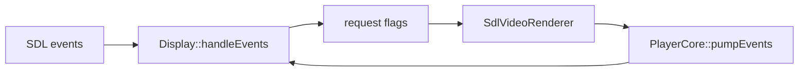

# Display 旧 SDL 窗口实现

源码: `include/display.h`, `src/display.cpp`

## 角色

SDL 窗口、纹理、事件和简易控制栏实现。当前由 `SdlVideoRenderer` 持有，用作软件渲染和输入事件来源。

## 接口

| 接口 | 用途 |
|---|---|
| `init(width, height, title)` / `close()` | 创建或销毁 SDL 窗口和渲染器 |
| `renderFrame(data, width, height)` / `present()` / `clear()` | 软件帧渲染 |
| `handleEvents()` / `shouldQuit()` | SDL 事件循环 |
| `consume*Request` | 暂停、seek、音量、倍速、字幕、AB 循环、截图、逐帧、章节、播放列表、打开文件 |
| `setOverlayState` / `setSubtitleText` | 控制栏和字幕文本 |
| `getFrameCopyStats()` / `resetFrameCopyStats()` | 帧拷贝诊断 |

## 数据流

## 关键数据

| 数据 | 说明 |
|---|---|
| `PendingVideoFrame` | 待渲染帧和 Y/U/V plane 缓冲 |
| `ControlLayout` | 控制栏、进度条、音量条区域 |
| request flags | 输入事件转成一次性消费请求 |
| `FrameCopyStats` | 软件拷贝帧数、字节和耗时 |

## 关键约束

- `Display` 维护独立 render thread 和事件线程保护状态。
- 鼠标 seek、音量拖动、热键映射都在该层转换为播放器动作。

## 注意点

- 新渲染链路优先走 `IVideoRenderer` 接口；`Display` 是 SDL 后端内部实现，不应重新成为上层公共依赖。
- 修改热键动作时需要同步 `HotkeyManager` 和所有渲染输入源。
