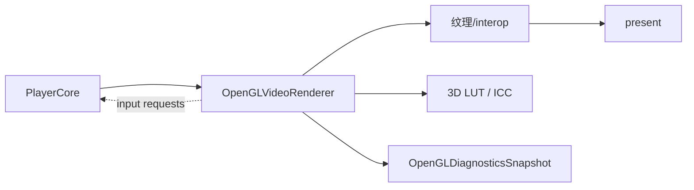

# OpenGLVideoRenderer 渲染后端

源码: `include/render/opengl_video_renderer.h`, `src/render/opengl_video_renderer.cpp`

## 角色

OpenGL 渲染后端。它负责 OpenGL 上下文、视频纹理上传或 native interop、控制栏和字幕 overlay、HDR bridge、输出 3D LUT、ICC 自动绑定以及相关诊断。

## 接口

| 接口 | 用途 |
|---|---|
| `init` / `close` | 创建和释放 OpenGL/窗口资源 |
| `renderFrame` / `present` / `clear` | 上传/渲染/呈现视频帧 |
| `supportsNativeFrameFormat` / `supportsDirectFrameFormat` | 判断 native/direct 路径 |
| `nativeDeviceHandle()` | 暴露互操作设备句柄 |
| `setSubtitleItems` / `setSubtitleTrackState` / `setSubtitleTrackCatalog` | 字幕和轨道 overlay |
| `probeSystemDiagnostics()` | 系统级 OpenGL 诊断 |

## 数据流

## 诊断

| 数据 | 说明 |
|---|---|
| `OpenGLDiagnosticsSnapshot` | 系统 OpenGL 探测 |
| `OpenGLHdrOutputDiagnosticsSnapshot` | HDR 输出能力 |
| `OpenGLOutputDisplayDiagnosticsSnapshot` | SDL display 到系统输出绑定 |
| `RendererDiagnostics` 中 `opengl_*` 字段 | native interop、present wait、HDR bridge、LUT、ICC、显示器绑定 |

## 关键约束

- OpenGL 后端由 `ENABLE_OPENGL_RENDERER` 控制。
- ICC/LUT 路径依赖 `output_color_profile` 组件和环境变量/CLI 配置。
- overlay 字幕支持比 SDL 后端更完整，包含轨道状态和目录显示。

## 注意点

- 修改 OpenGL 输出色彩相关逻辑时，需要同步 `--opengl-output-color-check` 和 `--opengl-output-color-icc-check`。
- native interop 的启停需要保留诊断原因，便于回归脚本判断。
