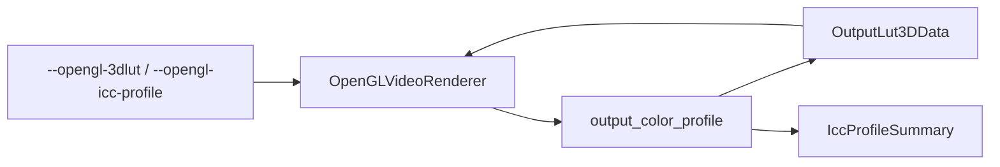

# output_color_profile 输出色彩配置

源码: `include/render/output_color_profile.h`, `src/render/output_color_profile.cpp`

## 角色

OpenGL 输出色彩辅助模块。负责读取 `.cube` 3D LUT，或从 ICC profile 生成 3D LUT，并返回 ICC 摘要信息给渲染诊断。

## 接口

| 接口 | 用途 |
|---|---|
| `loadCubeLut3D(path, out, error)` | 读取 `.cube` LUT 文件 |
| `generateIccProfileLut(path, lut_size, out, summary, error)` | 从 ICC profile 生成 LUT |

## 数据

| 数据 | 说明 |
|---|---|
| `OutputLut3DData` | LUT 尺寸和 RGB8 数据 |
| `IccProfileSummary` | ICC 是否有效、是否 matrix-shaper RGB、device class、color space、PCS、描述 |

## 数据流

## 关键约束

- `.cube` 解析和 ICC 解析都通过错误字符串返回失败原因。
- ICC 路径包含二进制 profile 读取、tag 解析、tone curve 和矩阵计算。

## 注意点

- 该模块当前主要被 OpenGL 输出色彩路径消费。
- 修改 LUT 格式时需要同步 OpenGL 诊断字段和本地回归检查。
