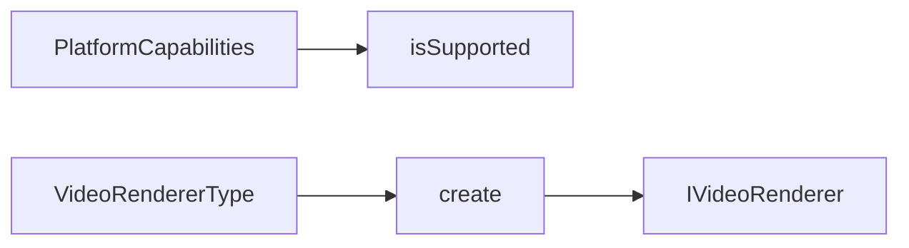

# RendererFactory 渲染器工厂

源码: `include/render/renderer_factory.h`, `src/render/renderer_factory.cpp`

## 角色

根据 `VideoRendererType` 创建具体渲染器，并根据平台能力判断后端是否可用。

## 接口

| 接口 | 用途 |
|---|---|
| `isSupported(type, capabilities)` | 判断平台探测结果中是否支持指定后端 |
| `rendererName(type)` | 返回后端显示名称 |
| `create(type)` | 创建 `IVideoRenderer` 实例 |

## 创建规则

| 类型 | 创建结果 |
|---|---|
| `Auto` | 当前转为 `SoftwareSDL` |
| `SoftwareSDL` | `SdlVideoRenderer` |
| `D3D11` | 编译启用 `MVP_HAVE_D3D11_RENDERER` 时创建 `D3D11VideoRenderer` |
| `OpenGL` | `OpenGLVideoRenderer` |
| `Vulkan` | 编译启用 `MVP_HAVE_VULKAN_RENDERER` 时创建 `VulkanVideoRenderer` |

## 数据流

## 关键约束

- D3D11 和 Vulkan 受编译宏控制；未启用时即使请求该类型也不会创建后端。
- CMake 至少要求启用一个渲染器：D3D11、OpenGL、SDL、Vulkan 之一。

## 注意点

- `isSupported()` 与 `create()` 关注点不同：前者基于运行时平台能力，后者基于编译产物能否构造对象。
- 新后端需要同时补 `rendererName()`，否则诊断输出不可读。
