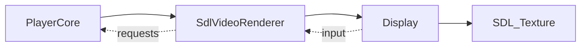

# SdlVideoRenderer 软件渲染后端

源码: `include/render/sdl_video_renderer.h`, `src/render/sdl_video_renderer.cpp`, `include/display.h`, `src/display.cpp`

## 角色

软件 SDL 渲染后端。它通过 `Display` 实现窗口、纹理、事件输入、控制栏、字幕文本和帧拷贝统计，是 `RendererFactory` 的 `SoftwareSDL` 后端。

## 接口

| 接口 | 用途 |
|---|---|
| `init` / `close` | 创建或释放 `Display` |
| `renderFrame` / `present` / `clear` | 委托给 SDL display 渲染 |
| `supportsDirectFrameFormat` | 判断可直接处理的像素格式 |
| `handleEvents` / `consume*Request` | 透传 `Display` 的输入请求 |
| `setOverlayState` / `setSubtitleText` | 控制栏和文本字幕 |
| `getDiagnostics` / `resetDiagnostics` | 暴露帧拷贝统计 |

## 数据流

## 关键约束

- `SdlVideoRenderer` 自身主要是适配层，实际窗口和 SDL 资源在 `Display` 中。
- 软件路径会产生帧拷贝统计，诊断字段来自 `Display::FrameCopyStats`。

## 注意点

- 当硬件后端不可用时，SDL 软件后端是基础 fallback。
- 字幕接口以 `setSubtitleText` 为主，不包含 OpenGL 后端的完整轨道目录 overlay 能力。
