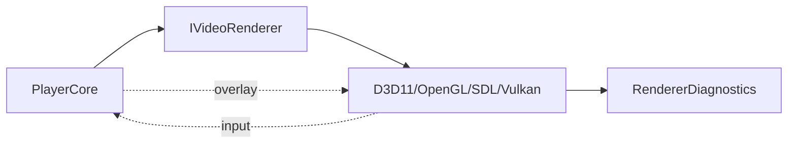

# IVideoRenderer 渲染接口

源码: `include/render/video_renderer.h`, `include/render/render_overlay_sink.h`, `include/input/playback_input_source.h`

## 角色

渲染后端统一抽象。D3D11、OpenGL、SDL、Vulkan 后端都通过 `IVideoRenderer` 被 `PlayerCore` 调用；带窗口输入的后端同时实现 `input::IPlaybackInputSource`，带字幕和控制栏 overlay 的后端实现 `IRenderOverlaySink`。

## 接口

| 接口 | 用途 |
|---|---|
| `init(config)` / `close()` | 创建或释放渲染资源 |
| `renderFrame(frame)` / `present()` / `clear()` | 提交画面、呈现和清屏 |
| `supportsNativeFrameFormat(format)` | 判断是否支持硬件/native frame |
| `supportsDirectFrameFormat(format)` | 判断是否支持直接上传/零拷贝路径 |
| `nativeDeviceHandle()` | 暴露原生设备给硬件解码或互操作 |
| `getDiagnostics()` / `resetDiagnostics()` | 渲染器诊断 |
| `rendererBackendName()` | 后端名称 |

## 数据结构

| 数据 | 说明 |
|---|---|
| `VideoRendererConfig` | 宽、高、窗口标题 |
| `RendererDiagnostics` | SDL copy、OpenGL interop/HDR/LUT/ICC、D3D11 HDR/present 等指标 |
| `VideoRendererType` | `Auto`、`SoftwareSDL`、`D3D11`、`OpenGL`、`Vulkan` |

## 数据流

## 关键约束

- `IVideoRenderer` 本身只定义视频帧提交接口，不定义输入事件；输入能力通过 `IPlaybackInputSource` 动态识别。
- 字幕和控制栏 overlay 通过 `IRenderOverlaySink` 传入，避免核心直接依赖具体渲染实现。

## 注意点

- 新增渲染后端时需要同步 `RendererFactory`、CMake feature switch、诊断字段和回归脚本。
- `Auto` 不是实际后端，工厂当前会落到软件 SDL 后端。
