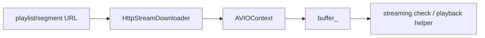

# HttpStreamDownloader HTTP 分块下载

源码: `include/streaming/http_stream_downloader.h`, `src/streaming/http_stream_downloader.cpp`

## 角色

基于 FFmpeg AVIO 的 HTTP 读取封装。用于打开 URL、读取分块、预取缓冲、消费缓冲并记录 EOF、错误和读取字节数。

## 接口

| 接口 | 用途 |
|---|---|
| `open(url)` / `close()` | 打开或关闭 HTTP 输入 |
| `readChunk(max_bytes)` | 读取一段数据 |
| `prefetch(target_bytes, chunk_size)` | 预取到目标缓冲量 |
| `consumeBuffered(max_bytes)` | 从内部缓冲消费数据 |
| `bufferedBytes()` / `totalBytesRead()` | 查询缓冲和累计读取 |
| `eof()` / `lastError()` | 查询 EOF 和错误 |

## 数据流

## 关键约束

- `open_`、`eof_`、`last_error_` 表示下载器当前状态。
- `prefetch` 会循环读取分块直到满足目标缓冲或 EOF/错误。

## 注意点

- 该模块是流媒体辅助能力，不替代 FFmpeg 自身对 URL 输入的 demux。
- 错误文本通过 `lastError()` 暴露给回归输出。
