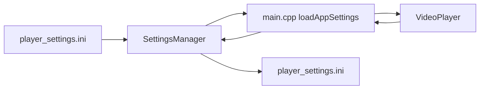

# SettingsManager 配置读写

源码: `include/config/settings_manager.h`, `src/config/settings_manager.cpp`, `config/player_settings.ini`

## 角色

轻量 INI 风格配置管理器。负责加载、保存、重新加载 key-value 设置，并提供 string/int/double/bool 类型读写接口。

## 接口

| 接口 | 用途 |
|---|---|
| `loadIni(file_path)` | 加载配置文件 |
| `saveIni(file_path)` | 保存当前配置 |
| `reload()` | 按 `loaded_path_` 重新加载 |
| `setString` / `setInt` / `setDouble` / `setBool` | 写入配置值 |
| `getString` / `getInt` / `getDouble` / `getBool` | 读取配置值 |

## 配置项

| 前缀 | 用途 |
|---|---|
| `player.*` | 音量、倍速、延迟、播放列表恢复 |
| `decoder.*` | 硬件解码偏好 |
| `subtitle.*` | 首选语言、forced、SDH 策略 |
| `hotkey.*` | 热键绑定和恢复默认值 |

## 数据流

## 关键约束

- 所有值内部以字符串保存，类型转换发生在 getter/setter。
- `reload()` 依赖最近一次成功加载的路径。

## 注意点

- 新增用户设置时需要同步默认写入、加载、保存和设置持久化检查。
- bool 文本解析规则会影响配置兼容性。
