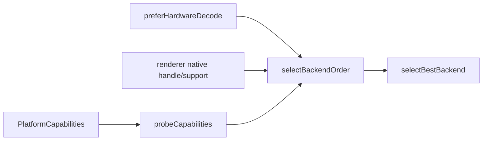

# DecoderFactory 解码后端选择

源码: `include/decoder/decoder_capability.h`, `include/decoder/decoder_factory.h`, `src/decoder/decoder_factory.cpp`

## 角色

解码后端能力和优先级选择模块。根据平台能力、用户偏好和渲染器互操作条件，选择软件或硬件解码后端。

## 接口

| 接口 | 用途 |
|---|---|
| `probeCapabilities(capabilities)` | 生成可用解码后端列表 |
| `selectBackendOrder(context)` | 输出候选后端顺序 |
| `selectBestBackend(context)` | 选择首选后端 |
| `backendName(backend)` | 返回后端名称 |

## 数据

| 数据 | 说明 |
|---|---|
| `DecoderBackend` | `Software`、`D3D11VA`、`DXVA2`、`VAAPI`、`VideoToolbox` 等 |
| `DecoderCapability` | 是否硬件加速、优先级、支持 codec |
| `DecoderSelectionContext` | 平台能力、偏好、渲染器能力等选择上下文 |

## 数据流

## 关键约束

- 硬件后端受 CMake feature switch、平台和 FFmpeg 硬件设备可用性共同限制。
- 渲染器是否支持 native frame 会影响硬件解码路径收益和选择。

## 注意点

- `VideoPlayer::videoDecoderBackendName()` 最终依赖该模块选择结果。
- 修改优先级时需要同步格式回归和平台 gate。
