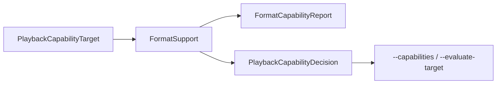

# FormatSupport 格式能力

源码: `include/media/format_support.h`, `src/media/format_support.cpp`

## 角色

媒体格式和播放目标能力评估模块。提供容器、视频 codec、音频 codec 支持判断，并生成运行时能力报告和播放目标决策。

## 接口

| 接口 | 用途 |
|---|---|
| `isContainerSupported(extension)` | 判断容器扩展名 |
| `isVideoCodecLikelySupported(codec_name)` | 判断视频 codec |
| `isAudioCodecLikelySupported(codec_name)` | 判断音频 codec |
| `supportedContainers` / `supportedVideoCodecs` / `supportedAudioCodecs` | 列出静态支持项 |
| `supportsMkvChapters()` / `supportsMp4MoovPreload()` | 特性支持判断 |
| `queryRuntimeCapabilities()` | 查询运行时能力 |
| `evaluatePlaybackTarget(target)` | 评估播放目标并给出建议 |

## 数据流

## 关键约束

- “likely supported” 是基于项目支持列表和运行能力的判断，不等同于实际打开成功。
- 播放目标评估会影响命令行 probe 输出和 D3D11 推荐字段。

## 注意点

- 新增 codec/container 时需要同步能力矩阵、README 或相关文档。
- 实际播放仍以 FFmpeg 打开和解码结果为准。
