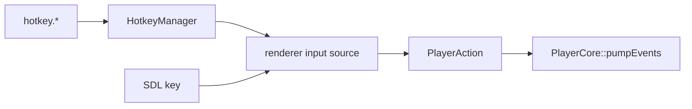

# HotkeyManager 热键映射

源码: `include/input/hotkey_manager.h`, `src/input/hotkey_manager.cpp`

## 角色

播放器动作到键码的映射管理器。负责默认热键、配置序列化 key、键码 token 转换和冲突检测。

## 接口

| 接口 | 用途 |
|---|---|
| `bind(action, key_code)` / `unbind(action)` | 绑定或解绑动作 |
| `resetToDefaults()` | 恢复默认热键 |
| `actionForKey(key_code)` | 根据键码查找动作 |
| `keyForAction(action)` | 根据动作查找键码 |
| `findConflicts()` / `hasConflicts()` | 检查重复绑定 |
| `actionConfigKey` / `actionFromConfigKey` | 配置 key 转换 |
| `keyCodeToToken` / `keyCodeFromToken` | 键码文本转换 |

## 数据流

## 关键约束

- `PlayerAction` 是输入层和播放器核心之间的动作枚举契约。
- 热键配置由 `config/player_settings.ini` 的 `hotkey.*` 保存。
- 渲染器需要持有最新 `HotkeyManager` 才能正确消费键盘事件。

## 注意点

- 新增动作时要同步枚举、默认绑定、配置 key、渲染器输入处理和使用说明输出。
- 冲突检测只判断动作到键码的重复，不代表业务动作是否互斥。
