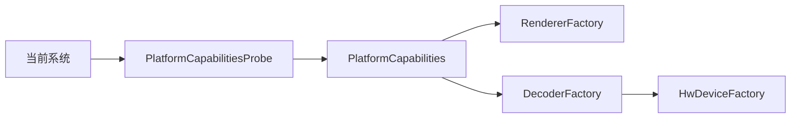

# PlatformCapabilities 平台能力

源码: `include/platform/platform_capabilities.h`, `include/platform/hw_device_factory.h`, `src/platform/*.cpp`

## 角色

平台、渲染器、硬件解码和 SDL 能力探测层。为 `RendererFactory`、`DecoderFactory` 和播放策略提供当前系统可用能力。

## 接口

| 接口 | 用途 |
|---|---|
| `PlatformCapabilitiesProbe::detect()` | 探测当前平台能力 |
| `HwDeviceFactory::supportsBackend` | 判断硬件解码后端是否支持 |
| `HwDeviceFactory::findCodecHardwarePixelFormat` | 查找 codec 对应硬件像素格式 |
| `HwDeviceFactory::createHardwareDeviceContext` | 创建 FFmpeg 硬件设备上下文 |
| `HwDeviceFactory::probeRuntimeAvailability` | 探测硬件后端运行时可用性 |

## 数据

| 数据 | 说明 |
|---|---|
| `PlatformCapabilities` | 平台类型、渲染器支持、解码支持、SDL window/audio |
| `RendererSupport` | 单个渲染后端支持状态 |
| `DecoderBackendSupport` | 单个解码后端支持状态 |
| `HardwareDeviceCreateRequest` | 硬件设备创建请求 |

## 数据流

## 关键约束

- D3D11/D3D11VA 仅 Windows；VAAPI 仅非 Apple Unix/Linux；VideoToolbox 仅 Apple。
- CMake 会对不匹配平台的 feature switch 强制关闭。

## 注意点

- 平台探测和编译宏需要保持一致，否则可能出现“运行时支持但工厂无法创建”的状态。
- 硬件设备上下文创建失败时应保留 detail，便于回退软件解码。
