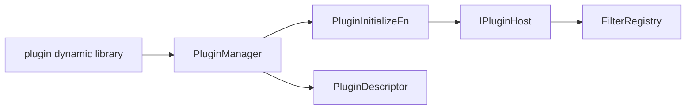

# PluginManager 插件管理

源码: `include/plugin/plugin_api.h`, `include/plugin/plugin_manager.h`, `src/plugin/*.cpp`

## 角色

动态插件加载和插件 host。插件可以注册自身描述信息，并通过 host 向 `FilterRegistry` 注册音视频滤镜，也可以输出日志。

## 接口

| 接口 | 用途 |
|---|---|
| `registerPlugin` / `unregisterPlugin` | 管理静态插件记录 |
| `setEnabled(id, enabled)` | 启用或禁用插件 |
| `loadPlugin(path)` | 加载单个动态库插件 |
| `loadPluginsFromDirectory(directory)` | 批量加载目录插件 |
| `unloadAll()` | 卸载全部动态插件 |
| `listPlugins()` | 查询插件描述 |
| `registerVideoFilter` / `registerAudioFilter` | 作为 host 注册滤镜 |
| `logInfo` / `logWarning` / `logError` | 插件日志 |

## 数据

| 数据 | 说明 |
|---|---|
| `PluginDescriptor` | id、name、version、description、library_path、api_version、enabled |
| `PluginRecord` | descriptor、动态库句柄、initialize/shutdown、注册的滤镜名称 |
| `IPluginHost` | 插件与主程序交互接口 |

## 数据流

## 关键约束

- 插件 API 版本由 `kPluginApiVersion` 约束。
- 动态插件卸载时需要调用 shutdown，并清理已注册滤镜。
- `active_plugin_` 用于记录当前正在激活的插件上下文。

## 注意点

- 修改 plugin ABI 时要同步示例插件和回归检查。
- 插件注册的滤镜名称不能与已有滤镜冲突。
