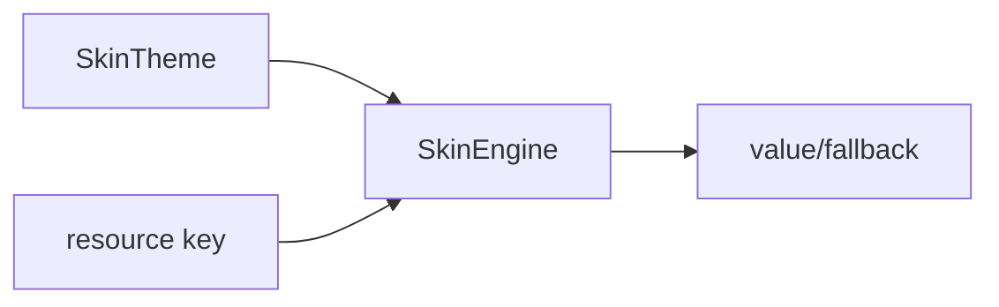

# SkinEngine 皮肤占位模块

源码: `include/ui/skin_engine.h`, `src/ui/skin_engine.cpp`

## 角色

轻量主题键值解析模块。当前提供主题设置、主题查询和按 key 解析字符串资源的能力。

## 接口

| 接口 | 用途 |
|---|---|
| `setTheme(theme)` | 设置当前主题 |
| `theme()` | 返回当前主题 |
| `resolve(key, fallback)` | 按 key 获取主题值，不存在时返回 fallback |

## 数据

| 数据 | 说明 |
|---|---|
| `SkinTheme` | 主题名称和 key-value 字典 |
| `theme_` | 当前主题，默认名为 `default` |

## 数据流

## 关键约束

- 当前模块只提供数据解析，不直接绘制 UI。
- UI 渲染仍主要由具体渲染后端和 `Display` 控制。

## 注意点

- 如果后续引入完整皮肤系统，需要定义主题文件格式、加载路径和渲染器消费契约。
- 当前不应把业务状态塞进 `SkinTheme`。
