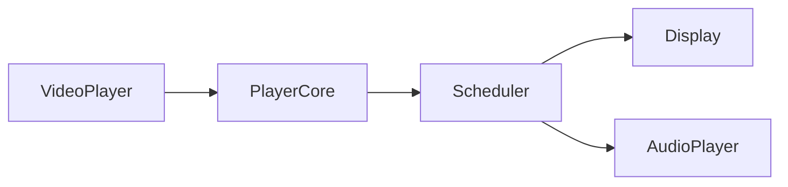
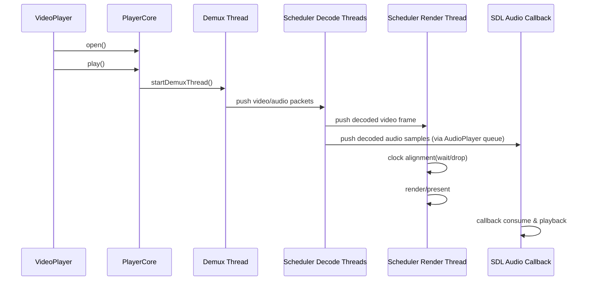

# Day 1 执行版（主链路总览）

日期：2026-03-10  
目标：在 1 天内建立“架构、主链、线程、队列、时钟”的整体认知，不做细节深挖。

---

## 1. 今日执行安排（8 小时）

1. `09:00-09:40` 对齐文档边界：只读“当前有效架构”和“主链路解读”。
2. `09:40-10:40` 串调用链：`VideoPlayer::open/play -> PlayerCore::open/play`。
3. `10:40-11:40` 识别线程入口：demux / scheduler(3) / audio consumer / display / SDL audio callback。
4. `13:30-14:30` 识别数据流：`PacketQueue -> decode -> FrameQueue -> render/audio`。
5. `14:30-15:20` 识别同步策略：`pumpRenderOnce()` 的 `diff` 等待/丢帧。
6. `15:20-16:00` 识别背压：`80%` 停解码，`50%` 恢复。
7. `16:00-16:40` 识别渲染落地：`Display::renderFrame -> copyFrameData -> SDL_UpdateYUVTexture`。
8. `16:40-17:20` 输出当日结论：模块图 + 时序图 + 疑问清单。

---

## 2. 固定产出 A：模块图

---

## 3. 固定产出 B：时序图

---

## 4. 固定产出 C：疑问清单（>=10，已按优先级）

### P0（明天先攻克）

1. `seek()` 时为何要“暂停调度 -> 停 demux -> flush -> avcodec_flush_buffers -> 恢复”这一顺序？
2. `PacketQueue` 的 EOF、stop、clear 三种信号边界分别是什么？
3. `Scheduler::pumpRenderOnce()` 中 `diff < -0.25` 丢帧阈值为什么取 `250ms`？
4. 音频主时钟模式下，`position_` 的最终权威来源是 `AudioPlayer::getPlaybackPts()` 还是视频渲染 PTS？
5. `renderPausedFrameAtOrAfter()` 在暂停步进时可能与调度线程产生哪些竞争？

### P1（次优先）

6. `FrameQueue` 容量（视频 16、音频 32）在高码率素材上是否会导致频繁背压？
7. `decodeVideoFrame()` 的“先 receive 后 send”在所有 codec 上都稳定吗？
8. `Display::copyFrameData()` 每帧 memcpy 的开销在 4K60 下占比多少？
9. 硬解路径下 `av_hwframe_transfer_data()` 的回拷是否是当前主要瓶颈？
10. `Scheduler` 线程异常只允许一次重启的策略是否会过早中断播放？

### P2（后续专项）

11. `OpenGLVideoRenderer` 目前是占位实现，后续是否保留或删除？
12. 滤镜管道在音频/视频线程上的执行点是否需要独立 profiling 指标？

---

## 5. 今日验收标准

- 能口述完整主链：`open -> play -> demux -> decode -> render/audio callback`。
- 能指出 5 个关键线程函数入口和职责。
- 能解释“背压 + 时钟对齐 + 丢帧”三者关系。
- 能给出明天优先级最高的 5 个问题（即上面 P0）。

---

## 6. 关键代码定位（用于复盘）

- `src/video_player.cpp`: `open/play`
- `src/core/player_core.cpp`: `open/play/startDemuxThread/startAudioConsumer/decodeVideoFrame/decodeAudioFrame/renderFrame`
- `src/core/scheduler.cpp`: `start/videoDecoderLoop/audioDecoderLoop/pumpRenderOnce/renderLoop`
- `src/display.cpp`: `renderFrame/copyFrameData/updateTexture`
- `src/audio_player.cpp`: `play/audioCallback/getPlaybackPts`
